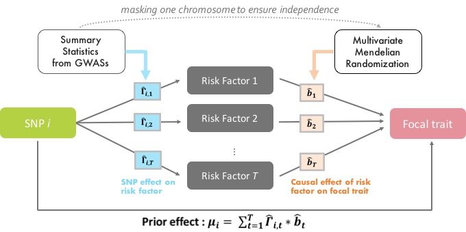

```{r setup, include=FALSE}
setwd("/Users/nmounier/Documents/SGG/Projects/Packaging/bGWAS")
knitr::opts_chunk$set(echo = TRUE,
                      fig.path = "doc/Figures/README-",
                      out.width = "100%")
# for tibbles...
options(pillar.neg=F, # do no print neg number in red
        pillar.subtle=F, # turn off highliting of significant digits
        tibble.width = 170) # default=95, increase it to make it readable
A = readRDS("inst/Data/A.RDS")
# automatically updates manual
devtools::build_manual()
system("mv ../bGWAS_1.0.2.pdf doc/bGWAS-manual.pdf")
#
remove.packages("bGWAS")
```


```{r badges, echo = FALSE, results='asis'}
# https://shields.io/


#TRAVIS CI buil
cat(
badger::badge_travis("n-mounier/bGWAS"),

#version
#badger::badge_github_version("n-mounier/bGWAS", "informational")
badger::badge_custom("version", suppressMessages(badger::ver_devel("n-mounier/bGWAS")), "informational", "https://github.com/n-mounier/bGWAS"),

#lifecycle
badger::badge_lifecycle("maturing", "9cf"), 

#last commit:
badger::badge_last_commit("n-mounier/bGWAS"),

#license
badger::badge_custom("license", "GPL-2.0", "lightgrey", "https://www.gnu.org/licenses/old-licenses/gpl-2.0.en.html")

#DOI
#badger::badge_custom("poster", "10.5281/zenodo.3403093", "blueviolet", "https://doi.org/10.5281/zenodo.3403093")
)

```


# bGWAS   
<!--- 
# https://github.com/GuangchuangYu/hexSticker
library(hexSticker)
imgurl <- "inst/Figures/PriorEstimation.jpg"
sticker(imgurl, 
        package="bGWAS", p_size=8, p_color="#B4CE4E",
        h_fill="white", h_color="#A7E4F8",
        s_x=1, s_y=.8, s_width=.75,
        filename="inst/Figures/logo.png", dpi=2000) --->


:arrow_right: ESHG poster is available [here](doc/P17.051.A_NinonMounier.pdf).      

:information\_source: `bGWAS` has been updated to version 1.0.2.    
:warning: 28/10/2019 : The variance of the prior effects has been modified. If you used a previous version of the package, please re-run yout analysis using this new version to get more accurate results.        
Check the [NEWS](NEWS.md) to learn more about what has been modified\!
    
    
:warning: If you downloaded the Z-Matrix files before 20/08/2019, they are now obsolete and you will not be able to use them with the newest version of the package.      
Note: some Prior GWASs have been removed, you can find more details [here](doc/ZMatrices.md).

## Overview
[//]:*******

bGWAS is an R-package to perform a Bayesian GWAS (Genome Wide Association Study), using summary statistics from a conventional GWAS as input. The aim of the approach is to increase power by leveraging information from related traits and by comparing the observed Z-scores from the focal phenotype (provided as input) to prior effects. These prior effects are directly estimated from publicly available GWASs (currently, a set of 38 studies, last update 20-08-2019 - hereinafter referred to as "prior GWASs" or "risk factors"). Only prior GWASs having a significant causal effect on the focal phenotype, identified using a multivariable Mendelian Randomization (MR) approach, are used to calculate the prior effects. Causal effects are estimated masking the focal chromosome to ensure independence, and the prior effects are estimated as described in the figure below.         
    

Observed and prior effects are compared using Bayes Factors. Significance is assessed by calculating the probability of observing a value larger than the observed BF (P-value) given the prior distribution. This is done by decomposing the analytical form of the BFs and using an approximation for most BFs to make the computation faster. Prior, posterior and direct effects, alongside BFs and p-values are returned. Note that prior, posterior and direct effects are estimated on the Z-score scale, but are automatically rescaled to beta scale if possible.  


The principal functions available are:  

-   **`bGWAS()`**  
main function that calculates prior effects from prior GWASs, compares them to observed Z-scores and returns an object of class *bGWAS*   

-   **`list_priorGWASs()`**    
directly returns information about the prior GWASs that can be used to calculate prior effects  

-   **`select_priorGWASs()`**   
allows a quick selection of prior GWASs (to include/exclude specific studies when calculating prior effects)  

-   **`extract_results_bGWAS()`**    
returns results (prior, posterior and direct estimate / standard-error + p-value from BF for SNPs) from an object of class *bGWAS*   

-   **`manhattan_plot_bGWAS()`**   
creates a Manhattan Plot from an object of class *bGWAS*  

-   **`extract_MRcoeffs_bGWAS()`**    
returns multivariable MR coefficients (1 estimate using all chromosomes + 22 estimates with 1 chromosome masked) from an object of class *bGWAS*   

-   **`coefficients_plot_bGWAS()`**   
creates a Coefficients Plot (causal effect of each prior GWASs on the focal phenotype) from an object of class *bGWAS*  

-   **`heatmap_bGWAS()`**    
creates a heatmap to represent, for each significant SNP, the contribution of each prior GWAS to the estimated prior effect from an object of class *bGWAS*  

All the functions available and more details about their usage can be found in the [manual](doc/bGWAS-manual.pdf).   


## Installation
[//]:*******

You can install the current version of `bGWAS` with:    
```{r install-package, echo=TRUE, message=FALSE, results='hide'}
# Directly install the package from github
# install.packages("remotes")
remotes::install_github("n-mounier/bGWAS")
library(bGWAS)
```
<!--- Note: using remotes instead of devtools leads to re-build the package
and apparently, it may be a problem with R 3.4 and macOS, 
see https://stackoverflow.com/questions/43595457/alternate-compiler-for-installing-r-packages-clang-error-unsupported-option/43943631#43943631 --->

## Usage
[//]:*******

To run the analysis with `bGWAS` two inputs are needed:

#### 1. The *GWAS* results to be tested   
Can be a regular (space/tab/comma-separated) file or a gzipped file (.gz) or a `data.frame`. Must contain the following columns, which can have alternative names:  
<ul>   SNP-identifier:  `rs` or `rsid`, `snp`, `snpid`, `rnpid`     
       Alternate (effect) allele:  `a1` or `alt`, `alts`    
       Reference allele: `a2` or `a0`, `ref`    
       Z-statistics: `z` or `Z`, `zscore`  </ul>     
If the Z-statistics is not present, it will be automatically calculated from effect size and standard error, in which case the following columns should be provided:     
<ul>   Effect-size: `b` or `beta`, `beta1`    
       Standard error:  `se` or `std`     </ul>     
If you want the prior/posterior/corrected effects to be rescaled, please make sure to provide effect sizes and standard errors instead of (or in addition to) Z-statistics.    

#### 2. Prior *GWASs* - Z-Matrix files   
   
These files should be downloaded separately and stored in `~/ZMatrices` or in the folder specified when launching the analysis. These files contains the Z-scores for all prior GWASs :    
<ul><ul>   *ZMatrix_MR.csv.gz*: Z-scores (strong instruments only) used for multivariable MR,   
       *ZMatrix_Full.csv.gz*: Z-scores (all SNPs) used to calculate the prior Z-scores,     
       *AvailableStudies.tsv*: A file containing information about the prior GWASs available.  </ul></ul>  

You can download these files using this [link](https://drive.switch.ch/index.php/s/jvSwoIxRgCKUSI8) or following the instructions below. Please note that your input GWAS will be merged with the Z-Matrix files (using rsid and alleles to align effects), and that the results reported will use the Z-Matrix files chr:pos information (GRCh37 - since UK10K data has been used to imputed the prior GWASs).     

- On UNIX/MACOSX, from a terminal:    
``` bash
wget https://drive.switch.ch/index.php/s/jvSwoIxRgCKUSI8/download -O ZMatrices.tar.gz
tar xzvf ZMatrices.tar.gz
``` 
<!--- - On WINDOWS, from a terminal:   
``` bash
...
``` --->

<font color="grey"><small> If you want to use your own set of prior GWASs, please have a look [here](doc/ZMatrices.md) to see how you can modify the files.        
<!---We focused on including prior GWASs that do not come from UKBB, assuming that the focal phenotype results are more likely to be obtained from UKBB. Sample overlap between the focal phenotype and the prior GWASs is not accounted for by our method, so we did not include any UKBB results in the prior GWASs. ---> </font> </small>  

### Study Selection
[//]:-------------------------------

Before running your analysis, you can select the prior GWASs you want to include. You can use the function **`list_priorGWASs()`** to get some information about the prior GWASs available.   

You should remove traits that by definition are not independent from your trait of interest. For example, before analysing BMI results, make sure to exclude "Height" from the prior GWASs used. You can use the function **`select_priorGWASs()`** to automatically exclude/include some traits or some files. You should also check for sample overlap, and remove prior GWASs that come from the same consortium as your data. If there are individuals in common between your conventional GWAS and prior GWASs, it might induce some bias.


```{r PriorGWASS}
# Obtain the list of prior GWASs
AllStudies = list_priorGWASs()
# Select only the ones for specific traits
# select_priorGWASs will return the IDs of the files that are kept
MyStudies = select_priorGWASs(include_traits=c("Heart Rate", "Body Mass Index", "Smoking"))
# Match these IDs against the ones in the list of prior GWASs 
AllStudies[AllStudies$ID %in% MyStudies, ]
```


### Analysis
[//]:-------------------------------

- **Example A**

```{r exampleA-part1}
# Using a small GWAS (400,000 SNPs, Timmers et al data - stored as a data.frame)
# Please, not that this example is only for illustration, the method is designed
# to be used genome-wide, and using such a low number of SNPs can not yield
# interpretable results.
data("SmallGWAS_Timmers2019")
MyStudies = select_priorGWASs(include_traits=c("Blood Pressure", "Education"),  
include_files=c("cardiogram_gwas_results.txt", "All_ancestries_SNP_gwas_mc_merge_nogc.tbl.uniq.gz"))
# 6 Prior GWASs used
list_priorGWASs(MyStudies)[,c("Name", "Trait", "Reference")]
```


```{r exampleA-part2, eval=F}
A = bGWAS(name="Test_UsingSmallDataFrame",
          GWAS = SmallGWAS_Timmers2019,
          prior_studies = MyStudies,
          stepwise_threshold = 0.05)
# MR instruments will be selected using default parameter (1e-6) and distance-pruned (500Kb),
# MR will be performed using a threshold of 0.05 to select studies, and the default shrinkage thresholds (1) will be used,
# A subset of prior GWASs (MyStudies) will be used, and only the ones with at least 3 strong instruments will be kept to be tested and create the prior,
# Significant SNPs will be identified using default parameters (p<5e-8) and distance-pruned (500kb),
# No file will be saved.
``` 

- **Example B**


```{r exampleB-part1}
# Using a GWAS from our list our prior GWASs
# Using all other (37) GWASs to built the prior
MyGWAS = 3
list_priorGWASs(MyGWAS)[, c("Name", "Trait", "Reference")]
```

```{r exampleB-part2, eval=F}
B = bGWAS(name = "Test_UsingGWASfromPriorGWASs",
         GWAS = MyGWAS)
# MR instruments will be selected using default parameters,
# MR will be performed using default parameters (stepwise selection / shrinkage threshold)
# All Prior GWASs except the one use as "GWAS" will be used to create the prior,
# Significant SNPs will be identified using default parameters (p<5e-8) and distance-pruned (500kb)
# No file will be saved.
```

### Results
[//]:-------------------------------


**`bGWAS()`** returns an object of class "bGWAS" than can be handled in `R`.    

```{r printA}
class(A)

print(A)
```

```{r logA, eval=FALSE}
print_log_bGWAS(A)
```

<details>

  <summary>Show log</summary>
  
    ```{r logAdisplay,echo=FALSE, eval=TRUE}
    print_log_bGWAS(A)
    ```
    
</details>       

     


- Functions to extract results from an object of class *bGWAS*:   
```{r extractA}
# by default, extract "BF" results...
hits = extract_results_bGWAS(A, SNPs = "significant")
hits

all_results = extract_results_bGWAS(A, SNPs = "all")
nrow(all_results)

# but also possible to extract SNPs with significant posterior/direct effects
extract_results_bGWAS(A, SNPs = "significant", results = "direct")
```


```{r MRcoeffsA}
extract_MRcoeffs_bGWAS(A)[,1:12]

```


- Functions for graphic representations:   
```{r PlotsA, dpi=300}
# Coefficients plot
coefficients_plot_bGWAS(A) 

# Manhattan plot using BFs p-values
manhattan_plot_bGWAS(A)

# Manhattan plot using posterior p-values
manhattan_plot_bGWAS(A, results="posterior")

```


   
   
   
##### Aditionnaly, if `save_files=TRUE`, several files are created in the folder `./<name>/` :
-   **<name>.log** - log file  
-   **PriorGWASs.tsv** - contains information about all prior GWASs (general info + status (used/removed) + univariable/multivariable MR estimates)   
-   **CoefficientsByChromosome.csv** - contains the multivariable MR estimates when masking the focal chromosome (22 coefficients for each prior GWASs used for prior estimation)   
-   **PriorBFp.csv** - contains BF and p-values, prior, posterior and direct effects estimates for all SNPs      
-   **SignificantSNPs.csv** - contains BF and p-values, prior, posterior and direct effects estimates for a subset of significant SNPs (identified according to specified parameters)


A detailed description of these files can be found [here](doc/OutputFiles.md).


## Runtime
[//]:*******

Analysis using all the 38 prior GWASs available, for a conventional GWAS containing ~7M SNPs in common with the prior studies ~ 25 minutes.

Analysis using 6 prior GWASs, for a conventional GWAS containing ~ 300,000 SNPs in common with prior studies (see example A) ~ 2 minutes.


<font color="grey"><small> Results from analyses performed on a MacBook Pro (Early 2015) - Processor : 2.9 GHz Intel Core i5 - Memory : 8 GB 1867 MHz DDR3.</font> </small>    


## Application to Lifespan analysis
[//]:*******

This method has been applied to Lifespan analysis in [McDaid et al](https://www.ncbi.nlm.nih.gov/pubmed/28748955) and [Timmers et al](https://www.ncbi.nlm.nih.gov/pubmed/30642433).     
The most recent results (obtained using `bGWAS` version 1.0.2) are available [here](doc/Lifespan_Analysis.md) and summarised in [this poster](doc/P17.051.A_NinonMounier.pdf). 


<!--- ## Application to food choices
[//]:*******

The corrected to raw ratios (CRRs) derived from this approach have been used to study the relationship between food choices and health status in [Pirastu et al](https://www.biorxiv.org/content/10.1101/829952v2) --->


## Citation
[//]:*******

If you use the `bGWAS` package, please cite:

[Ninon Mounier, Zoltán Kutalik, bGWAS: an R package to perform Bayesian Genome Wide Association Studies, Bioinformatics](https://doi.org/10.1093/bioinformatics/btaa549)

## Contact
<mounier.ninon@gmail.com>

    
      
