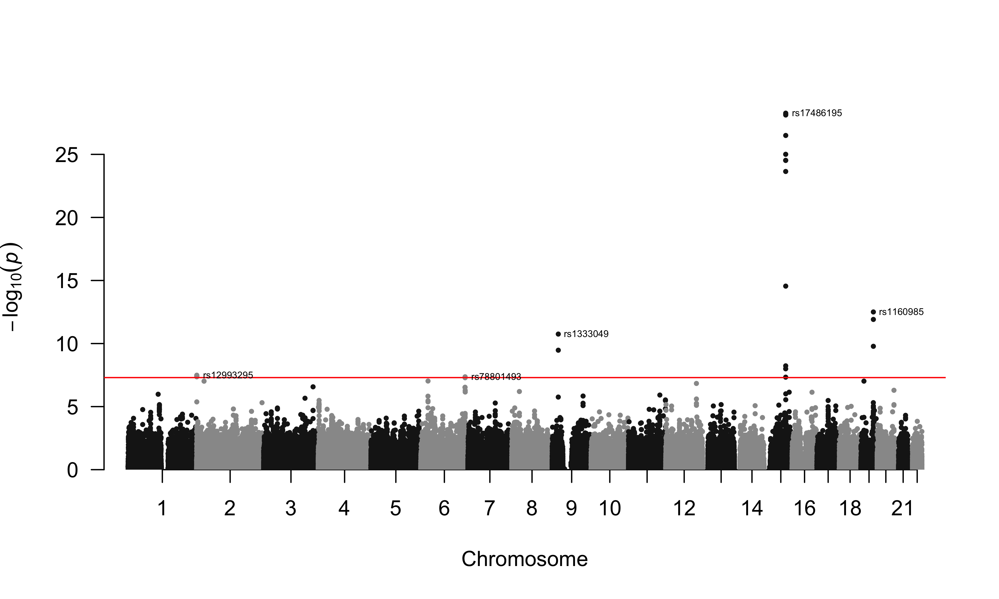
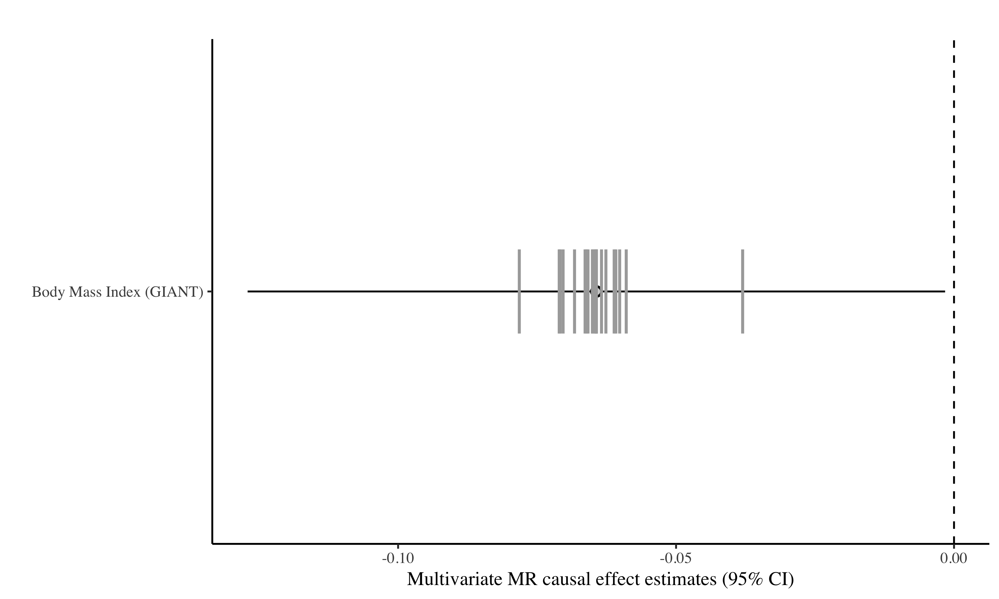

[](https://github.com/n-mounier/bGWAS)

<!--- 
badges: 
version 
DOI
[](https://doi.org/n-mounier/bGWAS)

lifecycle

Travis CI
https://shields.io/category/license

badger package
--->


# bGWAS
[//]:========================================

:information_source: `bGWAS` has been updated to version 1.0.0. Check the [NEWS](News.md) to learn more about what has been modified!
    
    
:warning: If you downloaded the Z-Matrix files before 20/08/2019, they are now obsolete and you will not be able to use them with the `bGWAS` package. Please download the new ones!   
Note: some Prior GWASs have been removed, you can find more details [here](docs/ZMatrices.md).

## Overview
[//]:*******

bGWAS is an R-package to perform a Bayesian GWAS, using summary statistics as input. Briefly, it compares the observed Z-scores from a conventional GWAS to prior effects. These prior Z-scores are directly calculated from publicly available GWASs (currently, a set of 38 studies, last update 20-08-2019 - hereinafter referred to as "prior GWASs"). Only prior GWASs having a significant influence on the conventional GWAS (identified using a multivariate Mendelian Randomization (MR) approach) are used to calculate the prior effects. Causal effects are estimated masking the focal chromosome to ensure independence.          
Observed and prior effects are compared using Bayes Factors. Significance is assessed by calculating the probability of observing a value larger than the observed BF (P-value) given the prior distribution by decomposing the analytical form of the BFs and using an approximation for most BFs to make the computation faster. Prior, posterior and direct effects, alongside BFs and p-values are returned. Note that prior, posterior and direct effects are estimated on the Z-score scale, but are automatically rescaled to beta scale if possible.   

The functions available are:  

-   **`bGWAS()`**  
main function that calculates prior effects from prior GWASs, compares them to observed Z-scores and returns an object of class "bGWAS"   

-   **`list_priorGWASs()`**
directly returns information about the prior GWASs that can be used to calculate prior Z-scores   

-   **`select_priorGWASs()`**   
allows a quick selection of prior GWASs (to include/exclude specific studies when calculating prior Z-scores)  

-   **`extract_results_bGWAS()`**    
returns results (prior, posterior and direct estimate / standard-error + p-value from BF for SNPs) from an object of class "bGWAS"   

-   **`manhattan_plot_bGWAS()`**   
creates a Manhattan Plot from an object of class "bGWAS"  

-   **`extract_MRcoeffs_bGWAS()`**    
returns multivariate MR coefficients (1 estimate using all chromosomes + 22 estimates with 1 chromosome masked) from an object of class "bGWAS"   

-   **`coefficients_plot_bGWAS()`**   
creates a Coefficients Plot (causal effect of prior GWASs) from an object of class "bGWAS"  

-   **`heatmap_bGWAS()`**    
creates a heatmap to represent, for each significant SNP, the contribution of each prior GWAS used to create the prior effect from an object of class "bGWAS"  


## Installation
[//]:*******

* Install R-package
``` r
# Directly install the package from github
# install.packages("devtools")
devtools::install_github("n-mounier/bGWAS")
```

In order to use the **`bGWAS()`** function to calculate prior Z-scores, you should download Z-Matrix files.

* Download Z-Matrix files (Size ~ 1 GB):   
These files contains the Z-scores for all prior GWASs (before and after imputation) :   
*ZMatrix_MR.csv.gz*: Z-scores (strong instruments only) used for multivariate MR,   
*ZMatrix_Full.csv.gz*: Z-scores (all SNPs) used to calculate the prior Z-scores,
*AvailableStudies.tsv*: A file containing information about the prior GWASs available.   

**Problem with switch drive, download link will be added soon!**
<!---
On UNIX/MACOSX, from a terminal:    
``` bash
wget --no-check-certificate ##https://drive.switch.ch/index.php/s/t3xepllvzobVTCh/download## -O ZMatrices.tar.gz
tar xzvf ZMatrices.tar.gz
``` 
On WINDOWS:   
--->
  
## Usage
[//]:*******

To run the analysis with `bGWAS` two inputs are needed:

#### 1. The *GWAS* results to be tested   
Can be a regular (space/tab/comma-separated) file or a gzipped file (.gz) or a `data.frame`. Must contain the following columns, which can have alternative names.  
SNP-identifier:  `rs` or `rsid`, `snp`, `snpid`, `rnpid`    
Alternate allele:  `a1` or `alt`, `alts`    
Reference allele: `a2` or `a0`, `ref`    
Z-statistics: `z` or `Z`, `zscore`      
If the Z-statistics is not present, it will be automatically calculated from effect size and standard error, in which case the following columns should be provided:
Effect-size: `b` or `beta`, `beta1`    
Standard error:  `se` or `std`     
If you want the prior/posterior/corrected effects to be rescaled, please provide effect sizes and standard errors instead of (or in addition to) Z-statistics.    

#### 2. Prior *GWASs*   
   
Matrix files, containing Z-scores for all prior GWASs should be downloaded separately and stored in `~/ZMatrices` or in the folder specified when launching the analysis (see above for downloading instructions).    
  

*If you want to use your own set of prior GWASs, please have a look [here](docs/ZMatrices.md) to see how you can modify the files.   *
*We focused on including prior GWASs that do not come from UKBB, assuming that the focal phenotype is more likely to be obtained from UKBB. Sample overlap between the focal phenotype and the Prior GWASs is not accounted for by our method, so we did not include any UKBB results in the prior GWASs.    *


### Study Selection
[//]:-------------------------------

Before running your analysis, you can select the prior GWASs you want to include. You can use the function **`list_prioGWASs()`** to get some information about the prior GWASs available.   
You should remove traits that by definition are not independent from your trait of interest. For example, before analysing BMI results, make sure to exclude "Height" from the prior GWASs used. You can use the function **`select_priorGWASs()`** to automatically exclude/include some traits or some files.   
You should also check for sample overlap, and remove prior GWASs that come from the same consortium as your data. If there are individuals in common between your conventional GWAS and prior GWASs, it might induce some bias.

``` r
# Obtain the list of prior GWASs
AllStudies = list_priorGWASs()
# Select only the ones for specific traits
# select_priorGWASs will return the IDs of the files that are kept
MyStudies = select_priorGWASs(include_traits=c("Heart Rate", "Body mass index", "Smoking"))
# Match these IDs against the ones in the list of prior GWASs 
AllStudies[AllStudies$ID %in% MyStudies, ]
```

### Analysis
[//]:-------------------------------

``` r
## Example A
# Using a small GWAS (100,000 SNPs, Timmers et al data - stored as a data.frame)
# Please, not that this example is only for illustration, the method is designed
# to be used genome-wide, and using such a low number of SNPs can not yield
# interpretable results.
data("SmallGWAS_Timmers2019")
MyStudies = select_priorGWASs(include_traits=c("Blood Pressure", "Education"),  
include_files=c("cardiogram_gwas_results.txt", "All_ancestries_SNP_gwas_mc_merge_nogc.tbl.uniq.gz"))
# 6 Prior GWASs used
list_priorGWASs(MyStudies)

A = bGWAS(name="Test_UsingSmallDataFrame",
          GWAS = SmallGWAS_Timmers2019,
          prior_studies=MyStudies,
          stepwise_threshold=0.05,
          save_files=F)
# MR instruments will be selected using default parameters,
# MR will be performed using a threshold of 0.05 to select studies, and the default shrinkage threshold,
# A subset of prior GWASs will be used to create the prior,
# Significant SNPs will be identified using default parameters (p<5e-8) and distance-pruned (500kb),
# Files will be saved.
``` 

``` r
## Example B
# Using a GWAS from our list our prior GWASs
# Using all other (37) GWASs to built the prior
MyGWAS = 3
list_priorGWASs(MyGWAS)
# Coronary Artery Disease GWAS (CARDIoGRAM)

# MR instruments will be selected using default parameters,
# MR will be performed using default parameters (stepwise / shrinkage threshold)
# All Prior GWASs except the one use as "GWAS" will be used to create the prior,
# Significant SNPs will be identified using default parameters (p<5e-8) and distance-pruned (500kb)
# No file will be saved.
```

### Results
[//]:-------------------------------


**`bGWAS()`** returns an object of class "bGWAS" than can be handled in `R`.    

```r
## Results from example A

class(A)
# "bGWAS"
print(A)
# -_-_-_-_-_-_-_-_-_-_-_-_-_-_-_
#
#  bGWAS performed on 291,583 SNPs
#
# -_-_-_-_-_-_-_-_-_-_-_-_-_-_-_
#
# 7 studies used to build the prior :
#                                                      Study    Estimate    StdError
#           All_ancestries_SNP_gwas_mc_merge_nogc.tbl.uniq.gz -0.06433771 0.03200732
#
# -_-_-_-_-_-_-_-_-_-_-_-_-_-_-_
#
# 5 significant SNPs identified :
# rs17486195, rs1160985, rs1333049, rs12993295, rs78801493
#
# -_-_-_-_-_-_-_-_-_-_-_-_-_-_-_
 
```
Functions to extract results from an object of class "bGWAS":   
```r
hits = extract_results_bGWAS(A, "significant")
print(hits)
# chrm_UK10K pos_UK10K       rsid alt ref         beta           se     z_obs
#     15    78865197  rs17486195   A   G   2.653839e-04 2.400667e-05 11.054591
#     19    45403412   rs1160985   T   C   7.794651e-05 1.106417e-05  7.044946
#      9    22125503   rs1333049   C   G   1.037901e-04 1.533026e-05  6.770277
#      2      632808  rs12993295   T   G   4.337771e-05 8.810665e-06  4.923318
#      6   160714603  rs78801493   T   C   6.163882e-05 1.129490e-05  5.457228
# mu_prior_estimate mu_prior_std_error mu_posterior_estimate mu_posterior_std_error
#        0.18226713           1.007069              5.656723          0.7095929
#        0.24721016           1.011336              3.684390          0.7110809
#       -0.02910109           1.002660              3.379620          0.7080455
#        0.53776935           1.094399              2.927810          0.7382282
#        0.03345027           1.002510              2.752138          0.7079926
# mu_direct_estimate mu_direct_std_error beta_posterior_estimate beta_posterior_std_error
#     10.872324            1.419221               1.357991e-04            1.703496e-05
#      6.797736            1.422252               4.076473e-05            7.867522e-06
#      6.799378            1.416096               5.181044e-05            1.085452e-05
#      4.385549            1.482468               2.579595e-05           6.504281e-06 
#      5.423778            1.415990               3.108511e-05            7.996703e-06
# beta_direct_estimate  beta_direct_std_error           BF         BF_p
# 2.610083e-04        3.407077e-05               4.369258e+13   5.404863e-29
# 7.521133e-05        1.573604e-05               4.610704e+05   3.129656e-13
# 1.042362e-04        2.170911e-05               6.252005e+04   1.774607e-11
# 3.863960e-05        1.306152e-05               1.556388e+03   3.241267e-08
# 6.126101e-05        1.599346e-05               1.348752e+03   4.344164e-08

all_results =extract_results_bGWAS(A, "all")
nrow(all_results)
# 291583
```

```r
get_RSquared_bGWAS(A, "all")
# 1e-06
get_RSquared_bGWAS(A, "moderate")
# 0.00101761
```

```r
MR_coefficients = extract_MRcoeffs_bGWAS(A)
colnames(MR_coefficients)
# "Study"            "Estimate"        "StdError"        "T"     "P"
# "chrm1_Estimate"   "chrm1_StdError"  "chrm1_PValue"   "chrm2_Estimate"   "chrm2_StdError"   "chrm2_PValue"    
# "chrm3_Estimate"   "chrm3_StdError"  "chrm3_PValue"   "chrm4_Estimate"   "chrm4_StdError"   "chrm4_PValue"    
# "chrm5_Estimate"   "chrm5_StdError"  "chrm5_PValue"   "chrm6_Estimate"   "chrm6_StdError"   "chrm6_PValue"
# "chrm7_Estimate"   "chrm7_StdError"  "chrm7_PValue"   "chrm8_Estimate"   "chrm8_StdError"   "chrm8_PValue"
# "chrm9_Estimate"   "chrm9_StdError"  "chrm9_PValue"   "chrm10_Estimate"  "chrm10_StdError"  "chrm10_PValue"
# "chrm11_Estimate"  "chrm11_StdError" "chrm11_PValue"  "chrm12_Estimate"  "chrm12_StdError"  "chrm12_PValue"   
# "chrm13_Estimate"  "chrm13_StdError" "chrm13_PValue"  "chrm14_Estimate"  "chrm14_StdError"  "chrm14_PValue"
# "chrm15_Estimate"  "chrm15_StdError" "chrm15_PValue"  "chrm16_Estimate"  "chrm16_StdError"  "chrm16_PValue"   
# "chrm17_Estimate"  "chrm17_StdError" "chrm17_PValue"  "chrm18_Estimate"  "chrm18_StdError"  "chrm18_PValue"
# "chrm19_Estimate"  "chrm19_StdError" "chrm19_PValue"  "chrm20_Estimate"  "chrm20_StdError"  "chrm20_PValue"   
# "chrm21_Estimate"  "chrm21_StdError" "chrm21_PValue"  "chrm22_Estimate"  "chrm22_StdError"  "chrm22_PValue"

MR_coefficients[1, 1:8]
#              Study                                   Estimate   StdError        T             P            
# All_ancestries_SNP_gwas_mc_merge_nogc.tbl.uniq.gz  -0.06433771 0.03200732    -2.010094    0.04900041    
# chrm1_Estimate  chrm1_StdError  chrm1_PValue
#  -0.07819836      0.03233513     0.01919931
```


Functions for graphic representations:   
```r 
manhattan_plot_bGWAS(A)
```
  
```r 
coefficients_plot_bGWAS(A) 
```
  
  

   
   
   
##### Aditionnaly, if `save_files=T`, several files are created in the folder `./name/` :
-   **`name`.log** - log file  
-   **PriorGWASs.tsv** - contains information about all prior GWASs (general info + status (used/removed) + univariate/multivariate MR estimates)   
-   **CoefficientsByChromosome.csv** - contains the multivariate MR estimates when masking the focal chromosome (22 coefficients for each prior GWASs used for prior estimation)   
-   **PriorBFp.csv** - contains BF and p-values, prior, posterior and direct effects estimates for all SNPs      
-   **SignificantSNPs.csv** - contains BF and p-values, prior, posterior and direct effects estimates for a subset of significant SNPs (identified according to specified parameters)


A detailed description of these files can be found [here](doc/OutputFiles.md).


## Runtime
[//]:*******

Analysis using all the 38 prior GWASs available, for a conventional GWAS containing ~7M SNPs in common with the prior studies ~ 25 minutes (see complete Lifespan Analysis [here]()).

Analysis using 6 prior GWASs, for a conventional GWAS containing ~ 400,000 SNPs in common with prior studies (see example A) ~ 2 minutes.


## Contact
<mounier.ninon@gmail.com>

    
      

       
       
<!---    
## Improvements to be implemented
[//]:-------------------------------

document results files    

bGWASfromPrior()    

selection from consortium (maybe not possible - complicated, too many cohorts in each consortium...)    
use of a subset of SNPs   
use of additional studies for prior   
--->  


