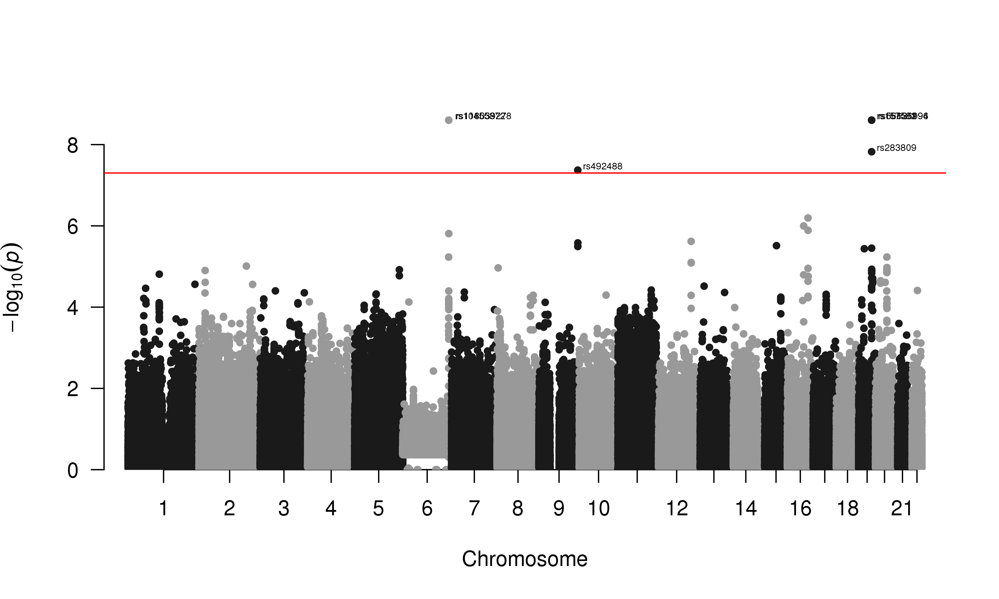
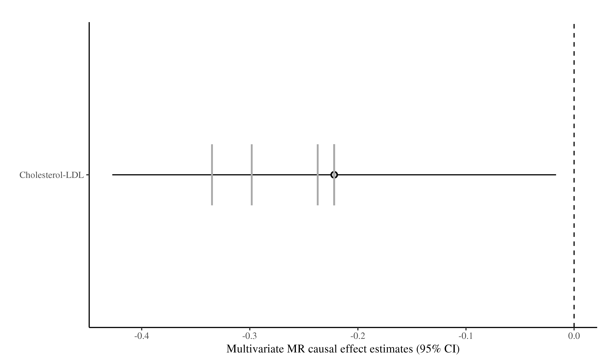

# bGWAS
[//]:========================================

:information_source: package under development  
    
    
:warning: if you downloaded the Z-Matrix files before 25/02/2018, they are obsolete, you need to delete the old ones and download the new ones!   

## Overview
[//]:-------------------------------

bGWAS is an R-package to perform a Bayesian GWAS, using summary statistics as input. Briefly, it compares the observed Z-scores from a conventional GWAS to prior Z-scores. These prior Z-scores can be provided by the user or directly calculated from publicly available GWASs (currently, a set of 58 studies, last update 25-02-2018 - hereinafter referred to as "prior GWASs"). In this second scenario, only prior GWASs having a significant influence on the conventional GWAS (identified using a multivariate Mendelian Randomization (MR) approach) are used to calculate the prior Z-scores. Causal effect are estimated masking the focal chromosome to ensure independence.          
Observed and prior Z-scores are compared using Bayes Factors, and empirical p-values are calculated using a permutation approach.   

The main functions are:  

-   **`bGWAS()`**  
core function that calculates prior Z-scores from prior GWASs, compares them to observed Z-scores and returns an object of class "bGWAS"   

-   **`list_priorGWASs()`**
directly returns information about the prior GWASs that can be used to calculate prior Z-scores   

-   **`select_priorGWASs()`**   
allows a quick selection of prior GWASs (to include/exclude specific studies when calculating prior Z-scores)  

-   **`extract_results_bGWAS()`**    
returns results (prior estimate / standard-error + p-value from BF for SNPs) from an object of class "bGWAS"   

-   **`manatthan_plot_bGWAS()`**   
creates a Manhattan Plot from an object of class "bGWAS"  

-   **`extract_MRcoeffs_bGWAS()`**    
returns multivariate MR coefficients (1 estimate using all chromosomes + 22 estimates with 1 chromosome masked) from an object of class "bGWAS"   

-   **`coefficients_plot_bGWAS()`**   
creates a Coefficients Plot (causal effect of Prior GWASs) from an object of class "bGWAS"  

-   **`bGWAS_fromPrior()`**    
alternative function that compares prior Z-scores provided by the user to observed Z-scores and returns an object of class "bGWAS" # NOT IMPLEMENTED YET   


## Installation
[//]:-------------------------------

* Install R-package
``` r
# Directly install the package from github
# install.packages("devtools")
devtools::install_github("n-mounier/bGWAS")
```

If you want to use the **`bGWAS()`** function to calculate prior Z-scores, you should download Z-Matrix files. If you are planning to calculate your own prior Z-scores and analyse them using the **`bGWAS_fromPrior()`** you can skip this step.

* Download Z-Matrix files (Size ~ 2.09 GB):   
These files contains the Z-scores for all prior GWASs (before and after imputation) :   
Z-scores before imputation are used for multivariate MR,   
Z-scores after imputation are used to calculate the prior Z-scores.
``` bash
wget --no-check-certificate https://drive.switch.ch/index.php/s/BpRrDXvFPbnKCM6/download -O ZMatrices.tar.gz
tar xzvf ZMatrices.tar.gz
```
  
## Usage
[//]:-------------------------------

To run the analysis with `bGWAS` two inputs are needed:

##### 1. The *GWAS* results to be tested   
Can be a regular (space/tab/comma-separated) file or a gzipped file (.gz), must contain the following columns, which can have alternative names.  
SNP-identifier:  `rs` or `rsid`, `snp`, `snpid`, `rnpid`    
Alternate allele:  `a1` or `alt`, `alts`    
Reference allele: `a2` or `a0`, `ref`    
Z-statistics: `z` or `Z`, `zscore`      
If the Z-statistics is not present, it can be calculated from effect size and standard error, in which case the following columns should be provided:
Effect-size: `b` or `beta`, `beta1`    
Standard error:  `se` or `std`     

##### 2. Prior *GWASs*   
(see above for downloading instructions) - not needed for the function **`bGWAS_fromPrior()`**    
   
Matrix files, containing Z-scores for all prior GWASs should be downloaded separately and stored in `~/ZMatrices` or in the folder specified when launching the analysis.   

*Currently, this is not possible for users to directly add their own GWASs to this set of prior GWASs. Feel free to contact us for more information.*   
 
<!---  Format?
Can I add one more?--->


### Study Selection

Before running your analysis, you can select the prior GWASs you want to include. You can use the function **`list_prioGWASs()`** to get some information about the prior GWASs available.   
You should remove traits that by definition are not independent from your trait. For example, before analysing BMI results, make sure to exclude "Height" from the prior GWASs used. You can use the function **`select_priorGWASs()`** to automatically exclude/include some traits or some files.   
*+ also check consortium (no function for selection) but if same individuals in your GWAS + prior GWASs, not ok*

``` r
AllStudies = list_priorGWASs()
MyStudies = select_priorGWASs(include_traits=c("Heart Rate", "Body mass index", "Smoking"))
AllStudies[AllStudies$ID %in% MyStudies, ]
```

### Analysis
``` r
## Example A
# Using a GWAS from our list our prior GWASs
# Using all other (57) GWASs to built the prior
MyGWAS = 5
list_priorGWASs(MyGWAS)
# Coronary Artery Disease GWAS (CARDIoGRAM)

A = bGWAS(name = "Test_UsingGWASfromPriorGWASs",
         GWAS = MyGWAS,
         verbose=T)
# MR instruments will be selected using default parameters,
# All Prior GWASs except the one use as "GWAS" will be used to create the prior,
# Significant SNPs will be identified using default parameters (p<5e-8) and will not be pruned,
# No file will be saved.
         

## Example B
# Using a small GWAS (400,000 SNPs, Pilling et al data - file)
# Using only specific traits / files (resulting in 9 GWASs included)

MyGWAS = system.file("Data/SmallGWAS_Pilling2017.csv", package="bGWAS")
MyStudies = select_priorGWASs(include_traits=c("Type 2 diabetes", "Smoking"),
                          include_files=c("jointGwasMc_HDL.txt.gz","jointGwasMc_LDL.txt.gz"))
list_files(MyStudies)
 
B = bGWAS(name = "Test_UsingSmallGWAS",
         GWAS = MyGWAS,
         prior_studies=MyStudies,
         verbose=T) 
print(B)
manatthan_plot_bGWAS(B)
```
    
``` r         
## Example C
# Using a small GWAS (400,000 SNPs, Pilling et al data - data.frame)
# Using only specific traits / files (resulting in 9 GWASs included)
data("SmallGWAS_Pilling2017")
MyStudies = select_priorGWASs(include_traits=c("Type 2 diabetes", "Smoking"),
                          include_files=c("jointGwasMc_HDL.txt.gz","jointGwasMc_LDL.txt.gz"))

C = bGWAS(name="Test_UsingSmallDataFrame",
         GWAS = SmallGWAS_Pilling2017,
         prior_studies=MyStudies,
         verbose=T,
         save_files=T)
print(C)
         
         
# Note that B and C are using the same data (stored differently) and give the same results.

         
```

## Results
`bGWAS()` returns an object of class "bGWAS" than can be handled in `R`.    

```r
class(bGWAS_obj)
# "bGWAS"
print(bGWAS_obj)
# -_-_-_-_-_-_-_-_-_-_-_-_-_-_-_ 
# 
#  bGWAS performed on 399,986 SNPs 
# 
# -_-_-_-_-_-_-_-_-_-_-_-_-_-_-_ 
# 
# 1 studies used to build the prior : 
#                   Study   Estimate  StdError
#  jointGwasMc_LDL.txt.gz -0.2219264 0.1047306
#
# -_-_-_-_-_-_-_-_-_-_-_-_-_-_-_ 
# 
# 7 significant SNPs identified : 
#  rs56131196, rs66626994, rs157582, rs157581, rs10455872, rs118039278, rs283809
#
# -_-_-_-_-_-_-_-_-_-_-_-_-_-_-_ 
```
Functions to extract results from an object of class "bGWAS":   
```r
extract_results_bGWAS(bGWAS_obj)
```

```r
extract_coefficients_bGWAS(bGWAS_obj)
```


Functions for graphic representations:   
```r 
manatthan_plot_bGWAS(bGWAS_obj)
```
  
```r 
coefficients_plot_bGWAS(myObj) 
```
  
   

Aditionnaly, if `save_files=T`, several files are created...   
... in your working directory :    
-   "`name`.log" - log file    
... in the folder `./name/` :   
-   "PriorGWASs.tsv" - contains Prior GWASs information (general info + status (used/removed) + MR coefficients)   
-   "CoefficientsByChromosome.csv" - contains the MR estimates when masking the focal chromosome (22 coefficients / study)    
-   "PriorBFp.csv" - contains BF and p-values estimated for all SNPs    
-   "SignificantSNPs.csv" - contains BF and p-values estimated for a subset of SNPs    


Further description of the files?   


## Runtime
[//]:-------------------------------

Analysis using all the 58 prior GWASs available, for a conventional GWAS containing ~7M SNPs in common with the prior studies ~ 145 minutes.

Analysis using 9 prior GWASs, for a conventional GWAS containing 400,000 SNPs in common with prior studies (see example B) ~ 8 minutes


## Improvements to be implemented
[//]:-------------------------------

document results files    

bGWASfromPrior()    

selection from consortium (maybe not possible - too complicated, too many cohorts in each consortium...)    
use of a subset of SNPs   
use of re-imputed studies for prior   
use of additional studies for prior   

optimize null-BF calculation


## Contact
<mounier.ninon@gmail.com>


