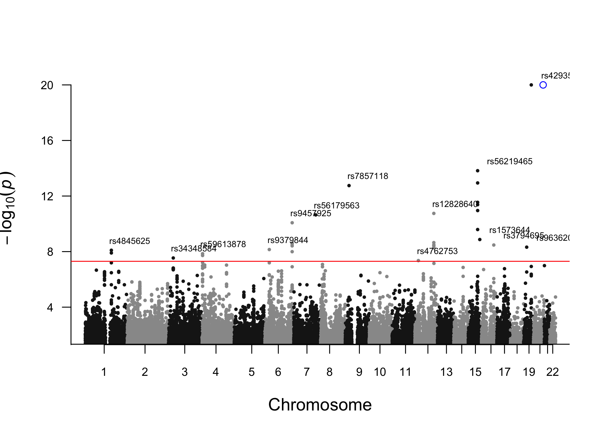
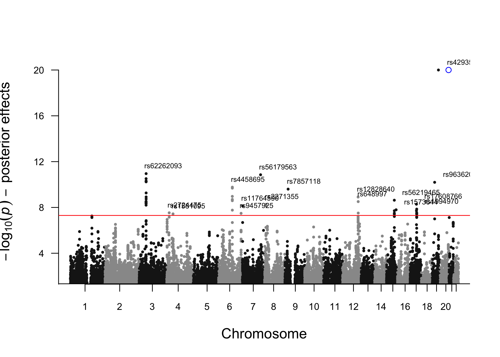

[](https://travis-ci.org/n-mounier/bGWAS)
[](https://github.com/n-mounier/bGWAS)
[](https://www.tidyverse.org/lifecycle/#maturing)
[](https://github.com/n-mounier/bGWAS/commits/master)
[](https://www.gnu.org/licenses/old-licenses/gpl-2.0.en.html)

# bGWAS 

<!--- 
# https://github.com/GuangchuangYu/hexSticker
library(hexSticker)
imgurl <- "inst/Figures/PriorEstimation.jpg"
sticker(imgurl, 
        package="bGWAS", p_size=8, p_color="#B4CE4E",
        h_fill="white", h_color="#A7E4F8",
        s_x=1, s_y=.8, s_width=.75,
        filename="inst/Figures/logo.png", dpi=2000) --->

:information\_source: `bGWAS` has been updated to version 1.0.0.  
Check the [NEWS](NEWS.md) to learn more about what has been modified\!

:warning: If you downloaded the Z-Matrix files before 20/08/2019, they
are now obsolete and you will not be able to use them with the newest
version of the package.  
Note: some Prior GWASs have been removed, you can find more details
[here](doc/ZMatrices.md).

## Overview

bGWAS is an R-package to perform a Bayesian GWAS, using summary
statistics from a conventional GWAS as input. Briefly, it compares the
observed Z-scores for a focal phenotype to prior effects. These prior
effects are directly estimated from publicly available GWASs (currently,
a set of 38 studies, last update 20-08-2019 - hereinafter referred to as
“prior GWASs”). Only prior GWASs having a significant causal effect on
the focal phenotype, identified using a multivariate Mendelian
Randomization (MR) approach, are used to calculate the prior effects.
Causal effects are estimated masking the focal chromosome to ensure
independence.  
Observed and prior effects are compared using Bayes Factors.
Significance is assessed by calculating the probability of observing a
value larger than the observed BF (P-value) given the prior
distribution. This is done by decomposing the analytical form of the BFs
and using an approximation for most BFs to make the computation faster.
Prior, posterior and direct effects, alongside BFs and p-values are
returned. Note that prior, posterior and direct effects are estimated on
the Z-score scale, but are automatically rescaled to beta scale if
possible.

The principal functions available are:

  - **`bGWAS()`**  
    main function that calculates prior effects from prior GWASs,
    compares them to observed Z-scores and returns an object of class
    *bGWAS*

  - **`list_priorGWASs()`**  
    directly returns information about the prior GWASs that can be used
    to calculate prior effects

  - **`select_priorGWASs()`**  
    allows a quick selection of prior GWASs (to include/exclude specific
    studies when calculating prior effects)

  - **`extract_results_bGWAS()`**  
    returns results (prior, posterior and direct estimate /
    standard-error + p-value from BF for SNPs) from an object of class
    *bGWAS*

  - **`manhattan_plot_bGWAS()`**  
    creates a Manhattan Plot from an object of class *bGWAS*

  - **`extract_MRcoeffs_bGWAS()`**  
    returns multivariate MR coefficients (1 estimate using all
    chromosomes + 22 estimates with 1 chromosome masked) from an object
    of class *bGWAS*

  - **`coefficients_plot_bGWAS()`**  
    creates a Coefficients Plot (causal effect of each prior GWASs on
    the focal phenotype) from an object of class *bGWAS*

  - **`heatmap_bGWAS()`**  
    creates a heatmap to represent, for each significant SNP, the
    contribution of each prior GWAS to the estimated prior effect from
    an object of class *bGWAS*

All the functions available and more details about their usage can be
found in the [manual](doc/bGWAS-manual.pdf).

## Installation

You can install the current version of `bGWAS` with:

``` r
# Directly install the package from github
# install.packages("remotes")
remotes::install_github("n-mounier/bGWAS")
library(bGWAS)
```

<!--- Note: using remotes instead of devtools leads to re-build the package
and apparently, it may be a problem with R 3.4 and macOS, 
see https://stackoverflow.com/questions/43595457/alternate-compiler-for-installing-r-packages-clang-error-unsupported-option/43943631#43943631 --->

## Usage

To run the analysis with `bGWAS` two inputs are needed:

#### 1\. The *GWAS* results to be tested

Can be a regular (space/tab/comma-separated) file or a gzipped file
(.gz) or a `data.frame`. Must contain the following columns, which can
have alternative names:  

<ul>

SNP-identifier: `rs` or `rsid`, `snp`, `snpid`, `rnpid` Alternate
allele: `a1` or `alt`, `alts`  
Reference allele: `a2` or `a0`, `ref`  
Z-statistics: `z` or `Z`, `zscore`

</ul>

If the Z-statistics is not present, it will be automatically calculated
from effect size and standard error, in which case the following columns
should be provided:  

<ul>

Effect-size: `b` or `beta`, `beta1`  
Standard error: `se` or `std`

</ul>

If you want the prior/posterior/corrected effects to be rescaled, please
make sure to provide effect sizes and standard errors instead of (or in
addition to) Z-statistics.

#### 2\. Prior *GWASs* - Z-Matrix files

These files should be downloaded separately and stored in `~/ZMatrices`
or in the folder specified when launching the analysis. These files
contains the Z-scores for all prior GWASs :  

<ul>

<ul>

*ZMatrix\_MR.csv.gz*: Z-scores (strong instruments only) used for
multivariate MR,  
*ZMatrix\_Full.csv.gz*: Z-scores (all SNPs) used to calculate the prior
Z-scores,  
*AvailableStudies.tsv*: A file containing information about the prior
GWASs available.

</ul>

</ul>

You can download these files using this
[link](https://drive.switch.ch/index.php/s/jvSwoIxRgCKUSI8) or following
the instructions below.

  - On UNIX/MACOSX, from a terminal:  

<!-- end list -->

``` bash
wget https://drive.switch.ch/index.php/s/jvSwoIxRgCKUSI8/download -O ZMatrices.tar.gz
tar xzvf ZMatrices.tar.gz
```

  - On WINDOWS, from a terminal:  

<!-- end list -->

``` bash
...
```

<font color="grey"><small> If you want to use your own set of prior
GWASs, please have a look [here](doc/ZMatrices.md) to see how you can
modify the files.  
We focused on including prior GWASs that do not come from UKBB, assuming
that the focal phenotype results are more likely to be obtained from
UKBB. Sample overlap between the focal phenotype and the prior GWASs is
not accounted for by our method, so we did not include any UKBB results
in the prior GWASs.</font> </small>

### Study Selection

Before running your analysis, you can select the prior GWASs you want to
include. You can use the function **`list_prioGWASs()`** to get some
information about the prior GWASs available.

You should remove traits that by definition are not independent from
your trait of interest. For example, before analysing BMI results, make
sure to exclude “Height” from the prior GWASs used. You can use the
function **`select_priorGWASs()`** to automatically exclude/include some
traits or some files. You should also check for sample overlap, and
remove prior GWASs that come from the same consortium as your data. If
there are individuals in common between your conventional GWAS and prior
GWASs, it might induce some bias.

``` r
# Obtain the list of prior GWASs
AllStudies = list_priorGWASs()
# Select only the ones for specific traits
# select_priorGWASs will return the IDs of the files that are kept
MyStudies = select_priorGWASs(include_traits=c("Heart Rate", "Body Mass Index", "Smoking"))
# Match these IDs against the ones in the list of prior GWASs 
AllStudies[AllStudies$ID %in% MyStudies, ]
```

    ## # A tibble: 6 x 10
    ##   File   Name      ID Trait  Consortium Reference Download  Remarks  N_SNPs
    ##   <chr>  <chr>  <dbl> <chr>  <chr>      <chr>     <chr>     <chr>     <dbl>
    ## 1 All_a… Body …     1 Body … GIANT      https://… https://… <NA>     6.81e6
    ## 2 META_… Heart…    23 Heart… HRgene     https://… http://w… <NA>     6.81e6
    ## 3 tag.c… Smoki…    35 Smoki… TAG        https://… https://… Other G… 6.63e6
    ## 4 tag.e… Smoki…    36 Smoki… TAG        https://… https://… Other G… 6.78e6
    ## 5 tag.f… Smoki…    37 Smoki… TAG        https://… https://… Other G… 6.78e6
    ## 6 tag.l… Smoki…    38 Smoki… TAG        https://… https://… Other G… 6.77e6
    ##   N_Instruments
    ##           <dbl>
    ## 1         10052
    ## 2          3229
    ## 3           558
    ## 4            94
    ## 5           184
    ## 6            34

### Analysis

  - **Example A**

<!-- end list -->

``` r
# Using a small GWAS (400,000 SNPs, Timmers et al data - stored as a data.frame)
# Please, not that this example is only for illustration, the method is designed
# to be used genome-wide, and using such a low number of SNPs can not yield
# interpretable results.
data("SmallGWAS_Timmers2019")
MyStudies = select_priorGWASs(include_traits=c("Blood Pressure", "Education"),  
include_files=c("cardiogram_gwas_results.txt", "All_ancestries_SNP_gwas_mc_merge_nogc.tbl.uniq.gz"))
# 6 Prior GWASs used
list_priorGWASs(MyStudies)[,c("Name", "Trait", "Reference")]
```

    ## # A tibble: 6 x 3
    ##   Name                                 Trait                  
    ##   <chr>                                <chr>                  
    ## 1 Body Mass Index (GIANT)              Body Mass Index        
    ## 2 Coronary Artery Disease (CARDIoGRAM) Coronary Artery Disease
    ## 3 Years of Schooling (SSGAC)           Education              
    ## 4 Systolic Blood Pressure (ICBP)       Blood Pressure         
    ## 5 Diastolic Blood Pressure (ICBP)      Blood Pressure         
    ## 6 College Completion (SSGAC)           Education              
    ##   Reference                                   
    ##   <chr>                                       
    ## 1 https://www.ncbi.nlm.nih.gov/pubmed/25673413
    ## 2 https://www.ncbi.nlm.nih.gov/pubmed/21378990
    ## 3 https://www.ncbi.nlm.nih.gov/pubmed/27225129
    ## 4 https://www.ncbi.nlm.nih.gov/pubmed/21909115
    ## 5 https://www.ncbi.nlm.nih.gov/pubmed/21909115
    ## 6 https://www.ncbi.nlm.nih.gov/pubmed/23722424

``` r
A = bGWAS(name="Test_UsingSmallDataFrame",
          GWAS = SmallGWAS_Timmers2019,
          prior_studies = MyStudies,
          stepwise_threshold = 0.05)
# MR instruments will be selected using default parameters,
# MR will be performed using a threshold of 0.05 to select studies, and the default shrinkage threshold,
# A subset of prior GWASs (MyStudies) will be used to create the prior,
# Significant SNPs will be identified using default parameters (p<5e-8) and distance-pruned (500kb),
# No file will be saved.
```

  - **Example B**

<!-- end list -->

``` r
# Using a GWAS from our list our prior GWASs
# Using all other (37) GWASs to built the prior
MyGWAS = 3
list_priorGWASs(MyGWAS)[, c("Name", "Trait", "Reference")]
```

    ## # A tibble: 1 x 3
    ##   Name                                 Trait                  
    ##   <chr>                                <chr>                  
    ## 1 Coronary Artery Disease (CARDIoGRAM) Coronary Artery Disease
    ##   Reference                                   
    ##   <chr>                                       
    ## 1 https://www.ncbi.nlm.nih.gov/pubmed/21378990

``` r
B = bGWAS(name = "Test_UsingGWASfromPriorGWASs",
         GWAS = MyGWAS)
# MR instruments will be selected using default parameters,
# MR will be performed using default parameters (stepwise selection / shrinkage threshold)
# All Prior GWASs except the one use as "GWAS" will be used to create the prior,
# Significant SNPs will be identified using default parameters (p<5e-8) and distance-pruned (500kb)
# No file will be saved.
```

### Results

**`bGWAS()`** returns an object of class “bGWAS” than can be handled in
`R`.

``` r
class(A)
```

    ## [1] "bGWAS"

``` r
print(A)
```

    ## -_-_-_-_-_-_-_-_-_-_-_-_-_-_-_ 
    ##  
    ##   Analysis : "Test_UsingSmallDataFrame" 
    ## bGWAS performed on 286,807 SNPs 
    ##  
    ## -_-_-_-_-_-_-_-_-_-_-_-_-_-_-_ 
    ##  
    ## 4 studies used to build the prior : 
    ## # A tibble: 4 x 3
    ##   study                                             estimate std_error
    ##   <chr>                                                <dbl>     <dbl>
    ## 1 EDUyears_2016_sumstat.txt                            0.187    0.0255
    ## 2 All_ancestries_SNP_gwas_mc_merge_nogc.tbl.uniq.gz   -0.122    0.0248
    ## 3 cardiogram_gwas_results.txt                         -0.439    0.0623
    ## 4 DBP                                                 -0.248    0.0623
    ## 
    ## -_-_-_-_-_-_-_-_-_-_-_-_-_-_-_ 
    ##  
    ## 11 significant SNPs identified : 
    ##  rs429358, rs11633958, rs7857118, rs9457925, rs12828640, rs56179563, rs9379844, rs3794695, rs1573644, rs4762753, rs59613878
    ## 
    ## -_-_-_-_-_-_-_-_-_-_-_-_-_-_-_

``` r
print_log_bGWAS(A)
```

    ## <<< Preparation of analysis >>> 
    ## 
    ## > Checking parameters 
    ## The name of your analysis is: "Test_UsingSmallDataFrame". 
    ## The Z-Matrix files are stored in "/Users/nmounier/ZMatrices".  
    ## # Preparation of the data... 
    ## The conventional GWAS used as input the object: "GWAS".  
    ##    SNPID column, ok - ALT column, ok - REF column, ok - BETA column, ok - SE column, ok
    ## Posterior effects will be rescaled using BETA and SE.
    ## The analysis will be run in the folder: "/Users/nmounier/Documents/SGG/Projects/Packaging/bGWAS".  
    ## The p-value threshold used for selecting MR instruments is: 1e-06.  
    ## The minimum number instruments required for each trait is: 3.  
    ## The distance used for pruning MR instruments is: 500Kb.  
    ## Distance-based pruning will be used for MR instruments.  
    ## No shrinkage applied before performing MR.
    ## The p-value threshold used for stepwise selection is 0.05.  
    ## No shrinkage applied before performing calculating the prior.
    ## Significant SNPs will be identified according to p-value. The threshold used is :5e-08.  
    ## The distance used for pruning results is: 500Kb.  
    ## Distance-based pruning will be used for results.  
    ## 
    ## 
    ## <><><><><><><><><><><><><><><><><><><><><><><><><><><><><><><><><><><><><><><><><><><><> 
    ## <<< Identification of significant prior GWASs for MR >>>  
    ## 
    ## > Creating the Z-Matrix of strong instruments 
    ## # Loading the ZMatrix... 
    ## Selecting studies :
    ## 6 studies 
    ## 209,840 SNPs 
    ## # Adding data from the conventional GWAS :  "GWAS" 
    ## Done! 
    ## 8,813 SNPs in common between prior studies and the conventional GWAS 
    ## # Thresholding... 
    ## 767 SNPs left after thresholding 
    ## 6 studies left after thresholding 
    ## Pruning MR instruments... 
    ##    distance : 500Kb 
    ## 159 SNPs left after pruning 
    ## 6 studies left after thresholding+pruning 
    ## 
    ## > Performing MR  
    ## #Preparation of the MR analyses to identify significant studies... 
    ## Studies tested : Body Mass Index (GIANT) - Coronary Artery Disease (CARDIoGRAM) - Years of Schooling (SSGAC) - Systolic Blood Pressure (ICBP) - Diastolic Blood Pressure (ICBP) - College Completion (SSGAC)
    ## Conventionnal GWAS of interest : GWAS
    ## # Univariate regressions for each trait... 
    ##   Number of trait-specific instruments per univariate regression: 
    ##   . Body Mass Index (GIANT) : 59 
    ##   . Coronary Artery Disease (CARDIoGRAM) : 6 
    ##   . Years of Schooling (SSGAC) : 83 
    ##   . Systolic Blood Pressure (ICBP) : 8 
    ##   . Diastolic Blood Pressure (ICBP) : 8 
    ##   . College Completion (SSGAC) : 4 
    ## Done! 
    ## # Stepwise selection (all traits)... 
    ## Adding the first study :Years of Schooling (SSGAC) 
    ## #Test if any study can be added with p<0.05 
    ## Adding one study :Systolic Blood Pressure (ICBP) 
    ## Done! 
    ## #Test if any study has p>0.05 now 
    ## #Test if any study can be added with p<0.05 
    ## Adding one study :Body Mass Index (GIANT) 
    ## Done! 
    ## #Test if any study has p>0.05 now 
    ## #Test if any study can be added with p<0.05 
    ## Adding one study :Coronary Artery Disease (CARDIoGRAM) 
    ## Done! 
    ## #Test if any study has p>0.05 now 
    ## #Test if any study can be added with p<0.05 
    ## Adding one study :Diastolic Blood Pressure (ICBP) 
    ## Done! 
    ## #Test if any study has p>0.05 now 
    ## Excluding one study :Systolic Blood Pressure (ICBP) 
    ## Done! 
    ## #Test if any study can be added with p<0.05 
    ## #Test if any study has p>0.05 now 
    ## It converged! 
    ## # Final regression... 
    ## The studies used are: 
    ## - Years of Schooling (SSGAC)- Body Mass Index (GIANT)- Coronary Artery Disease (CARDIoGRAM)- Diastolic Blood Pressure (ICBP)
    ## 
    ## Estimating adjusted R-squared: 
    ## - in-sample adjusted R-squared for the all-chromosomes multivariate regression is 0.5534 
    ## - out-of-sample R-squared (masking one chromosome at a time), for the multivariate regression will be estimated when calculating the prior. 
    ## 
    ## 
    ## <><><><><><><><><><><><><><><><><><><><><><><><><><><><><><><><><><><><><><><><><><><><> 
    ## <<< Estimation of the prior >>>  
    ## 
    ## > Creating the full Z-Matrix  
    ## # Loading the ZMatrix... 
    ## Selecting studies :
    ## 4 studies 
    ## 6,811,310 SNPs 
    ## # Adding data from the conventional GWAS :  "GWAS" 
    ## Done! 
    ## 286,807 SNPs in common between prior studies and the conventional GWAS 
    ## 
    ## > Computing prior  
    ## # Calculating the prior chromosome by chromosome... 
    ##    Chromosome 1
    ## Running regression, 
    ## Calculating prior estimates for SNPs on this chromosome, 
    ## Calculating prior standard errors for SNPs on this chromosome, 
    ##    Chromosome 2
    ## Running regression, 
    ## Calculating prior estimates for SNPs on this chromosome, 
    ## Calculating prior standard errors for SNPs on this chromosome, 
    ##    Chromosome 3
    ## Running regression, 
    ## Calculating prior estimates for SNPs on this chromosome, 
    ## Calculating prior standard errors for SNPs on this chromosome, 
    ##    Chromosome 4
    ## Running regression, 
    ## Calculating prior estimates for SNPs on this chromosome, 
    ## Calculating prior standard errors for SNPs on this chromosome, 
    ##    Chromosome 5
    ## Running regression, 
    ## Calculating prior estimates for SNPs on this chromosome, 
    ## Calculating prior standard errors for SNPs on this chromosome, 
    ##    Chromosome 6
    ## Running regression, 
    ## Calculating prior estimates for SNPs on this chromosome, 
    ## Calculating prior standard errors for SNPs on this chromosome, 
    ##    Chromosome 7
    ## Running regression, 
    ## Calculating prior estimates for SNPs on this chromosome, 
    ## Calculating prior standard errors for SNPs on this chromosome, 
    ##    Chromosome 8
    ## Running regression, 
    ## Calculating prior estimates for SNPs on this chromosome, 
    ## Calculating prior standard errors for SNPs on this chromosome, 
    ##    Chromosome 9
    ## Running regression, 
    ## Calculating prior estimates for SNPs on this chromosome, 
    ## Calculating prior standard errors for SNPs on this chromosome, 
    ##    Chromosome 10
    ## Running regression, 
    ## Calculating prior estimates for SNPs on this chromosome, 
    ## Calculating prior standard errors for SNPs on this chromosome, 
    ##    Chromosome 11
    ## Running regression, 
    ## Calculating prior estimates for SNPs on this chromosome, 
    ## Calculating prior standard errors for SNPs on this chromosome, 
    ##    Chromosome 12
    ## Running regression, 
    ## Calculating prior estimates for SNPs on this chromosome, 
    ## Calculating prior standard errors for SNPs on this chromosome, 
    ##    Chromosome 13
    ## Running regression, 
    ## Calculating prior estimates for SNPs on this chromosome, 
    ## Calculating prior standard errors for SNPs on this chromosome, 
    ##    Chromosome 14
    ## Running regression, 
    ## Calculating prior estimates for SNPs on this chromosome, 
    ## Calculating prior standard errors for SNPs on this chromosome, 
    ##    Chromosome 15
    ## Running regression, 
    ## Calculating prior estimates for SNPs on this chromosome, 
    ## Calculating prior standard errors for SNPs on this chromosome, 
    ##    Chromosome 16
    ## Running regression, 
    ## Calculating prior estimates for SNPs on this chromosome, 
    ## Calculating prior standard errors for SNPs on this chromosome, 
    ##    Chromosome 17
    ## Running regression, 
    ## Calculating prior estimates for SNPs on this chromosome, 
    ## Calculating prior standard errors for SNPs on this chromosome, 
    ##    Chromosome 18
    ## Running regression, 
    ## Calculating prior estimates for SNPs on this chromosome, 
    ## Calculating prior standard errors for SNPs on this chromosome, 
    ##    Chromosome 19
    ## Running regression, 
    ## Calculating prior estimates for SNPs on this chromosome, 
    ## Calculating prior standard errors for SNPs on this chromosome, 
    ##    Chromosome 20
    ## Running regression, 
    ## Calculating prior estimates for SNPs on this chromosome, 
    ## Calculating prior standard errors for SNPs on this chromosome, 
    ##    Chromosome 21
    ## Running regression, 
    ## Calculating prior estimates for SNPs on this chromosome, 
    ## Calculating prior standard errors for SNPs on this chromosome, 
    ##    Chromosome 22
    ## Running regression, 
    ## Calculating prior estimates for SNPs on this chromosome, 
    ## Calculating prior standard errors for SNPs on this chromosome, 
    ## ## Out-of-sample R-squared for MR instruments across all chromosomes is 0.5206
    ## ## Out-of-sample squared correlation for MR instruments across all chromosome is 0.5271
    ## ## Correlation between prior and observed effects for all SNPs is 0.1855
    ## ## Correlation between prior and observed effects for SNPs with GWAS p-value < 0.001 is 0.5944
    ## Done! 
    ## 
    ## 
    ## <><><><><><><><><><><><><><><><><><><><><><><><><><><><><><><><><><><><><><><><><><><><> 
    ## <<< Calculation of Bayes Factors and p-values >>>  
    ## 
    ## > Calculating them for all SNPs  
    ## # Computing observed Bayes Factor for all SNPs... 
    ## Done! 
    ## # Computing BF p-values... 
    ##    using a distribution approach: 
    ## ... getting approximated p-values using non-linear quantiles  
    ## ... checking p-values near significance threshold  
    ##     everything is ok!  
    ## # Estimating p-values for posterior effects... 
    ## Done! 
    ## # Estimating p-values for direct effects... 
    ## Done! 
    ## Done! 
    ## > Pruning and identifying significant SNPs 
    ## Identification based on BFs 
    ##    Starting with 286,807 SNPs 
    ## # Selecting significant SNPs according to p-values... 
    ## 31 SNPs left 
    ## Done! 
    ## # Pruning significant SNPs... 
    ##    distance : 500Kb 
    ## 11 SNPs left 
    ## Done! 
    ## Identification based on posterior effects 
    ##    Starting with 286,807 SNPs 
    ## # Selecting significant SNPs according to p-values... 
    ## 11 SNPs left 
    ## Done! 
    ## # Pruning significant SNPs... 
    ##    distance : 500Kb 
    ## 6 SNPs left 
    ## Done! 
    ## Identification based on direct effects 
    ##    Starting with 286,807 SNPs 
    ## # Selecting significant SNPs according to p-values... 
    ## 3 SNPs left 
    ## Done! 
    ## # Pruning significant SNPs... 
    ##    distance : 500Kb 
    ## 2 SNPs left 
    ## Done! 
    ## 
    ## 
    ## <><><><><><><><><><><><><><><><><><><><><><><><><><><><><><><><><><><><><><><><><><><><>
    ## Time of the analysis: 1 minute(s) and 36 second(s).

Functions to extract results from an object of class *bGWAS*:

``` r
# by default, extract "BF" results...
hits = extract_results_bGWAS(A, SNPs = "significant")
hits
```

    ## # A tibble: 11 x 10
    ##    rsid       chrm_UK10K pos_UK10K alt   ref    z_obs mu_prior_estimate
    ##    <chr>           <dbl>     <dbl> <chr> <chr>  <dbl>             <dbl>
    ##  1 rs429358           19  45411941 T     C      19.3             -0.351
    ##  2 rs11633958         15  78862064 T     C     -10.2             -0.190
    ##  3 rs7857118           9  22124140 A     T       6.20             2.61 
    ##  4 rs9457925           6 160848743 A     G      -6.03            -1.72 
    ##  5 rs12828640         12 111361298 A     G      -5.74            -2.34 
    ##  6 rs56179563          7 129685597 A     G       5.19             3.37 
    ##  7 rs9379844           6  26291527 A     G       5.50             1.43 
    ##  8 rs3794695          16  72097827 T     C      -5.30            -1.69 
    ##  9 rs1573644          15  91421283 T     C       4.88             2.43 
    ## 10 rs4762753          12  20579969 T     G       5.31             1.16 
    ## 11 rs59613878          4   3139152 T     C       4.90             1.78 
    ##    mu_prior_std_error      BF     BF_p
    ##                 <dbl>   <dbl>    <dbl>
    ##  1               1.16 1.24e45 6.01e-68
    ##  2               1.16 1.30e13 1.85e-21
    ##  3               1.32 1.26e 7 9.21e-13
    ##  4               1.17 1.00e 6 4.19e-11
    ##  5               1.20 8.51e 5 5.36e-11
    ##  6               1.23 2.31e 5 3.93e-10
    ##  7               1.14 6.57e 4 2.71e- 9
    ##  8               1.16 5.16e 4 3.94e- 9
    ##  9               1.21 2.76e 4 1.04e- 8
    ## 10               1.16 2.20e 4 1.47e- 8
    ## 11               1.16 1.36e 4 3.11e- 8

``` r
all_results = extract_results_bGWAS(A, SNPs = "all")
nrow(all_results)
```

    ## [1] 286807

``` r
# but also possible to extract SNPs with significant posterior/direct effects
extract_results_bGWAS(A, SNPs = "significant", results = "direct")
```

    ## # A tibble: 2 x 10
    ##   rsid       chrm_UK10K pos_UK10K alt   ref   z_obs mu_direct_estimate
    ##   <chr>           <dbl>     <dbl> <chr> <chr> <dbl>              <dbl>
    ## 1 rs429358           19  45411941 T     C      19.3              19.7 
    ## 2 rs11633958         15  78862064 T     C     -10.2              -9.99
    ##   mu_direct_std_error z_direct p_direct
    ##                 <dbl>    <dbl>    <dbl>
    ## 1                1.53    12.8  8.90e-38
    ## 2                1.53    -6.51 7.28e-11

``` r
extract_MRcoeffs_bGWAS(A)[,1:12]
```

    ## # A tibble: 4 x 12
    ##   name        study        estimate std_error Tstat        P chrm1_estimate
    ##   <chr>       <chr>           <dbl>     <dbl> <dbl>    <dbl>          <dbl>
    ## 1 Years of S… EDUyears_20…    0.187    0.0255  7.33 1.32e-11          0.187
    ## 2 Body Mass … All_ancestr…   -0.122    0.0248 -4.93 2.12e- 6         -0.108
    ## 3 Coronary A… cardiogram_…   -0.439    0.0623 -7.05 6.18e-11         -0.469
    ## 4 Diastolic … DBP            -0.248    0.0623 -3.98 1.07e- 4         -0.264
    ##   chrm1_std_error  chrm1_P chrm2_estimate chrm2_std_error  chrm2_P
    ##             <dbl>    <dbl>          <dbl>           <dbl>    <dbl>
    ## 1          0.0258 2.93e-11          0.186          0.0273 3.01e-10
    ## 2          0.0259 5.55e- 5         -0.124          0.0268 8.72e- 6
    ## 3          0.0616 4.27e-12         -0.439          0.0685 2.24e- 9
    ## 4          0.0619 3.78e- 5         -0.250          0.0653 1.93e- 4

Functions for graphic representations:

``` r
# Coefficients plot
coefficients_plot_bGWAS(A) 
```


``` r
# Manhattan plot using BFs p-values
manhattan_plot_bGWAS(A)
```



``` r
# Manhattan plot using posterior p-values
manhattan_plot_bGWAS(A, results="posterior")
```



##### Aditionnaly, if `save_files=T`, several files are created in the folder `./name/` :

  - **name.log** - log file  
  - **PriorGWASs.tsv** - contains information about all prior GWASs
    (general info + status (used/removed) + univariate/multivariate MR
    estimates)  
  - **CoefficientsByChromosome.csv** - contains the multivariate MR
    estimates when masking the focal chromosome (22 coefficients for
    each prior GWASs used for prior estimation)  
  - **PriorBFp.csv** - contains BF and p-values, prior, posterior and
    direct effects estimates for all SNPs  
  - **SignificantSNPs.csv** - contains BF and p-values, prior, posterior
    and direct effects estimates for a subset of significant SNPs
    (identified according to specified parameters)

A detailed description of these files can be found
[here](doc/OutputFiles.md).

## Runtime

Analysis using all the 38 prior GWASs available, for a conventional GWAS
containing \~7M SNPs in common with the prior studies \~ 20 minutes (see
complete Lifespan Analysis [here](doc/Lifespan_Analysis.md)).

Analysis using 6 prior GWASs, for a conventional GWAS containing \~
300,000 SNPs in common with prior studies (see example A) \~ 2 minutes.

## Contact

<mounier.ninon@gmail.com>
