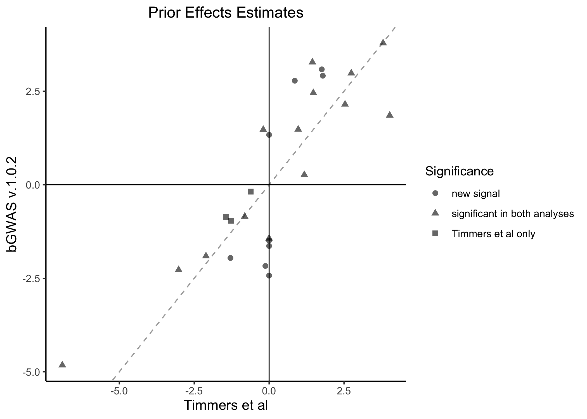
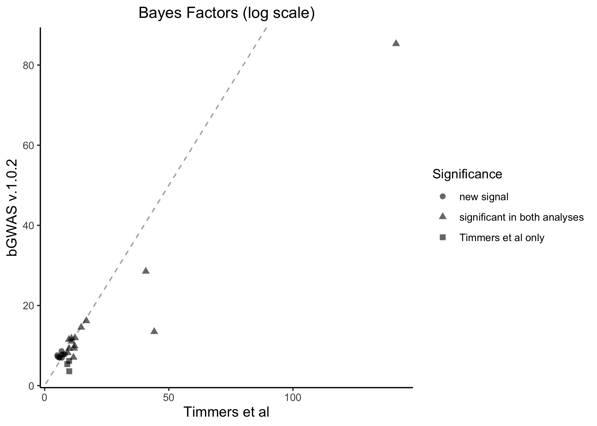
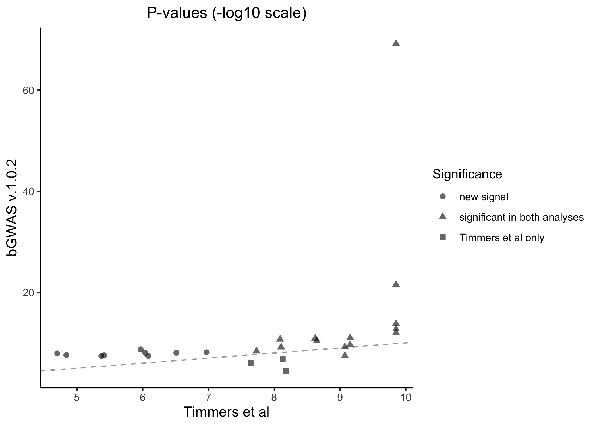
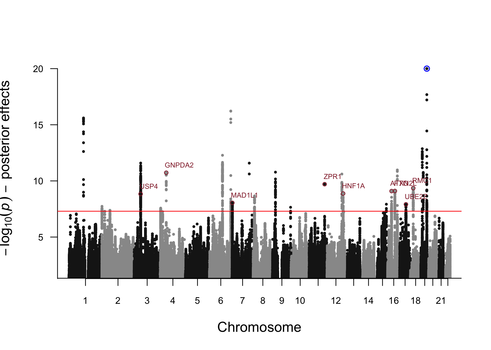
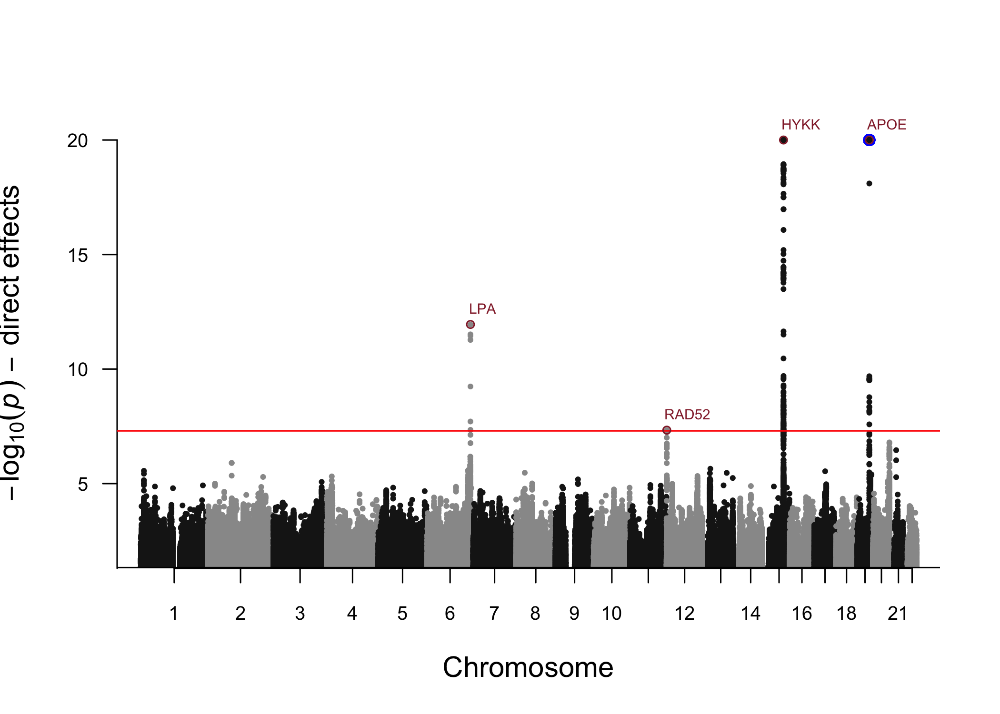

Lifespan Analysis
================

  - [Description](#description)
  - [Risk factors (Prior GWASs) used](#risk-factors-prior-gwass-used)
  - [Results - BF](#results---bf)
      - [All significant hits](#all-significant-hits)
      - [New hits](#new-hits)
      - [New hits, association with risk
        factors](#new-hits-association-with-risk-factors)
      - [Comparison with Timmers *et al*
        results](#comparison-with-timmers-et-al-results)
  - [Results - Posterior Effects](#results---posterior-effects)
      - [All significant hits](#all-significant-hits-1)
      - [New hits](#new-hits-1)
      - [New hits, association with risk
        factors](#new-hits-association-with-risk-factors-1)
  - [Results - Direct Effects](#results---direct-effects)
      - [variant near LPA](#variant-near-lpa)
      - [variant near RAD52](#variant-near-rad52)
      - [variant near HYKK](#variant-near-hykk)
      - [variant near APOE](#variant-near-apoe)

## Description

In this example, we will use the data from [Timmers *et
al*](https://doi.org/10.7554/eLife.39856) to apply our Bayesian GWAS
approach to study lifespan.  
Here, we assume that the `bGWAS` package is already installed, that the
Z-matrix files have already been downloaded and stored in
`"~/ZMatrices"`. If that is not the case, please follow the steps
described [here](../README.md).

``` r
library(bGWAS) # bGWAS github version: v.1.0.2

# Download data to working directory (~460 MB) if not already here
if(!file.exists("lifegen_phase2_bothpl_alldr_2017_09_18.tsv.gz")) download.file(url = "https://datashare.is.ed.ac.uk/bitstream/handle/10283/3209/lifegen_phase2_bothpl_alldr_2017_09_18.tsv.gz?sequence=1&isAllowed=y", destfile = "lifegen_phase2_bothpl_alldr_2017_09_18.tsv.gz")
```

Now that we have the data in our working directory, we can launch the
analysis (with default parameters):

``` r
Lifespan_bGWAS = bGWAS(name = "Lifespan_Timmers2019",
                       GWAS = "lifegen_phase2_bothpl_alldr_2017_09_18.tsv.gz")
```

<details>

<summary> See log </summary>

``` r
Lifespan_bGWAS = bGWAS(name = "Lifespan_Timmers2019",
                       GWAS = "lifegen_phase2_bothpl_alldr_2017_09_18.tsv.gz")
```

    ## <<< Preparation of analysis >>> 
    ## > Checking parameters 
    ## The name of your analysis is: "Lifespan_Timmers2019". 
    ## The Z-Matrix files are stored in "/Users/nmounier/ZMatrices".  
    ## # Preparation of the data... 
    ## The conventional GWAS used as input is: "lifegen_phase2_bothpl_alldr_2017_09_18.tsv.gz".  
    ##    SNPID column, ok - ALT column, ok - REF column, ok - BETA column, ok - SE column, ok
    ## Posterior effects will be rescaled using BETA and SE.The analysis will be run in the folder: "/Users/nmounier/Documents/SGG/Projects/Packaging/bGWAS/doc".  
    ## The p-value threshold used for selecting MR instruments is: 1e-06.  
    ## The minimum number instruments required for each trait is: 3.  
    ## The distance used for pruning MR instruments is: 500Kb.  
    ## Distance-based pruning will be used for MR instruments.  
    ## No shrinkage applied before performing MR.The p-value threshold used for stepwise selection will be derived according to the number of Prior GWASs used.  
    ## Using MR_shrinkage as default for prior_shrinkage:No shrinkage applied before performing calculating the prior.The p-value threshold used for stepwise selection will be derived according to the number of Prior GWASs used.  
    ## Significant SNPs will be identified according to p-value. The threshold used is :5e-08.  
    ## The distance used for pruning results is: 500Kb.  
    ## Distance-based pruning will be used for results.  
    ## <><><><><><><><><><><><><><><><><><><><><><><><><><><><><><><><><><><><><><><><><><><><> 
    ## <<< Identification of significant prior GWASs for MR >>>  
    ## > Creating the Z-Matrix of strong instruments 
    ## # Loading the ZMatrix... 
    ## Selecting studies :
    ## 38 studies 
    ## 209,840 SNPs 
    ## # Adding data from the conventional GWAS : 
    ##  "lifegen_phase2_bothpl_alldr_2017_09_18.tsv.gz" 
    ## Done! 
    ## 197,681 SNPs in common between prior studies and the conventional GWAS 
    ## # Thresholding... 
    ## 134,807 SNPs left after thresholding 
    ## Neuroticism (GPC) - Smoking - ever smoked (TAG) - Smoking - age of onset (TAG) : removed (less than 3 instrument after thresholding) 
    ## 35 studies left after thresholding 
    ## Pruning MR instruments... 
    ##    distance : 500Kb 
    ## 1,934 SNPs left after pruning 
    ## Anorexia (GCAN) - Openness to Experience (GPC) - Extraversion (GPC) - Insulin (MAGIC) - 2010 - HOMA-IR (MAGIC) - Depression (PGC) - Autism (PGC) - Smoking - cigarettes per day (TAG) - Smoking - former smoker (TAG) : removed (less than 3 strong instrument after pruning) 
    ## 26 studies left after thresholding+pruning 
    ## 1,927 SNPs left after removing studies with only one strong instrument 
    ## > Performing MR  
    ## #Preparation of the MR analyses to identify significant studies... 
    ## Conventionnal GWAS of interest : lifegen_phase2_bothpl_alldr_2017_09_18.tsv.gz
    ## # Univariate regressions for each trait... 
    ##   Number of trait-specific instruments per univariate regression: 
    ##   . Body Mass Index (GIANT) : 89 
    ##   . Schizophrenia (PGC) - 2014 : 6 
    ##   . Coronary Artery Disease (CARDIoGRAM) : 12 
    ##   . Type 2 Diabetes (DIAGRAM) : 12 
    ##   . Years of Schooling (SSGAC) : 80 
    ##   . Glucose (ENGAGE) : 11 
    ##   . Crohns Disease (IBD) : 43 
    ##   . Ulcerative Colitis (IBD) : 75 
    ##   . HDL Cholesterol (GLGC) : 72 
    ##   . LDL Cholesterol (GLGC) : 57 
    ##   . Total Cholesterol (GLGC) : 73 
    ##   . Triglycerides (GLGC) : 51 
    ##   . Glucose (MAGIC) - 2010 : 10 
    ##   . HOMA-B (MAGIC) : 6 
    ##   . Glucose (MAGIC) : 17 
    ##   . Insulin (MAGIC) : 5 
    ##   . Heart Rate (HRgene) : 14 
    ##   . Height (GIANT) : 522 
    ##   . Parkinsons : 382 
    ##   . Neuroblastoma : 353 
    ##   . Multiple Sclerosis : 153 
    ##   . Systolic Blood Pressure (ICBP) : 8 
    ##   . Diastolic Blood Pressure (ICBP) : 9 
    ##   . Schizophrenia (PGC) - 2013 : 19 
    ##   . Schizophrenia (PGC) : 107 
    ##   . College Completion (SSGAC) : 3 
    ## Done! 
    ## # Stepwise selection (all traits)... 
    ## The p-value threshold used for stepwise selection is 0.0019 (26 Prior GWASs tested).  
    ## Studies tested (reaching p<0.05 in univariate models) : 
    ##  Years of Schooling (SSGAC) 
    ##  Body Mass Index (GIANT) 
    ##  Coronary Artery Disease (CARDIoGRAM) 
    ##  Ulcerative Colitis (IBD) 
    ##  HDL Cholesterol (GLGC) 
    ##  LDL Cholesterol (GLGC) 
    ##  Total Cholesterol (GLGC) 
    ##  Triglycerides (GLGC) 
    ##  Glucose (MAGIC) - 2010 
    ##  Glucose (MAGIC) 
    ##  Systolic Blood Pressure (ICBP) 
    ##  Diastolic Blood Pressure (ICBP)
    ## Adding the first study :Years of Schooling (SSGAC) 
    ##   iteration 1: 1 studies 
    ## #Run model 
    ## #Test if any study can be added with p<0.0019 
    ## Adding one study :LDL Cholesterol (GLGC) 
    ## Done! 
    ## #Update model 
    ## #Test if any study has p>0.0019 now 
    ##   iteration 2: 2 studies 
    ## #Run model 
    ## #Test if any study can be added with p<0.0019 
    ## Adding one study :Body Mass Index (GIANT) 
    ## Done! 
    ## #Update model 
    ## #Test if any study has p>0.0019 now 
    ##   iteration 3: 3 studies 
    ## #Run model 
    ## #Test if any study can be added with p<0.0019 
    ## Adding one study :Coronary Artery Disease (CARDIoGRAM) 
    ## Done! 
    ## #Update model 
    ## #Test if any study has p>0.0019 now 
    ##   iteration 4: 4 studies 
    ## #Run model 
    ## #Test if any study can be added with p<0.0019 
    ## Adding one study :Diastolic Blood Pressure (ICBP) 
    ## Done! 
    ## #Update model 
    ## #Test if any study has p>0.0019 now 
    ##   iteration 5: 5 studies 
    ## #Run model 
    ## #Test if any study can be added with p<0.0019 
    ## #Update model 
    ## #Test if any study has p>0.0019 now 
    ## It converged! 
    ## # Final regression... 
    ## The studies used are: 
    ## - Years of Schooling (SSGAC)
    ## - LDL Cholesterol (GLGC)
    ## - Body Mass Index (GIANT)
    ## - Coronary Artery Disease (CARDIoGRAM)
    ## - Diastolic Blood Pressure (ICBP)
    ## Estimating adjusted R-squared: 
    ## - in-sample adjusted R-squared for the all-chromosomes multivariate regression is 0.5435 
    ## - out-of-sample R-squared (masking one chromosome at a time), for the multivariate regression will be estimated when calculating the prior. 
    ## <><><><><><><><><><><><><><><><><><><><><><><><><><><><><><><><><><><><><><><><><><><><> 
    ## <<< Estimation of the prior >>>  
    ## > Creating the full Z-Matrix  
    ## # Loading the ZMatrix... 
    ## Selecting studies :
    ## 5 studies 
    ## 6,811,310 SNPs 
    ## # Adding data from the conventional GWAS : 
    ##  "lifegen_phase2_bothpl_alldr_2017_09_18.tsv.gz" 
    ## Done! 
    ## 6,513,704 SNPs in common between prior studies and the conventional GWAS 
    ## > Computing prior  
    ## # Calculating the prior chromosome by chromosome... 
    ##    Chromosome 1
    ## Running regression, 
    ## Calculating prior estimates for SNPs on this chromosome, 
    ## Calculating prior standard errors for SNPs on this chromosome, 
    ##    Chromosome 2
    ## Running regression, 
    ## Calculating prior estimates for SNPs on this chromosome, 
    ## Calculating prior standard errors for SNPs on this chromosome, 
    ##    Chromosome 3
    ## Running regression, 
    ## Calculating prior estimates for SNPs on this chromosome, 
    ## Calculating prior standard errors for SNPs on this chromosome, 
    ##    Chromosome 4
    ## Running regression, 
    ## Calculating prior estimates for SNPs on this chromosome, 
    ## Calculating prior standard errors for SNPs on this chromosome, 
    ##    Chromosome 5
    ## Running regression, 
    ## Calculating prior estimates for SNPs on this chromosome, 
    ## Calculating prior standard errors for SNPs on this chromosome, 
    ##    Chromosome 6
    ## Running regression, 
    ## Calculating prior estimates for SNPs on this chromosome, 
    ## Calculating prior standard errors for SNPs on this chromosome, 
    ##    Chromosome 7
    ## Running regression, 
    ## Calculating prior estimates for SNPs on this chromosome, 
    ## Calculating prior standard errors for SNPs on this chromosome, 
    ##    Chromosome 8
    ## Running regression, 
    ## Calculating prior estimates for SNPs on this chromosome, 
    ## Calculating prior standard errors for SNPs on this chromosome, 
    ##    Chromosome 9
    ## Running regression, 
    ## Calculating prior estimates for SNPs on this chromosome, 
    ## Calculating prior standard errors for SNPs on this chromosome, 
    ##    Chromosome 10
    ## Running regression, 
    ## Calculating prior estimates for SNPs on this chromosome, 
    ## Calculating prior standard errors for SNPs on this chromosome, 
    ##    Chromosome 11
    ## Running regression, 
    ## Calculating prior estimates for SNPs on this chromosome, 
    ## Calculating prior standard errors for SNPs on this chromosome, 
    ##    Chromosome 12
    ## Running regression, 
    ## Calculating prior estimates for SNPs on this chromosome, 
    ## Calculating prior standard errors for SNPs on this chromosome, 
    ##    Chromosome 13
    ## Running regression, 
    ## Calculating prior estimates for SNPs on this chromosome, 
    ## Calculating prior standard errors for SNPs on this chromosome, 
    ##    Chromosome 14
    ## Running regression, 
    ## Calculating prior estimates for SNPs on this chromosome, 
    ## Calculating prior standard errors for SNPs on this chromosome, 
    ##    Chromosome 15
    ## Running regression, 
    ## Calculating prior estimates for SNPs on this chromosome, 
    ## Calculating prior standard errors for SNPs on this chromosome, 
    ##    Chromosome 16
    ## Running regression, 
    ## Calculating prior estimates for SNPs on this chromosome, 
    ## Calculating prior standard errors for SNPs on this chromosome, 
    ##    Chromosome 17
    ## Running regression, 
    ## Calculating prior estimates for SNPs on this chromosome, 
    ## Calculating prior standard errors for SNPs on this chromosome, 
    ##    Chromosome 18
    ## Running regression, 
    ## Calculating prior estimates for SNPs on this chromosome, 
    ## Calculating prior standard errors for SNPs on this chromosome, 
    ##    Chromosome 19
    ## Running regression, 
    ## Calculating prior estimates for SNPs on this chromosome, 
    ## Calculating prior standard errors for SNPs on this chromosome, 
    ##    Chromosome 20
    ## Running regression, 
    ## Calculating prior estimates for SNPs on this chromosome, 
    ## Calculating prior standard errors for SNPs on this chromosome, 
    ##    Chromosome 21
    ## Running regression, 
    ## Calculating prior estimates for SNPs on this chromosome, 
    ## Calculating prior standard errors for SNPs on this chromosome, 
    ##    Chromosome 22
    ## Running regression, 
    ## Calculating prior estimates for SNPs on this chromosome, 
    ## Calculating prior standard errors for SNPs on this chromosome, 
    ## ## Out-of-sample R-squared for MR instruments across all chromosomes is 0.5298
    ## ## Out-of-sample squared correlation for MR instruments across all chromosome is 0.53
    ## ## Correlation between prior and observed effects for all SNPs is 0.1953
    ## ## Correlation between prior and observed effects for SNPs with GWAS p-value < 0.001 is 0.6141
    ## Done! 
    ## <><><><><><><><><><><><><><><><><><><><><><><><><><><><><><><><><><><><><><><><><><><><> 
    ## <<< Calculation of Bayes Factors and p-values >>>  
    ## > Calculating them for all SNPs  
    ## # Computing observed Bayes Factor for all SNPs... 
    ## Done! 
    ## # Computing BF p-values... 
    ##    using a distribution approach: 
    ## ... getting approximated p-values using non-linear quantiles  
    ## ... checking p-values near significance threshold  
    ##    9 p-values have been re-estimated using the exact formula.  
    ## # Estimating p-values for posterior effects... 
    ## Done! 
    ## # Estimating p-values for direct effects... 
    ## Done! 
    ## > Pruning and identifying significant SNPs 
    ## Identification based on BFs 
    ##    Starting with 6,513,704 SNPs 
    ## # Selecting significant SNPs according to p-values... 
    ## 871 SNPs left 
    ## Done! 
    ## # Pruning significant SNPs... 
    ##    distance : 500Kb 
    ## 28 SNPs left 
    ## Done! 
    ## Identification based on posterior effects 
    ##    Starting with 6,513,704 SNPs 
    ## # Selecting significant SNPs according to p-values... 
    ## 975 SNPs left 
    ## Done! 
    ## # Pruning significant SNPs... 
    ##    distance : 500Kb 
    ## 28 SNPs left 
    ## Done! 
    ## Identification based on direct effects 
    ##    Starting with 6,513,704 SNPs 
    ## # Selecting significant SNPs according to p-values... 
    ## 166 SNPs left 
    ## Done! 
    ## # Pruning significant SNPs... 
    ##    distance : 500Kb 
    ## 4 SNPs left 
    ## Done! 
    ## <><><><><><><><><><><><><><><><><><><><><><><><><><><><><><><><><><><><><><><><><><><><>
    ## Time of the analysis: 94 minute(s) and 15 second(s).

</details>

We can now look at the results more in details.

## Risk factors (Prior GWASs) used

``` r
coefficients_plot_bGWAS(Lifespan_bGWAS)
```


5 risk factors are used to create the prior, the multivariate causal
effect estimates are consistent with what we would expect. On this
figure, the multivariate causal effect estimate and the 95% interval
from the multivariate MR model using all chromosomes (black dot and
bars) as well as the 22 per-chromosome estimates (grey bars) are
represented for each prior GWASs. Coronary Artery Disease (CAD) has the
strongest negative effect on lifespan. High Diastolic Blood Pressure
(DBP) and Body Mass Index (BMI) also decreases lifespan. We can also see
that education, in this case the number of years of schooling, has a
positive effect on lifespan.

Overall, the squared correlation between prior and observed effects is
about 0.038 and goes up to 0.377 when we consider only SNPs having at
least a moderate effect on lifespan (observed p-value \< 0.001).  
Using the previous version (Timmers et al), squared correlation was
around 0.003 when considering all SNPs and around 0.082 for SNPs having
a moderate effect.

## Results - BF

### All significant hits

With this approach, we identified 28 SNPs affecting lifespan through the
selected risk factors:

``` r
# all hits
extract_results_bGWAS(Lifespan_bGWAS) %>% 
  mutate(BF = as.character(format(BF, scientific=T, digits=3)), BF_p = as.character(format(BF_p, scientific=T, digits=3))) %>%
  arrange(chrm_UK10K, pos_UK10K) -> Hits
knitr::kable(Hits, digits=3)
```

| rsid       | chrm\_UK10K | pos\_UK10K | alt | ref |    beta |    se |  z\_obs | mu\_prior\_estimate | mu\_prior\_std\_error | beta\_prior\_estimate | beta\_prior\_std\_error | BF       | BF\_p    |
| :--------- | ----------: | ---------: | :-- | :-- | ------: | ----: | ------: | ------------------: | --------------------: | --------------------: | ----------------------: | :------- | :------- |
| rs646776   |           1 |  109818530 | T   | C   | \-0.023 | 0.005 | \-4.908 |             \-4.822 |                 0.748 |               \-0.022 |                   0.003 | 1.36e+05 | 1.21e-11 |
| rs1230666  |           1 |  114173410 | A   | G   | \-0.032 | 0.006 | \-5.805 |             \-1.433 |                 0.527 |               \-0.008 |                   0.003 | 1.03e+04 | 6.99e-10 |
| rs7536152  |           1 |  154423909 | A   | G   | \-0.018 | 0.004 | \-4.627 |             \-1.636 |                 0.544 |               \-0.006 |                   0.002 | 1.24e+03 | 2.86e-08 |
| rs6719980  |           2 |     651507 | T   | C   | \-0.028 | 0.005 | \-5.407 |             \-1.906 |                 0.581 |               \-0.010 |                   0.003 | 1.97e+04 | 2.45e-10 |
| rs1275922  |           2 |   26932887 | A   | G   | \-0.026 | 0.004 | \-5.817 |             \-0.850 |                 0.515 |               \-0.004 |                   0.002 | 1.15e+03 | 3.31e-08 |
| rs7599488  |           2 |   60718347 | T   | C   | \-0.018 | 0.004 | \-4.663 |             \-1.956 |                 0.521 |               \-0.008 |                   0.002 | 2.62e+03 | 7.32e-09 |
| rs13082711 |           3 |   27537909 | T   | C   |   0.020 | 0.005 |   4.428 |               1.954 |                 0.616 |                 0.009 |                   0.003 | 1.67e+03 | 1.65e-08 |
| rs2271961  |           3 |   49878113 | T   | C   |   0.015 | 0.004 |   3.824 |               3.085 |                 0.572 |                 0.012 |                   0.002 | 1.06e+03 | 3.87e-08 |
| rs61348208 |           4 |    3089564 | T   | C   |   0.023 | 0.004 |   5.823 |               1.479 |                 0.502 |                 0.006 |                   0.002 | 1.10e+04 | 6.32e-10 |
| rs9393691  |           6 |   26272829 | T   | C   | \-0.022 | 0.004 | \-5.570 |             \-1.565 |                 0.505 |               \-0.006 |                   0.002 | 8.18e+03 | 1.03e-09 |
| rs4580876  |           6 |   98322872 | A   | G   |   0.016 | 0.004 |   4.112 |               2.915 |                 0.526 |                 0.011 |                   0.002 | 2.37e+03 | 8.76e-09 |
| rs10455872 |           6 |  161010118 | A   | G   |   0.076 | 0.007 |  10.282 |               2.150 |                 0.606 |                 0.016 |                   0.005 | 2.42e+12 | 2.85e-22 |
| rs11556924 |           7 |  129663496 | T   | C   |   0.020 | 0.004 |   5.062 |               3.276 |                 0.648 |                 0.013 |                   0.003 | 1.00e+05 | 1.93e-11 |
| rs10104032 |           8 |    9616664 | A   | C   | \-0.017 | 0.004 | \-4.232 |             \-2.169 |                 0.533 |               \-0.009 |                   0.002 | 1.31e+03 | 2.61e-08 |
| rs11986845 |           8 |   10691318 | T   | C   | \-0.017 | 0.004 | \-4.237 |             \-2.428 |                 0.544 |               \-0.010 |                   0.002 | 1.96e+03 | 1.23e-08 |
| rs59234174 |           9 |   16730258 | T   | C   | \-0.028 | 0.005 | \-5.127 |             \-1.492 |                 0.508 |               \-0.008 |                   0.003 | 2.38e+03 | 8.70e-09 |
| rs1333045  |           9 |   22119195 | T   | C   |   0.024 | 0.004 |   6.256 |               2.981 |                 0.844 |                 0.012 |                   0.003 | 1.05e+07 | 1.62e-14 |
| rs2519093  |           9 |  136141870 | T   | C   | \-0.022 | 0.005 | \-4.517 |             \-2.275 |                 0.596 |               \-0.011 |                   0.003 | 3.62e+03 | 4.13e-09 |
| rs10841520 |          12 |   20586395 | T   | C   |   0.024 | 0.005 |   4.944 |               1.334 |                 0.522 |                 0.006 |                   0.003 | 1.08e+03 | 3.75e-08 |
| rs10849925 |          12 |  111495518 | A   | G   |   0.021 | 0.004 |   5.193 |               1.881 |                 0.605 |                 0.008 |                   0.002 | 1.11e+04 | 6.24e-10 |
| rs11065979 |          12 |  112059557 | T   | C   | \-0.028 | 0.004 | \-7.128 |             \-2.227 |                 0.719 |               \-0.009 |                   0.003 | 3.19e+07 | 3.06e-15 |
| rs17630235 |          12 |  112591686 | A   | G   | \-0.026 | 0.004 | \-6.503 |             \-1.884 |                 0.713 |               \-0.007 |                   0.003 | 1.06e+06 | 5.27e-13 |
| rs8042849  |          15 |   78817929 | T   | C   |   0.044 | 0.004 |  10.659 |               0.265 |                 0.499 |                 0.001 |                   0.002 | 6.99e+05 | 9.90e-13 |
| rs8039305  |          15 |   91422543 | T   | C   |   0.025 | 0.004 |   6.414 |               1.473 |                 0.550 |                 0.006 |                   0.002 | 6.40e+04 | 3.86e-11 |
| rs12924886 |          16 |   72075593 | A   | T   |   0.028 | 0.005 |   5.679 |               2.455 |                 0.522 |                 0.012 |                   0.003 | 1.51e+05 | 1.03e-11 |
| rs6511720  |          19 |   11202306 | T   | G   |   0.034 | 0.006 |   5.631 |               3.787 |                 0.754 |                 0.023 |                   0.005 | 2.07e+06 | 1.89e-13 |
| rs12459965 |          19 |   18452195 | T   | C   |   0.020 | 0.004 |   4.426 |               2.781 |                 0.533 |                 0.012 |                   0.002 | 5.51e+03 | 2.00e-09 |
| rs429358   |          19 |   45411941 | T   | C   |   0.106 | 0.005 |  19.328 |               1.854 |                 0.712 |                 0.010 |                   0.004 | 1.11e+37 | 7.06e-70 |

### New hits

``` r
# new hits (compared to conventional GWAS)
# look at SNPs in a 100kb window around (to assess significance in conventional GWAS)
Hits$NewHits = NA
dist=100000
for(snp in 1:nrow(Hits)){
  Hits %>% dplyr::slice(snp) %>% pull(chrm_UK10K) -> chr
  Hits %>% dplyr::slice(snp) %>% pull(pos_UK10K) -> pos
  extract_results_bGWAS(Lifespan_bGWAS, SNPs = "all") %>%
    filter(chrm_UK10K  == chr,
           pos_UK10K > pos - dist,
           pos_UK10K < pos + dist) %>%
    mutate(p_obs =  2*pnorm(-abs(z_obs))) %>%
    pull(p_obs) %>% min() -> minP_region
  Hits$NewHits[snp] = ifelse(minP_region<5e-8,FALSE,TRUE)
}
Hits %>%
  filter(NewHits == TRUE) %>%
  mutate(NewHits = NULL)-> New_Hits
# also add gene names using annovar
suppressWarnings(suppressMessages(source(system.file("Scripts/Get_GenesAndTraits.R", package="bGWAS"))))
Gene_Info <- do.call(rbind.data.frame, 
                     apply(New_Hits, 1, function(x) get_geneInfo(as.numeric(x[2]), as.numeric(x[3]), x[4], x[5])))
# clean some names for intergenic regions
knitr::kable(Gene_Info)
```

| Function   | Gene                 | Distance      |
| :--------- | :------------------- | :------------ |
| downstream | CELSR2               | 157           |
| intronic   | IL6R                 | 0             |
| intergenic | LOC105373352/TMEM18  | 89415/12371   |
| intronic   | BCL11A               | 0             |
| intergenic | SLC4A7/EOMES         | 12034/219531  |
| intronic   | TRAIP                | 0             |
| intergenic | LOC101927314/MIR2113 | 166079/149535 |
| exonic     | ZC3HC1               | 0             |
| intronic   | TNKS                 | 0             |
| intronic   | PINX1                | 0             |
| intronic   | BNC2                 | 0             |
| intronic   | ABO                  | 0             |
| intronic   | PDE3A                | 0             |
| intronic   | CUX2                 | 0             |
| intronic   | PGPEP1               | 0             |

``` r
# intergenic    LOC105373352/TMEM18 89415/12371 -> TMEM18
Gene_Info[3,2:3] = c("TMEM18", "12371")
# intergenic    SLC4A7/EOMES    12034/219531
Gene_Info[5,2:3] = c("SLC4A7", "12034")
# intergenic    LOC101927314/MIR2113    166079/149535 -> MIR2113
Gene_Info[7,2:3] = c("MIR2113", "149535")

Gene_Info %>%
  bind_cols(New_Hits) -> New_Hits

knitr::kable(New_Hits, digits=3)
```

| Function   | Gene    | Distance | rsid       | chrm\_UK10K | pos\_UK10K | alt | ref |    beta |    se |  z\_obs | mu\_prior\_estimate | mu\_prior\_std\_error | beta\_prior\_estimate | beta\_prior\_std\_error | BF       | BF\_p    |
| :--------- | :------ | :------- | :--------- | ----------: | ---------: | :-- | :-- | ------: | ----: | ------: | ------------------: | --------------------: | --------------------: | ----------------------: | :------- | :------- |
| downstream | CELSR2  | 157      | rs646776   |           1 |  109818530 | T   | C   | \-0.023 | 0.005 | \-4.908 |             \-4.822 |                 0.748 |               \-0.022 |                   0.003 | 1.36e+05 | 1.21e-11 |
| intronic   | IL6R    | 0        | rs7536152  |           1 |  154423909 | A   | G   | \-0.018 | 0.004 | \-4.627 |             \-1.636 |                 0.544 |               \-0.006 |                   0.002 | 1.24e+03 | 2.86e-08 |
| intergenic | TMEM18  | 12371    | rs6719980  |           2 |     651507 | T   | C   | \-0.028 | 0.005 | \-5.407 |             \-1.906 |                 0.581 |               \-0.010 |                   0.003 | 1.97e+04 | 2.45e-10 |
| intronic   | BCL11A  | 0        | rs7599488  |           2 |   60718347 | T   | C   | \-0.018 | 0.004 | \-4.663 |             \-1.956 |                 0.521 |               \-0.008 |                   0.002 | 2.62e+03 | 7.32e-09 |
| intergenic | SLC4A7  | 12034    | rs13082711 |           3 |   27537909 | T   | C   |   0.020 | 0.005 |   4.428 |               1.954 |                 0.616 |                 0.009 |                   0.003 | 1.67e+03 | 1.65e-08 |
| intronic   | TRAIP   | 0        | rs2271961  |           3 |   49878113 | T   | C   |   0.015 | 0.004 |   3.824 |               3.085 |                 0.572 |                 0.012 |                   0.002 | 1.06e+03 | 3.87e-08 |
| intergenic | MIR2113 | 149535   | rs4580876  |           6 |   98322872 | A   | G   |   0.016 | 0.004 |   4.112 |               2.915 |                 0.526 |                 0.011 |                   0.002 | 2.37e+03 | 8.76e-09 |
| exonic     | ZC3HC1  | 0        | rs11556924 |           7 |  129663496 | T   | C   |   0.020 | 0.004 |   5.062 |               3.276 |                 0.648 |                 0.013 |                   0.003 | 1.00e+05 | 1.93e-11 |
| intronic   | TNKS    | 0        | rs10104032 |           8 |    9616664 | A   | C   | \-0.017 | 0.004 | \-4.232 |             \-2.169 |                 0.533 |               \-0.009 |                   0.002 | 1.31e+03 | 2.61e-08 |
| intronic   | PINX1   | 0        | rs11986845 |           8 |   10691318 | T   | C   | \-0.017 | 0.004 | \-4.237 |             \-2.428 |                 0.544 |               \-0.010 |                   0.002 | 1.96e+03 | 1.23e-08 |
| intronic   | BNC2    | 0        | rs59234174 |           9 |   16730258 | T   | C   | \-0.028 | 0.005 | \-5.127 |             \-1.492 |                 0.508 |               \-0.008 |                   0.003 | 2.38e+03 | 8.70e-09 |
| intronic   | ABO     | 0        | rs2519093  |           9 |  136141870 | T   | C   | \-0.022 | 0.005 | \-4.517 |             \-2.275 |                 0.596 |               \-0.011 |                   0.003 | 3.62e+03 | 4.13e-09 |
| intronic   | PDE3A   | 0        | rs10841520 |          12 |   20586395 | T   | C   |   0.024 | 0.005 |   4.944 |               1.334 |                 0.522 |                 0.006 |                   0.003 | 1.08e+03 | 3.75e-08 |
| intronic   | CUX2    | 0        | rs10849925 |          12 |  111495518 | A   | G   |   0.021 | 0.004 |   5.193 |               1.881 |                 0.605 |                 0.008 |                   0.002 | 1.11e+04 | 6.24e-10 |
| intronic   | PGPEP1  | 0        | rs12459965 |          19 |   18452195 | T   | C   |   0.020 | 0.004 |   4.426 |               2.781 |                 0.533 |                 0.012 |                   0.002 | 5.51e+03 | 2.00e-09 |

15 of the 28 genome-wide significant loci are missed by the conventional
GWAS (using same p-value threshold of 5e-8 to assess significance).  
Using the previous version (Timmers et al), we identified 7 new loci
(using a threshold of 2.5e-8 for both GWAS and bGWAS results), 4 of them
are also significant in this analysis (near CELSR2, TMEM18, ZC3HC1 and
ABO). The 11 other variants identified in this analysis (near IL6R,
BCL11A, SLC4A7, TRAIP, MIR2113, PINX1, TNKS, BNC2, CUX2, PDE3A and
PGPEP1) are reported to be associated with lifespan for the first time.

``` r
# For the plots, we will use only the new hits
New_Hits %>% 
  transmute(rs=rsid,
        gene = Gene,
        color="#932735") -> my_SNPs

manhattan_plot_bGWAS(Lifespan_bGWAS, SNPs=my_SNPs)
```


### New hits, association with risk factors

``` r
my_SNPs %>%
  mutate(color=NULL) -> my_SNPs
heatmap_bGWAS(Lifespan_bGWAS, SNPs = my_SNPs)
```


On this figure, the contribution of each risk factor to the prior
effects of new hits (alleles aligned to be life-lengthening) is
represented as a heatmap. Overall, we observe a lot of red, as expected
since alleles are aligned to be life-lengthening.  
Among these 15 new variants, 8 were known to be associated with at least
one of the RFs (indicated with a star on the heatmap - variant near
CELSR2 associated with LDL cholesterol, variants near TMEM18 and PGPEP1
associated with Body Mass Index, variants near BCL11A, TRAIP and MIR2113
associated with Years of Schooling, variant near ZC3HC1 associated with
Coronary Artery Disease and variant near ABO associated with both LDL
cholesterol and Coronary Artery Disease). 7 variants (near IL6R, SLC4A7,
PINX1, TNKS, BNC2, CUX2 and PDE3A) are not associated with any of the
RFs (at least not in the summary statistics used to create the prior),
suggesting that they could be acting on lifespan through smaller
pleiotropic effects on several RFs.  
These variants (and the ones in a 100kb window) can be further
investigated using the [GWAS Catalog](https://www.ebi.ac.uk/gwas/). R2
estimates in EUR population from [LDlink](https://ldlink.nci.nih.gov/)
are used to keep only SNPs in LD (R2\>0.1) with the variant identified.
SNP-trait associations p-values below 5e-8 are reported below (when
LD-friends are used, p-values adjusted for the correlation between the
variants).

<details>

<summary> Reported Associations </summary>

    ## 
    ## * SNP - rs7536152 (IL6R):
    ## 
    ## 
    ## snp             chrm       posh19   LD_R2  LD_alleles                    trait                                                                                                                                                                        p       adjusted_p   effect                        gene   url                                  
    ## --------------  -----  ----------  ------  ----------------------------  ---------------------------------------------------------------------------------------------------------------------------------------------------------------------------  ------  -----------  ----------------------------  -----  -------------------------------------
    ## rs6689306-A     1       154395946   0.902  rs6689306(G)/rs7536152(G)     Atrial fibrillation                                                                                                                                                          1e-18   4.76e-17     [1.05-1.08]                   IL6R   www.ncbi.nlm.nih.gov/pubmed/30061737 
    ## rs146402667-G   1       154398553   0.616  rs34280647(AC)/rs7536152(G)   Blood protein levels                                                                                                                                                         0e+00   0.00e+00     [0.91-0.99] unit increase     IL6R   www.ncbi.nlm.nih.gov/pubmed/29875488 
    ## rs4129267-C     1       154426264   0.462  rs4129267(T)/rs7536152(G)     C-reactive protein levels                                                                                                                                                    2e-48   2.72e-23     [0.07-0.09] unit increase     IL6R   www.ncbi.nlm.nih.gov/pubmed/21300955 
    ## rs2228145-C     1       154426970   0.462  rs2228145(C)/rs7536152(G)     Cerebrospinal fluid biomarker levels                                                                                                                                         7e-29   3.39e-14                                   IL6R   www.ncbi.nlm.nih.gov/pubmed/28031287 
    ## rs61812598-G    1       154420087   0.464  rs61812598(G)/rs7536152(A)    Cerebrospinal fluid levels of Alzheimer's disease-related proteins                                                                                                           6e-63   3.68e-30                                   IL6R   www.ncbi.nlm.nih.gov/pubmed/25340798 
    ## rs4129267-?     1       154426264   0.462  rs4129267(T)/rs7536152(G)     Chronic inflammatory diseases (ankylosing spondylitis, Crohn's disease, psoriasis, primary sclerosing cholangitis, ulcerative colitis) (pleiotropy)                          9e-18   5.29e-09                                   IL6R   www.ncbi.nlm.nih.gov/pubmed/26974007 
    ## rs4845625-T     1       154422067   1.000  rs4845625(T)/rs7536152(A)     Coronary artery disease                                                                                                                                                      6e-16   6.00e-16     [0.034-0.056] unit increase   IL6R   www.ncbi.nlm.nih.gov/pubmed/29212778 
    ## rs6689306-A     1       154395946   0.902  rs6689306(G)/rs7536152(G)     Coronary artery disease (myocardial infarction, percutaneous transluminal coronary angioplasty, coronary artery bypass grafting, angina or chromic ischemic heart disease)   2e-09   1.22e-08     [1.03-1.07]                   IL6R   www.ncbi.nlm.nih.gov/pubmed/28714975 
    ## rs4129267-T     1       154426264   0.462  rs4129267(T)/rs7536152(G)     Fibrinogen                                                                                                                                                                   6e-27   2.70e-13     [0.009-0.013] unit decrease   IL6R   www.ncbi.nlm.nih.gov/pubmed/23969696 
    ## rs61812598-A    1       154420087   0.464  rs61812598(G)/rs7536152(A)    Fibrinogen levels                                                                                                                                                            3e-36   1.07e-17     NR unit decrease              IL6R   www.ncbi.nlm.nih.gov/pubmed/26561523 
    ## rs4129267-?     1       154426264   0.462  rs4129267(T)/rs7536152(G)     Protein quantitative trait loci                                                                                                                                              2e-57   1.79e-27                                   IL6R   www.ncbi.nlm.nih.gov/pubmed/18464913 
    ## 
    ## 
    ## * SNP - rs13082711 (SLC4A7):
    ## 
    ## 
    ## snp            chrm      posh19   LD_R2  LD_alleles                   trait                                                                  p       adjusted_p   effect                      gene                    url                                  
    ## -------------  -----  ---------  ------  ---------------------------  ---------------------------------------------------------------------  ------  -----------  --------------------------  ----------------------  -------------------------------------
    ## rs13082711-T   3       27537909      NA  NA                           Blood pressure                                                         5e-09   NA           [0.22-0.45] mmHg decrease   AC099535.1 - RNU1-96P   www.ncbi.nlm.nih.gov/pubmed/21909110 
    ## rs13082711-C   3       27537909      NA  NA                           Diastolic blood pressure                                               3e-10   NA           [0.23-0.43] unit increase   AC099535.1 - RNU1-96P   www.ncbi.nlm.nih.gov/pubmed/28739976 
    ## rs13082711-?   3       27537909      NA  NA                           Diastolic blood pressure (cigarette smoking interaction)               7e-12   NA                                       AC099535.1 - RNU1-96P   www.ncbi.nlm.nih.gov/pubmed/29455858 
    ## rs13082711-?   3       27537909      NA  NA                           Systolic blood pressure (cigarette smoking interaction)                3e-11   NA                                       AC099535.1 - RNU1-96P   www.ncbi.nlm.nih.gov/pubmed/29455858 
    ## rs2643826-T    3       27562988   0.309  rs2643826(T)/rs13082711(T)   Systolic blood pressure x alcohol consumption interaction (2df test)   6e-32   6.14e-11                                 RNU1-96P - AC137675.1   www.ncbi.nlm.nih.gov/pubmed/29912962 
    ## 
    ## 
    ## * SNP - rs10104032 (TNKS):
    ## 
    ## 
    ## snp           chrm     posh19   LD_R2  LD_alleles                   trait                                                                                      p       adjusted_p   effect                        gene               url                                  
    ## ------------  -----  --------  ------  ---------------------------  -----------------------------------------------------------------------------------------  ------  -----------  ----------------------------  -----------------  -------------------------------------
    ## rs9286060-A   8       9653145   0.702  rs9286060(C)/rs10104032(C)   Diastolic blood pressure x alcohol consumption interaction (2df test)                      2e-13   7.46e-10                                   TNKS - LINC00599   www.ncbi.nlm.nih.gov/pubmed/29912962 
    ## rs4383974-?   8       9619348   0.704  rs4383974(G)/rs10104032(A)   Heel bone mineral density                                                                  2e-17   1.02e-12     [0.014-0.023] unit decrease   TNKS               www.ncbi.nlm.nih.gov/pubmed/30048462 
    ## rs1976671-A   8       9679634   0.642  rs1976671(G)/rs10104032(C)   Systolic blood pressure x alcohol consumption interaction (2df test)                       7e-18   5.14e-12                                   TNKS - LINC00599   www.ncbi.nlm.nih.gov/pubmed/29912962 
    ## rs4841235-?   8       9683358   0.538  rs4841235(G)/rs10104032(C)   Systolic blood pressure x smoking status (current vs non-current) interaction (2df test)   5e-15   9.54e-09                                   TNKS - LINC00599   www.ncbi.nlm.nih.gov/pubmed/29455858 
    ## rs4841235-?   8       9683358   0.538  rs4841235(G)/rs10104032(C)   Systolic blood pressure x smoking status (ever vs never) interaction (2df test)            4e-14   2.96e-08                                   TNKS - LINC00599   www.ncbi.nlm.nih.gov/pubmed/29455858 
    ## 
    ## 
    ## * SNP - rs11986845 (PINX1):
    ## 
    ## 
    ## snp           chrm      posh19   LD_R2  LD_alleles                   trait                                                                   p       adjusted_p   effect                      gene           url                                  
    ## ------------  -----  ---------  ------  ---------------------------  ----------------------------------------------------------------------  ------  -----------  --------------------------  -------------  -------------------------------------
    ## rs4551304-A   8       10665069   0.723  rs4551304(G)/rs11986845(T)   Diastolic blood pressure x alcohol consumption interaction (2df test)   2e-14   7.82e-11                                 PINX1, PINX1   www.ncbi.nlm.nih.gov/pubmed/29912962 
    ## rs1821002-G   8       10640065   0.660  rs1821002(G)/rs11986845(T)   Systolic blood pressure                                                 4e-19   3.83e-13     [0.33-0.52] unit decrease   PINX1, PINX1   www.ncbi.nlm.nih.gov/pubmed/28135244 
    ## rs7814757-T   8       10675188   0.716  rs7814757(T)/rs11986845(T)   Systolic blood pressure x alcohol consumption interaction (2df test)    3e-22   2.28e-16                                 PINX1, PINX1   www.ncbi.nlm.nih.gov/pubmed/29912962 
    ## 
    ## 
    ## * SNP - rs59234174 (BNC2):
    ## 
    ##    No association reported
    ## 
    ## * SNP - rs10841520 (PDE3A):
    ## 
    ##    No association reported
    ## 
    ## * SNP - rs10849925 (CUX2):
    ## 
    ##    No association reported

</details>

Interestingly, we can see that a few loci identified have been
associated with some of the risk factors used to create the prior in
more recent studies. Variants in LD with the variant identified near
IL6R have been associated with Coronary Artery Disease. Variants in LD
with the variants identified near SLC4A7, PINX1 and TNKS have been
associated with Diastolic Blood Pressure. The other loci have not been
associated with any of the risk factors, and are likely acting on
lifespan through moderate effects on several risk factors (pleiotropic
effects).

### Comparison with Timmers *et al* results

``` r
# Download data to working directory (~230 MB) if not already here
if(!file.exists("bGWAS_Timmers2019/bGWAS_Timmers2019.csv.gz")){
  download.file(url = "https://drive.switch.ch/index.php/s/zlNLUSCUyfgovcp/download", destfile = "bGWAS_Timmers2019.tar.gz")
  system("tar -xzvf bGWAS_Timmers2019.tar.gz") }
Data_Timmers = data.table::fread("bGWAS_Timmers2019/bGWAS_Timmers2019.csv.gz")
```

``` r
All_Results = extract_results_bGWAS(Lifespan_bGWAS, SNPs = "all")
# combine results
All_Results %>%
  inner_join(Data_Timmers, by="rsid", suffix=c("", "_Timmers")) -> All_Results
# keep SNPs significant in one of the two analyses 
# (note that in Timmers et al paper a different threshold was used because of multiple analyses)
All_Results %>%
  filter(BF_p < 5e-8 | pvalue < 2.5e-8) -> Combined_Results
# identify lead SNP in each region (distance pruning)
prune_byDistance = getFromNamespace("prune_byDistance", "bGWAS")
Combined_Results %>% 
  transmute(SNP = rsid,
            chr_name = chrm_UK10K,
            chr_start = pos_UK10K,
            pval.exposure = pmin(pvalue, BF_p)) -> ToPrune 
SNPsToKeep = prune_byDistance(ToPrune, prune.dist=500, byP=T)

Combined_Results %>%
  filter(rsid %in% SNPsToKeep) %>%
  transmute(rsid,
            chr= chrm_UK10K,
            pos = pos_UK10K,
            obs = z_obs,
            # align alleles to be able to compare directions
            prior_new = mu_prior_estimate,
            prior_Timmers = case_when(
               a1 == alt ~ prior_estimate,
               TRUE ~ -prior_estimate),
            BF_new = BF,
            BF_Timmers,
            p_new = BF_p,
            p_Timmers = pvalue,
            Significance = case_when(
              p_new > 5e-8 ~ "Timmers et al only",
              p_Timmers > 2.5e-8 ~ "new signal",
              TRUE ~ "significant in both analyses"
            )) -> Combined_Results
nrow(Combined_Results %>% filter(p_new<5e-8))
```

    ## [1] 23

``` r
# here we do have less new hits 
Hits %>% filter(!rsid %in% Combined_Results$rsid) %>% pull(rsid) -> Missing_SNPs
Missing_SNPs %in% Data_Timmers$rsid
```

    ## [1] FALSE FALSE FALSE FALSE FALSE

``` r
# this is because we are only looking at variants present in both analyses
# these variants where not included in Timmers et al (i.e no prior effect could
# be estimated) because when creating the Z-Matrices, variants with low imputation 
# quality  for any RF were excluded instead of set to 0 as they are now
knitr::kable(Combined_Results, digits=3)
```

| rsid        | chr |       pos |     obs | prior\_new | prior\_Timmers |      BF\_new | BF\_Timmers          | p\_new | p\_Timmers | Significance                 |
| :---------- | --: | --------: | ------: | ---------: | -------------: | -----------: | :------------------- | -----: | ---------: | :--------------------------- |
| rs429358    |  19 |  45411941 |  19.328 |      1.854 |          4.026 | 1.110463e+37 | 29171248738146925e45 |      0 |          0 | significant in both analyses |
| rs10455872  |   6 | 161010118 |  10.282 |      2.150 |          2.534 | 2.424978e+12 | 492671224373715e3    |      0 |          0 | significant in both analyses |
| rs1333045   |   9 |  22119195 |   6.256 |      2.981 |          2.743 | 1.050057e+07 | 20029321.026961345   |      0 |          0 | significant in both analyses |
| rs6511720   |  19 |  11202306 |   5.631 |      3.787 |          3.804 | 2.071058e+06 | 2507806.256755927    |      0 |          0 | significant in both analyses |
| rs8042849   |  15 |  78817929 |  10.659 |      0.265 |          1.175 | 6.987773e+05 | 148475882457531e5    |      0 |          0 | significant in both analyses |
| rs12924886  |  16 |  72075593 |   5.679 |      2.455 |          1.477 | 1.507003e+05 | 204801.97853190443   |      0 |          0 | significant in both analyses |
| rs646776    |   1 | 109818530 | \-4.908 |    \-4.822 |        \-6.902 | 1.357283e+05 | 49399.20478889484    |      0 |          0 | significant in both analyses |
| rs11556924  |   7 | 129663496 |   5.062 |      3.276 |          1.446 | 1.001113e+05 | 17649.28405521511    |      0 |          0 | significant in both analyses |
| rs8039305   |  15 |  91422543 |   6.414 |      1.473 |        \-0.194 | 6.395981e+04 | 50550.771535476524   |      0 |          0 | significant in both analyses |
| rs6719980   |   2 |    651507 | \-5.407 |    \-1.906 |        \-2.107 | 1.973024e+04 | 173370.50556369557   |      0 |          0 | significant in both analyses |
| rs61348208  |   4 |   3089564 |   5.823 |      1.479 |          0.972 | 1.099280e+04 | 142313.10294079248   |      0 |          0 | significant in both analyses |
| rs1230666   |   1 | 114173410 | \-5.805 |    \-1.433 |          0.000 | 1.033311e+04 | 18404.921566568224   |      0 |          0 | significant in both analyses |
| rs12459965  |  19 |  18452195 |   4.426 |      2.781 |          0.857 | 5.514180e+03 | 920.439727029316     |      0 |          0 | new signal                   |
| rs2519093   |   9 | 136141870 | \-4.517 |    \-2.275 |        \-3.020 | 3.620905e+03 | 10857.171015204418   |      0 |          0 | significant in both analyses |
| rs7599488   |   2 |  60718347 | \-4.663 |    \-1.956 |        \-1.290 | 2.618682e+03 | 3659.2921681571866   |      0 |          0 | new signal                   |
| rs59234174  |   9 |  16730258 | \-5.127 |    \-1.492 |          0.000 | 2.378208e+03 | 1940.52607021053     |      0 |          0 | new signal                   |
| rs4580876   |   6 |  98322872 |   4.112 |      2.915 |          1.792 | 2.368247e+03 | 1017.410230589991    |      0 |          0 | new signal                   |
| rs11986845  |   8 |  10691318 | \-4.237 |    \-2.428 |          0.000 | 1.964372e+03 | 163.1002364768018    |      0 |          0 | new signal                   |
| rs10104032  |   8 |   9616664 | \-4.232 |    \-2.169 |        \-0.124 | 1.305137e+03 | 196.65685527856158   |      0 |          0 | new signal                   |
| rs7536152   |   1 | 154423909 | \-4.627 |    \-1.636 |          0.000 | 1.240998e+03 | 431.52332466696873   |      0 |          0 | new signal                   |
| rs1275922   |   2 |  26932887 | \-5.817 |    \-0.850 |        \-0.816 | 1.148873e+03 | 111238.35721435159   |      0 |          0 | significant in both analyses |
| rs10841520  |  12 |  20586395 |   4.944 |      1.334 |          0.000 | 1.075240e+03 | 1081.8164977967003   |      0 |          0 | new signal                   |
| rs2271961   |   3 |  49878113 |   3.824 |      3.085 |          1.757 | 1.058031e+03 | 406.50704370647395   |      0 |          0 | new signal                   |
| rs113160991 |   7 |  75094329 | \-5.137 |    \-0.963 |        \-1.276 | 4.765290e+02 | 19355.298796056322   |      0 |          0 | Timmers et al only           |
| rs10211471  |   2 | 237081854 | \-4.871 |    \-0.862 |        \-1.433 | 2.151440e+02 | 9263.378759875068    |      0 |          0 | Timmers et al only           |
| rs111333005 |   6 | 160487196 | \-5.496 |    \-0.183 |        \-0.614 | 3.618300e+01 | 20202.541832372604   |      0 |          0 | Timmers et al only           |

There are 3 variants from Timmers *et al* that are not significant in
the new analysis. Details about these variants and their association
with the RFs used to create the prior in the Timmers *et al* analysis
can be found [here](https://doi.org/10.7554/eLife.39856.015). The first
(rs113160991, near POM121C) and the second (rs113160991, near
GBX2/ASB18) variants were not significantly associated with any of the
risk factors used to create the prior in Timmers *et al* and they were
likely acting through small effects on various RFs. In our new analysis,
a different set of RFs is used, leading to a much smaller prior effect.
The third variant (rs111333005, LPA/IGF2R) is known to be significantly
associated with LDL, a RF that was selected to create the prior in both
analyses. However, the multivariate causal effect estimate of HDL on
lifespan is slighlty smaller in our new analysis (-0.09 vs -0.13),
reducing the prior effect. Additionnaly, this variant was also having
small effects on some additional RFs included in Timmers *et al*
analyses, explaining why the prior effect estimated in our new analysis
is smaller.

#### Prior Effects Estimates

``` r
# abs(prior effects):
p=ggplot2::ggplot(Combined_Results, ggplot2::aes(x=prior_Timmers, y=prior_new, shape=Significance)) +
  geom_abline(slope=1, intercept=0, col="darkgrey", lty=2) +
  geom_hline(yintercept = 0, size=0.4) +
  geom_vline(xintercept = 0, size=0.4) +
  ggplot2::geom_point(size=2, alpha=0.6) +
  labs(title = "Prior Effects Estimates") +
  ylab("bGWAS v.1.0.2") + xlab("Timmers et al") + 
  apatheme 
p
```


The prior effects are quite consistent (all except 1 agree in sign).
This variant (rs8039305) is still identified as significantly associated
with lifespan by both analyses because of its strong observed effect
(z-score of 6.413708).  
The differences that are observed likely come from the fact that
different RFs are selected (update of the stepwise selection approach).
It is also important to note that in the new analysis no shrinkage is
applied before the prior estimation. This also creates some differences
and this is why some of the prior effects from Timmers 

#### Bayes Factors

``` r
# abs(prior effects):
p=ggplot2::ggplot(Combined_Results, ggplot2::aes(x=log(as.numeric(BF_Timmers)), y=log(as.numeric(BF_new)), shape=Significance)) +
  geom_abline(slope=1, intercept=0, col="darkgrey", lty=2) +
  ggplot2::geom_point(size=2, alpha=0.6) +
  labs(title = "Bayes Factors (log scale)") +
  ylab("bGWAS v.1.0.2") + xlab("Timmers et al") + 
  apatheme 
p
```



The BFs are also quite consistent. Differences in BFs are directly
correlated to the differences in prior effects, since the observed
effects are the same for both analyses.

#### P-values

``` r
# abs(prior effects):
p=ggplot2::ggplot(Combined_Results, ggplot2::aes(x=-log10(p_Timmers), y=-log10(p_new), shape=Significance)) +
  geom_abline(slope=1, intercept=0, col="darkgrey", lty=2) +
  ggplot2::geom_point(size=2, alpha=0.6) +
  labs(title = "P-values (-log10 scale)") +
  ylab("bGWAS v.1.0.2") + xlab("Timmers et al") + 
  apatheme 
p
```

 The
p-values are also quite similar. Differences in p-values can be
explained by the differences in BFs (because each BF value might differ,
but also because the distribution of BFs is different in each analysis,
meaning that for a specific BF value, the respective p-value will
differ). In addition, this is important to note that since the p-values
from Timmers et al were estimated using a permutation approach, the
minimal p-value that could be estimated (1.4e-10) was dependent on the
number of permutations performed.

## Results - Posterior Effects

### All significant hits

With this approach, we identified 28 SNPs having significant posterior
effects:

``` r
# all posterior hits
extract_results_bGWAS(Lifespan_bGWAS, results="posterior") %>% 
  mutate(p_posterior = as.character(format(p_posterior, scientific=T, digits=3))) %>%
  arrange(chrm_UK10K, pos_UK10K) -> Posterior_Hits
knitr::kable(Posterior_Hits, digits=3)
```

| rsid        | chrm\_UK10K | pos\_UK10K | alt | ref |    beta |    se |   z\_obs | mu\_posterior\_estimate | mu\_posterior\_std\_error | beta\_posterior\_estimate | beta\_posterior\_std\_error | z\_posterior | p\_posterior |
| :---------- | ----------: | ---------: | :-- | :-- | ------: | ----: | -------: | ----------------------: | ------------------------: | ------------------------: | --------------------------: | -----------: | :----------- |
| rs629301    |           1 |  109818306 | T   | G   | \-0.022 | 0.005 |  \-4.699 |                 \-4.824 |                     0.589 |                   \-0.022 |                       0.003 |      \-8.196 | 2.48e-16     |
| rs13386964  |           2 |     650828 | A   | G   |   0.027 | 0.005 |    5.314 |                   2.837 |                     0.504 |                     0.015 |                       0.003 |        5.626 | 1.84e-08     |
| rs7599488   |           2 |   60718347 | T   | C   | \-0.018 | 0.004 |  \-4.663 |                 \-2.534 |                     0.462 |                   \-0.010 |                       0.002 |      \-5.484 | 4.15e-08     |
| rs13086611  |           3 |   49385417 | A   | T   | \-0.013 | 0.004 |  \-3.019 |                 \-3.043 |                     0.503 |                   \-0.013 |                       0.002 |      \-6.049 | 1.46e-09     |
| rs2681781   |           3 |   49898273 | A   | G   |   0.013 | 0.004 |    3.316 |                   3.577 |                     0.511 |                     0.014 |                       0.002 |        6.999 | 2.58e-12     |
| rs3135169   |           4 |    3262374 | T   | C   |   0.017 | 0.004 |    4.398 |                   2.512 |                     0.451 |                     0.010 |                       0.002 |        5.563 | 2.65e-08     |
| rs13130484  |           4 |   45175691 | T   | C   | \-0.012 | 0.004 |  \-3.161 |                 \-3.270 |                     0.487 |                   \-0.013 |                       0.002 |      \-6.716 | 1.86e-11     |
| rs3004179   |           6 |   98513032 | A   | G   |   0.015 | 0.004 |    3.930 |                   3.461 |                     0.479 |                     0.014 |                       0.002 |        7.220 | 5.20e-13     |
| rs118039278 |           6 |  160985526 | A   | G   | \-0.076 | 0.007 | \-10.275 |                 \-4.283 |                     0.512 |                   \-0.032 |                       0.004 |      \-8.366 | 5.97e-17     |
| rs34809719  |           7 |    2028968 | T   | G   |   0.016 | 0.005 |    3.227 |                   2.774 |                     0.483 |                     0.014 |                       0.002 |        5.749 | 8.97e-09     |
| rs11556924  |           7 |  129663496 | T   | C   |   0.020 | 0.004 |    5.062 |                   3.804 |                     0.544 |                     0.015 |                       0.002 |        6.998 | 2.60e-12     |
| rs10104032  |           8 |    9616664 | A   | C   | \-0.017 | 0.004 |  \-4.232 |                 \-2.626 |                     0.470 |                   \-0.011 |                       0.002 |      \-5.583 | 2.37e-08     |
| rs2271355   |           8 |   10692158 | T   | C   |   0.015 | 0.004 |    3.911 |                   2.866 |                     0.479 |                     0.011 |                       0.002 |        5.982 | 2.20e-09     |
| rs1333045   |           9 |   22119195 | T   | C   |   0.024 | 0.004 |    6.256 |                   4.344 |                     0.645 |                     0.017 |                       0.003 |        6.733 | 1.66e-11     |
| rs2519093   |           9 |  136141870 | T   | C   | \-0.022 | 0.005 |  \-4.517 |                 \-2.862 |                     0.512 |                   \-0.014 |                       0.003 |      \-5.593 | 2.23e-08     |
| rs964184    |          11 |  116648917 | C   | G   |   0.021 | 0.006 |    3.791 |                   3.165 |                     0.497 |                     0.018 |                       0.003 |        6.364 | 1.96e-10     |
| rs11065979  |          12 |  112059557 | T   | C   | \-0.028 | 0.004 |  \-7.128 |                 \-3.897 |                     0.584 |                   \-0.015 |                       0.002 |      \-6.677 | 2.45e-11     |
| rs11066309  |          12 |  112883476 | A   | G   | \-0.025 | 0.004 |  \-6.330 |                 \-3.444 |                     0.578 |                   \-0.014 |                       0.002 |      \-5.958 | 2.55e-09     |
| rs1183910   |          12 |  121420807 | A   | G   | \-0.015 | 0.004 |  \-3.676 |                 \-2.915 |                     0.481 |                   \-0.012 |                       0.002 |      \-6.064 | 1.33e-09     |
| rs1029420   |          15 |   91441086 | T   | C   |   0.023 | 0.004 |    5.738 |                   2.848 |                     0.499 |                     0.011 |                       0.002 |        5.701 | 1.19e-08     |
| rs8049439   |          16 |   28837515 | T   | C   |   0.011 | 0.004 |    2.809 |                   2.949 |                     0.480 |                     0.012 |                       0.002 |        6.144 | 8.05e-10     |
| rs1421085   |          16 |   53800954 | T   | C   |   0.014 | 0.004 |    3.550 |                   3.760 |                     0.612 |                     0.015 |                       0.002 |        6.147 | 7.89e-10     |
| rs12924886  |          16 |   72075593 | A   | T   |   0.028 | 0.005 |    5.679 |                   3.146 |                     0.463 |                     0.015 |                       0.002 |        6.798 | 1.06e-11     |
| rs999474    |          17 |   46987665 | A   | G   |   0.014 | 0.004 |    3.502 |                   2.674 |                     0.469 |                     0.010 |                       0.002 |        5.697 | 1.22e-08     |
| rs303757    |          18 |   21078716 | T   | G   |   0.011 | 0.004 |    2.793 |                   2.983 |                     0.478 |                     0.012 |                       0.002 |        6.240 | 4.37e-10     |
| rs6511720   |          19 |   11202306 | T   | G   |   0.034 | 0.006 |    5.631 |                   4.455 |                     0.602 |                     0.027 |                       0.004 |        7.400 | 1.36e-13     |
| rs17724992  |          19 |   18454825 | A   | G   | \-0.019 | 0.004 |  \-4.402 |                 \-3.170 |                     0.471 |                   \-0.014 |                       0.002 |      \-6.725 | 1.76e-11     |
| rs429358    |          19 |   45411941 | T   | C   |   0.106 | 0.005 |   19.328 |                   7.736 |                     0.580 |                     0.042 |                       0.003 |       13.334 | 1.47e-40     |

### New hits

``` r
# new hits (compared to conventional GWAS & BF p-values)
# look at SNPs in a 100kb window around (to assess significance in conventional GWAS / bGWAS results)
Posterior_Hits$NewHits = NA
dist=100000
for(snp in 1:nrow(Posterior_Hits)){
  Posterior_Hits %>% dplyr::slice(snp) %>% pull(chrm_UK10K) -> chr
  Posterior_Hits %>% dplyr::slice(snp) %>% pull(pos_UK10K) -> pos
  extract_results_bGWAS(Lifespan_bGWAS, SNPs = "all") %>%
    filter(chrm_UK10K  == chr,
           pos_UK10K > pos - dist,
           pos_UK10K < pos + dist) %>%
    mutate(p_obs =  2*pnorm(-abs(z_obs))) %>%
    dplyr::select(p_obs, BF_p) %>% min() -> minP_region
  Posterior_Hits$NewHits[snp] = ifelse(minP_region<5e-8,FALSE,TRUE)
}
Posterior_Hits %>%
  filter(NewHits == TRUE) %>%
  mutate(NewHits = NULL)-> NewPosterior_Hits
# also add gene names using annovar
Gene_Info_Posterior <- do.call(rbind.data.frame, 
                     apply(NewPosterior_Hits, 1, function(x) get_geneInfo(as.numeric(x[2]), as.numeric(x[3]), x[4], x[5])))
# clean some names for intergenic regions
knitr::kable(Gene_Info_Posterior)
```

| Function   | Gene          | Distance      |
| :--------- | :------------ | :------------ |
| intergenic | USP4/GPX1     | 7931/9187     |
| intergenic | GNPDA2/GABRG1 | 447040/862095 |
| intronic   | MAD1L1        | 0             |
| UTR3       | ZPR1          | 0             |
| intronic   | HNF1A         | 0             |
| intronic   | ATXN2L        | 0             |
| intronic   | FTO           | 0             |
| intronic   | UBE2Z         | 0             |
| intergenic | RIOK3/RMC1    | 15612/4718    |

``` r
# intergenic    USP4/GPX1 7931/9187 -> USP4
Gene_Info_Posterior[1,2:3] = c("USP4", "7931")
# intergenic    GNPDA2/GABRG1   447040/862095 -> GNPDA2 (super far away though ... )
Gene_Info_Posterior[2,2:3] = c("GNPDA2", "447040")
# intergenic    RIOK3/RMC1 15612/4718 -> RMC1
Gene_Info_Posterior[9,2:3] = c("RMC1", "4718")

Gene_Info_Posterior %>%
  bind_cols(NewPosterior_Hits) -> NewPosterior_Hits

knitr::kable(NewPosterior_Hits, digits=3)
```

| Function   | Gene   | Distance | rsid       | chrm\_UK10K | pos\_UK10K | alt | ref |    beta |    se |  z\_obs | mu\_posterior\_estimate | mu\_posterior\_std\_error | beta\_posterior\_estimate | beta\_posterior\_std\_error | z\_posterior | p\_posterior |
| :--------- | :----- | :------- | :--------- | ----------: | ---------: | :-- | :-- | ------: | ----: | ------: | ----------------------: | ------------------------: | ------------------------: | --------------------------: | -----------: | :----------- |
| intergenic | USP4   | 7931     | rs13086611 |           3 |   49385417 | A   | T   | \-0.013 | 0.004 | \-3.019 |                 \-3.043 |                     0.503 |                   \-0.013 |                       0.002 |      \-6.049 | 1.46e-09     |
| intergenic | GNPDA2 | 447040   | rs13130484 |           4 |   45175691 | T   | C   | \-0.012 | 0.004 | \-3.161 |                 \-3.270 |                     0.487 |                   \-0.013 |                       0.002 |      \-6.716 | 1.86e-11     |
| intronic   | MAD1L1 | 0        | rs34809719 |           7 |    2028968 | T   | G   |   0.016 | 0.005 |   3.227 |                   2.774 |                     0.483 |                     0.014 |                       0.002 |        5.749 | 8.97e-09     |
| UTR3       | ZPR1   | 0        | rs964184   |          11 |  116648917 | C   | G   |   0.021 | 0.006 |   3.791 |                   3.165 |                     0.497 |                     0.018 |                       0.003 |        6.364 | 1.96e-10     |
| intronic   | HNF1A  | 0        | rs1183910  |          12 |  121420807 | A   | G   | \-0.015 | 0.004 | \-3.676 |                 \-2.915 |                     0.481 |                   \-0.012 |                       0.002 |      \-6.064 | 1.33e-09     |
| intronic   | ATXN2L | 0        | rs8049439  |          16 |   28837515 | T   | C   |   0.011 | 0.004 |   2.809 |                   2.949 |                     0.480 |                     0.012 |                       0.002 |        6.144 | 8.05e-10     |
| intronic   | FTO    | 0        | rs1421085  |          16 |   53800954 | T   | C   |   0.014 | 0.004 |   3.550 |                   3.760 |                     0.612 |                     0.015 |                       0.002 |        6.147 | 7.89e-10     |
| intronic   | UBE2Z  | 0        | rs999474   |          17 |   46987665 | A   | G   |   0.014 | 0.004 |   3.502 |                   2.674 |                     0.469 |                     0.010 |                       0.002 |        5.697 | 1.22e-08     |
| intergenic | RMC1   | 4718     | rs303757   |          18 |   21078716 | T   | G   |   0.011 | 0.004 |   2.793 |                   2.983 |                     0.478 |                     0.012 |                       0.002 |        6.240 | 4.37e-10     |

9 of the 28 genome-wide significant loci are missed by the conventional
GWAS and by the identification based on BFs (using same p-value
threshold of 5e-8 to assess significance).

``` r
# For the plots, we will use only the new posterior hits
NewPosterior_Hits %>% 
  transmute(rs=rsid,
        gene = Gene,
        color="#932735") -> my_SNPsPosterior

manhattan_plot_bGWAS(Lifespan_bGWAS, SNPs=my_SNPsPosterior, results = "posterior")
```



### New hits, association with risk factors

These variants (and the ones in a 100kb window) can be further
investigated using the [GWAS Catalog](https://www.ebi.ac.uk/gwas/). R2
estimates in EUR population from [LDlink](https://ldlink.nci.nih.gov/)
are used to keep only SNPs in LD (R2\>0.1) with the variant identified.
SNP-trait associations p-values below 5e-8 are reported below (when
LD-friends are used, p-values adjusted for the correlation between the
variants).

<details>

<summary> Reported Associations for posterior Hits </summary>

    ## 
    ## * SNP - rs13086611 (USP4):
    ## 
    ## 
    ## snp             chrm      posh19   LD_R2  LD_alleles                     trait                                         p       adjusted_p   effect                         gene                url                                  
    ## --------------  -----  ---------  ------  -----------------------------  --------------------------------------------  ------  -----------  -----------------------------  ------------------  -------------------------------------
    ## rs13086611-?    3       49385417      NA  NA                             Educational attainment                        2e-14   NA           [NR] unit increase             USP4 - GPX1         www.ncbi.nlm.nih.gov/pubmed/27046643 
    ## rs7623659-T     3       49414791   0.991  rs7623659(T)/rs13086611(A)     Cognitive performance (MTAG)                  4e-57   1.24e-56     [0.035-0.044] unit increase    RHOA                www.ncbi.nlm.nih.gov/pubmed/30038396 
    ## rs148734725-A   3       49406708   0.991  rs148734725(G)/rs13086611(T)   Educational attainment (college completion)   5e-12   6.21e-12     [NR]                           RHOA                www.ncbi.nlm.nih.gov/pubmed/27225129 
    ## rs9859556-T     3       49455986   0.991  rs9859556(T)/rs13086611(A)     Educational attainment (years of education)   5e-82   2.58e-81     [0.026-0.032] unit increase    AC104452.1, AMT     www.ncbi.nlm.nih.gov/pubmed/30038396 
    ## rs1987628-A     3       49399259   0.991  rs1987628(G)/rs13086611(T)     Extremely high intelligence                   4e-08   4.59e-08     NR z score increase increase   RHOA                www.ncbi.nlm.nih.gov/pubmed/29520040 
    ## rs7646366-A     3       49470668   0.991  rs7646366(G)/rs13086611(T)     General cognitive ability                     2e-19   2.88e-19     z-score increase               NICN1 - RNA5SP130   www.ncbi.nlm.nih.gov/pubmed/29844566 
    ## rs7623659-T     3       49414791   0.991  rs7623659(T)/rs13086611(A)     Intelligence                                  1e-27   1.71e-27     z-score increase               RHOA                www.ncbi.nlm.nih.gov/pubmed/29942086 
    ## 
    ## 
    ## * SNP - rs13130484 (GNPDA2):
    ## 
    ## 
    ## snp            chrm      posh19   LD_R2  LD_alleles                    trait                                                                   p       adjusted_p   effect                          gene                    url                                  
    ## -------------  -----  ---------  ------  ----------------------------  ----------------------------------------------------------------------  ------  -----------  ------------------------------  ----------------------  -------------------------------------
    ## rs13130484-?   4       45175691      NA  NA                            Body mass index                                                         2e-13   NA           [0.036-0.063] unit increase     AC108467.1 - THAP12P9   www.ncbi.nlm.nih.gov/pubmed/31217584 
    ## rs13130484-T   4       45175691      NA  NA                            Childhood body mass index                                               2e-23   NA           [0.053-0.081] unit increase     AC108467.1 - THAP12P9   www.ncbi.nlm.nih.gov/pubmed/26604143 
    ## rs13130484-T   4       45175691      NA  NA                            Hand grip strength                                                      1e-12   NA           [0.0014-0.0026] unit decrease   AC108467.1 - THAP12P9   www.ncbi.nlm.nih.gov/pubmed/29691431 
    ## rs13130484-T   4       45175691      NA  NA                            Obesity                                                                 4e-28   NA           [NR]                            AC108467.1 - THAP12P9   www.ncbi.nlm.nih.gov/pubmed/23563607 
    ## rs10938397-A   4       45182527   0.992  rs10938397(G)/rs13130484(T)   BMI (adjusted for smoking behaviour)                                    2e-23   3.00e-23     [0.026-0.039] kg/m2 decrease    AC108467.1 - THAP12P9   www.ncbi.nlm.nih.gov/pubmed/28443625 
    ## rs10938397-A   4       45182527   0.992  rs10938397(G)/rs13130484(T)   BMI in non-smokers                                                      4e-18   5.45e-18     [0.025-0.04] kg/m2 decrease     AC108467.1 - THAP12P9   www.ncbi.nlm.nih.gov/pubmed/28443625 
    ## rs10938397-G   4       45182527   0.992  rs10938397(G)/rs13130484(T)   Body mass index (adult)                                                 6e-46   1.37e-45     [0.028-0.06] unit increase      AC108467.1 - THAP12P9   www.ncbi.nlm.nih.gov/pubmed/28430825 
    ## rs10938397-A   4       45182527   0.992  rs10938397(G)/rs13130484(T)   Body mass index (joint analysis main effects and smoking interaction)   7e-23   1.04e-22                                     AC108467.1 - THAP12P9   www.ncbi.nlm.nih.gov/pubmed/28443625 
    ## rs10938397-A   4       45182527   0.992  rs10938397(G)/rs13130484(T)   Hip circumference                                                       9e-17   1.20e-16     [0.023-0.038] unit decrease     AC108467.1 - THAP12P9   www.ncbi.nlm.nih.gov/pubmed/25673412 
    ## rs10938397-A   4       45182527   0.992  rs10938397(G)/rs13130484(T)   Menarche (age at onset)                                                 4e-13   4.97e-13     [0.03-0.05] unit increase       AC108467.1 - THAP12P9   www.ncbi.nlm.nih.gov/pubmed/25231870 
    ## rs12507026-T   4       45181334   0.996  rs12507026(T)/rs13130484(T)   Obese vs. thin                                                          6e-15   6.81e-15     [1.13-1.23]                     AC108467.1 - THAP12P9   www.ncbi.nlm.nih.gov/pubmed/30677029 
    ## rs10938398-A   4       45186139   0.992  rs10938398(G)/rs13130484(T)   Type 2 diabetes                                                         2e-09   2.32e-09     1.04-1.08                       AC108467.1 - THAP12P9   www.ncbi.nlm.nih.gov/pubmed/30718926 
    ## rs10938397-A   4       45182527   0.992  rs10938397(G)/rs13130484(T)   Waist circumference                                                     6e-20   8.45e-20     [0.025-0.038] unit decrease     AC108467.1 - THAP12P9   www.ncbi.nlm.nih.gov/pubmed/25673412 
    ## 
    ## 
    ## * SNP - rs34809719 (MAD1L1):
    ## 
    ## 
    ## snp            chrm     posh19   LD_R2  LD_alleles                    trait                                         p       adjusted_p   effect                          gene                 url                                  
    ## -------------  -----  --------  ------  ----------------------------  --------------------------------------------  ------  -----------  ------------------------------  -------------------  -------------------------------------
    ## rs62444881-T   7       2052318   0.942  rs62444881(T)/rs34809719(T)   Educational attainment (years of education)   3e-19   3.21e-18     [0.012-0.019] unit increase     AC069288.1, MAD1L1   www.ncbi.nlm.nih.gov/pubmed/30038396 
    ## rs11766468-A   7       2082604   0.680  rs11766468(G)/rs34809719(G)   Hand grip strength                            8e-12   1.72e-08     [0.0022-0.0038] unit increase   AC069288.1, MAD1L1   www.ncbi.nlm.nih.gov/pubmed/29691431 
    ## rs62442924-C   7       1989976   0.887  rs62442924(T)/rs34809719(T)   Highest math class taken                      3e-10   3.00e-09     [0.012-0.023] unit decrease     MAD1L1, AC069288.1   www.ncbi.nlm.nih.gov/pubmed/30038396 
    ## 
    ## 
    ## * SNP - rs964184 (ZPR1):
    ## 
    ## 
    ## snp            chrm       posh19   LD_R2  LD_alleles                  trait                                                           p        adjusted_p   effect                                       gene    url                                  
    ## -------------  -----  ----------  ------  --------------------------  --------------------------------------------------------------  -------  -----------  -------------------------------------------  ------  -------------------------------------
    ## rs964184-?     11      116648917      NA  NA                          Age-related disease endophenotypes                              3e-116   NA                                                        ZPR1    www.ncbi.nlm.nih.gov/pubmed/27790247 
    ## rs964184-?     11      116648917      NA  NA                          Age-related diseases, mortality and associated endophenotypes   2e-108   NA                                                        ZPR1    www.ncbi.nlm.nih.gov/pubmed/27790247 
    ## rs964184-C     11      116648917      NA  NA                          Blood metabolite levels                                         8e-15    NA           [0.019-0.031] unit decrease                  ZPR1    www.ncbi.nlm.nih.gov/pubmed/24816252 
    ## rs964184-C     11      116648917      NA  NA                          Blood protein levels                                            8e-24    NA           [NR] unit increase                           ZPR1    www.ncbi.nlm.nih.gov/pubmed/30072576 
    ## rs964184-G     11      116648917      NA  NA                          Cholesterol, total                                              6e-57    NA           [4.11-5.25] mg/dL increase                   ZPR1    www.ncbi.nlm.nih.gov/pubmed/20686565 
    ## rs964184-C     11      116648917      NA  NA                          Coronary artery disease                                         8e-15    NA           [0.053-0.089] unit decrease                  ZPR1    www.ncbi.nlm.nih.gov/pubmed/29212778 
    ## rs964184-?     11      116648917      NA  NA                          Coronary artery disease or large artery stroke                  9e-10    NA                                                        ZPR1    www.ncbi.nlm.nih.gov/pubmed/24262325 
    ## rs964184-G     11      116648917      NA  NA                          Coronary heart disease                                          1e-17    NA           [1.10-1.16]                                  ZPR1    www.ncbi.nlm.nih.gov/pubmed/21378990 
    ## rs964184-C     11      116648917      NA  NA                          HDL cholesterol                                                 6e-48    NA           [NR] unit increase                           ZPR1    www.ncbi.nlm.nih.gov/pubmed/24097068 
    ## rs964184-C     11      116648917      NA  NA                          HDL cholesterol levels                                          6e-49    NA           [0.018-0.024] unit increase                  ZPR1    www.ncbi.nlm.nih.gov/pubmed/30926973 
    ## rs964184-?     11      116648917      NA  NA                          High density lipoprotein cholesterol levels                     2e-19    NA           [0.91-1.43] unit increase                    ZPR1    www.ncbi.nlm.nih.gov/pubmed/31217584 
    ## rs964184-?     11      116648917      NA  NA                          Hypertriglyceridemia                                            5e-35    NA           [1.67-1.87]                                  ZPR1    www.ncbi.nlm.nih.gov/pubmed/23505323 
    ## rs964184-G     11      116648917      NA  NA                          LDL cholesterol                                                 1e-26    NA           [2.32-3.38] mg/dL increase                   ZPR1    www.ncbi.nlm.nih.gov/pubmed/20686565 
    ## rs964184-C     11      116648917      NA  NA                          LDL cholesterol levels                                          3e-18    NA           [0.07-0.101] unit decrease (EA Beta value)   ZPR1    www.ncbi.nlm.nih.gov/pubmed/28334899 
    ## rs964184-C     11      116648917      NA  NA                          Lipoprotein-associated phospholipase A2 activity and mass       8e-11    NA           [0.022-0.042] unit decrease                  ZPR1    www.ncbi.nlm.nih.gov/pubmed/22003152 
    ## rs964184-G     11      116648917      NA  NA                          Metabolic syndrome                                              3e-31    NA           [NR] mmol/l increase                         ZPR1    www.ncbi.nlm.nih.gov/pubmed/22399527 
    ## rs964184-?     11      116648917      NA  NA                          Metabolite levels                                               8e-20    NA                                                        ZPR1    www.ncbi.nlm.nih.gov/pubmed/22916037 
    ## rs964184-C     11      116648917      NA  NA                          Metabolite levels (lipoprotein measures)                        8e-66    NA           [0.22-0.26] unit decrease                    ZPR1    www.ncbi.nlm.nih.gov/pubmed/27005778 
    ## rs964184-?     11      116648917      NA  NA                          Phospholipid levels (plasma)                                    2e-10    NA           [NR] % increase                              ZPR1    www.ncbi.nlm.nih.gov/pubmed/22359512 
    ## rs964184-C     11      116648917      NA  NA                          Postprandial triglyceride response to high fat diet meal        1e-09    NA           [0.2-0.4] unit decrease                      ZPR1    www.ncbi.nlm.nih.gov/pubmed/26256467 
    ## rs964184-G     11      116648917      NA  NA                          Response to Vitamin E supplementation                           3e-12    NA           [0.050-0.090] mg/L increase                  ZPR1    www.ncbi.nlm.nih.gov/pubmed/22437554 
    ## rs964184-C     11      116648917      NA  NA                          Total cholesterol levels                                        2e-55    NA           [0.11-0.14] unit decrease (EA Beta values)   ZPR1    www.ncbi.nlm.nih.gov/pubmed/28334899 
    ## rs964184-C     11      116648917      NA  NA                          Triacylglyceride levels                                         1e-08    NA           [0.17-0.35] unit decrease                    ZPR1    www.ncbi.nlm.nih.gov/pubmed/31551469 
    ## rs964184-G     11      116648917      NA  NA                          Triacylglycerol 56:2 levels                                     8e-10    NA           [0.17-0.33] unit increase                    ZPR1    www.ncbi.nlm.nih.gov/pubmed/31560688 
    ## rs964184-C     11      116648917      NA  NA                          Triglyceride levels                                             2e-138   NA           [0.07-0.082] unit decrease                   ZPR1    www.ncbi.nlm.nih.gov/pubmed/30926973 
    ## rs964184-G     11      116648917      NA  NA                          Triglycerides                                                   7e-240   NA           [16.01-17.89] mg/dL increase                 ZPR1    www.ncbi.nlm.nih.gov/pubmed/20686565 
    ## rs964184-C     11      116648917      NA  NA                          Triglycerides x physical activity interaction (2df test)        0e+00    NA                                                        ZPR1    www.ncbi.nlm.nih.gov/pubmed/30670697 
    ## rs964184-G     11      116648917      NA  NA                          Very low density lipoprotein cholesterol levels                 4e-12    NA           [0.17-0.31] unit increase                    ZPR1    www.ncbi.nlm.nih.gov/pubmed/28548082 
    ## rs964184-G     11      116648917      NA  NA                          Vitamin E levels                                                8e-12    NA           [0.02-0.06] unit increase                    ZPR1    www.ncbi.nlm.nih.gov/pubmed/21729881 
    ## rs10790162-A   11      116639104   0.507  rs10790162(G)/rs964184(G)   HDL Cholesterol - Triglycerides (HDLC-TG)                       3e-15    1.91e-08     [0.28-0.48] unit increase                    BUD13   www.ncbi.nlm.nih.gov/pubmed/21386085 
    ## rs651821-?     11      116662579   0.439  rs651821(T)/rs964184(C)     Lipid metabolism phenotypes                                     8e-20    1.58e-09     [0.21-0.33] unit increase                    APOA5   www.ncbi.nlm.nih.gov/pubmed/22286219 
    ## rs651821-C     11      116662579   0.439  rs651821(T)/rs964184(C)     Lipid traits                                                    2e-59    4.90e-27     [0.14-0.20] mmol/L increase                  APOA5   www.ncbi.nlm.nih.gov/pubmed/24386095 
    ## rs66505542-T   11      116623214   0.849  rs66505542(A)/rs964184(G)   Red cell distribution width                                     2e-14    1.78e-12     [0.032-0.054] unit increase                  BUD13   www.ncbi.nlm.nih.gov/pubmed/28957414 
    ## rs2075290-C    11      116653296   0.527  rs2075290(T)/rs964184(C)    Waist Circumference - Triglycerides (WC-TG)                     1e-16    1.66e-09     [0.31-0.51] unit increase                    ZPR1    www.ncbi.nlm.nih.gov/pubmed/21386085 
    ## 
    ## 
    ## * SNP - rs1183910 (HNF1A):
    ## 
    ## 
    ## snp           chrm       posh19   LD_R2  LD_alleles                  trait                                                                                                                                                                        p        adjusted_p   effect                                         gene               url                                  
    ## ------------  -----  ----------  ------  --------------------------  ---------------------------------------------------------------------------------------------------------------------------------------------------------------------------  -------  -----------  ---------------------------------------------  -----------------  -------------------------------------
    ## rs1183910-T   12      121420807      NA  NA                          C-reactive protein                                                                                                                                                           1e-30    NA           [10.9-16.6] % decrease                         HNF1A              www.ncbi.nlm.nih.gov/pubmed/19567438 
    ## rs1183910-G   12      121420807      NA  NA                          C-reactive protein levels                                                                                                                                                    2e-124   NA           [0.14-0.16] unit increase                      HNF1A              www.ncbi.nlm.nih.gov/pubmed/21300955 
    ## rs1183910-A   12      121420807      NA  NA                          C-reactive protein levels or LDL-cholesterol levels (pleiotropy)                                                                                                             6e-128   NA                                                          HNF1A              www.ncbi.nlm.nih.gov/pubmed/27286809 
    ## rs1183910-A   12      121420807      NA  NA                          C-reactive protein levels or total cholesterol levels (pleiotropy)                                                                                                           8e-128   NA                                                          HNF1A              www.ncbi.nlm.nih.gov/pubmed/27286809 
    ## rs3213545-A   12      121471337   0.663  rs3213545(G)/rs1183910(G)   Cardiovascular disease risk factors                                                                                                                                          4e-15    1.59e-10     [0.092-0.150] units/l decrease                 OASL               www.ncbi.nlm.nih.gov/pubmed/21943158 
    ## rs1169288-C   12      121416650   0.888  rs1169288(C)/rs1183910(A)   Cholesterol, total                                                                                                                                                           4e-17    2.25e-15     [NR] unit increase                             HNF1A-AS1, HNF1A   www.ncbi.nlm.nih.gov/pubmed/24097068 
    ## rs2244608-A   12      121416988   0.909  rs2244608(G)/rs1183910(G)   Coronary artery disease                                                                                                                                                      7e-19    2.62e-17     [0.04-0.063] unit decrease                     HNF1A, HNF1A-AS1   www.ncbi.nlm.nih.gov/pubmed/29212778 
    ## rs2244608-G   12      121416988   0.909  rs2244608(G)/rs1183910(G)   Coronary artery disease (myocardial infarction, percutaneous transluminal coronary angioplasty, coronary artery bypass grafting, angina or chromic ischemic heart disease)   8e-10    4.65e-09     [1.035-1.070]                                  HNF1A, HNF1A-AS1   www.ncbi.nlm.nih.gov/pubmed/28714975 
    ## rs1169288-?   12      121416650   0.888  rs1169288(C)/rs1183910(A)   Gallstone disease                                                                                                                                                            2e-14    5.67e-13     [1.06-1.1]                                     HNF1A-AS1, HNF1A   www.ncbi.nlm.nih.gov/pubmed/30504769 
    ## rs1169288-G   12      121416650   0.888  rs1169288(C)/rs1183910(A)   Gamma glutamyl transferase levels                                                                                                                                            2e-18    1.57e-16     [0.10-0.16] unit decrease                      HNF1A-AS1, HNF1A   www.ncbi.nlm.nih.gov/pubmed/22010049 
    ## rs2393791-G   12      121423956   0.692  rs2393791(T)/rs1183910(G)   Gamma glutamyl transpeptidase                                                                                                                                                7e-30    3.46e-21     [0.0062-0.0090] IU/L increase                  HNF1A              www.ncbi.nlm.nih.gov/pubmed/21909109 
    ## rs2244608-G   12      121416988   0.909  rs2244608(G)/rs1183910(G)   HDL cholesterol levels x alcohol consumption (drinkers vs non-drinkers) interaction (2df)                                                                                    4e-09    2.02e-08                                                    HNF1A, HNF1A-AS1   www.ncbi.nlm.nih.gov/pubmed/30698716 
    ## rs2251468-A   12      121405126   0.814  rs2251468(C)/rs1183910(A)   Homocysteine levels                                                                                                                                                          1e-12    1.23e-10     [0.037-0.065] unit decrease                    HNF1A-AS1          www.ncbi.nlm.nih.gov/pubmed/23824729 
    ## rs2650000-A   12      121388962   0.807  rs2650000(C)/rs1183910(G)   Insulinogenic index                                                                                                                                                          5e-10    2.30e-08     [0.052-0.1] unit decrease                      HNF1A-AS1          www.ncbi.nlm.nih.gov/pubmed/23263489 
    ## rs1169288-C   12      121416650   0.888  rs1169288(C)/rs1183910(A)   LDL cholesterol                                                                                                                                                              6e-21    8.99e-19     [NR] unit increase                             HNF1A-AS1, HNF1A   www.ncbi.nlm.nih.gov/pubmed/24097068 
    ## rs1169288-A   12      121416650   0.888  rs1169288(C)/rs1183910(A)   LDL cholesterol levels                                                                                                                                                       2e-22    4.37e-20     [0.03-0.045] unit decrease (EA Beta value)     HNF1A-AS1, HNF1A   www.ncbi.nlm.nih.gov/pubmed/28334899 
    ## rs2244608-G   12      121416988   0.909  rs2244608(G)/rs1183910(G)   LDL cholesterol levels in current drinkers                                                                                                                                   1e-19    4.46e-18     NR unit decrease                               HNF1A, HNF1A-AS1   www.ncbi.nlm.nih.gov/pubmed/30698716 
    ## rs2244608-G   12      121416988   0.909  rs2244608(G)/rs1183910(G)   LDL cholesterol levels x alcohol consumption (drinkers vs non-drinkers) interaction (2df)                                                                                    2e-28    5.40e-26                                                    HNF1A, HNF1A-AS1   www.ncbi.nlm.nih.gov/pubmed/30698716 
    ## rs2244608-G   12      121416988   0.909  rs2244608(G)/rs1183910(G)   LDL cholesterol levels x alcohol consumption (regular vs non-regular drinkers) interaction (2df)                                                                             3e-26    5.16e-24                                                    HNF1A, HNF1A-AS1   www.ncbi.nlm.nih.gov/pubmed/30698716 
    ## rs6489786-A   12      121397875   0.810  rs6489786(G)/rs1183910(A)   LDL cholesterol x physical activity interaction (2df test)                                                                                                                   7e-19    1.37e-15                                                    HNF1A-AS1          www.ncbi.nlm.nih.gov/pubmed/30670697 
    ## rs7310409-G   12      121424861   0.688  rs7310409(G)/rs1183910(G)   Liver enzyme levels (gamma-glutamyl transferase)                                                                                                                             7e-45    2.05e-31     [5.70-7.80] % increase                         HNF1A              www.ncbi.nlm.nih.gov/pubmed/22001757 
    ## rs2650000-A   12      121388962   0.807  rs2650000(C)/rs1183910(G)   Metabolic traits                                                                                                                                                             3e-11    2.34e-09     [0.25-0.55] mmol/l decrease                    HNF1A-AS1          www.ncbi.nlm.nih.gov/pubmed/19060910 
    ## rs1169288-C   12      121416650   0.888  rs1169288(C)/rs1183910(A)   Serum alpha1-antitrypsin levels                                                                                                                                              2e-12    3.41e-11     [1.3-2.28] mg dl-1 increase                    HNF1A-AS1, HNF1A   www.ncbi.nlm.nih.gov/pubmed/26174136 
    ## rs2244608-A   12      121416988   0.909  rs2244608(G)/rs1183910(G)   Total cholesterol levels                                                                                                                                                     4e-19    1.57e-17     [0.024-0.039] unit decrease (EA Beta values)   HNF1A, HNF1A-AS1   www.ncbi.nlm.nih.gov/pubmed/28334899 
    ## rs1169288-C   12      121416650   0.888  rs1169288(C)/rs1183910(A)   Type 2 diabetes                                                                                                                                                              1e-11    1.43e-10     [1.03-1.06]                                    HNF1A-AS1, HNF1A   www.ncbi.nlm.nih.gov/pubmed/29632382 
    ## rs1169288-C   12      121416650   0.888  rs1169288(C)/rs1183910(A)   Type 2 diabetes (adjusted for BMI)                                                                                                                                           2e-10    2.05e-09     [1.02-1.06]                                    HNF1A-AS1, HNF1A   www.ncbi.nlm.nih.gov/pubmed/29632382 
    ## 
    ## 
    ## * SNP - rs8049439 (ATXN2L):
    ## 
    ## 
    ## snp             chrm      posh19   LD_R2  LD_alleles                    trait                                                                   p       adjusted_p   effect                               gene                     url                                  
    ## --------------  -----  ---------  ------  ----------------------------  ----------------------------------------------------------------------  ------  -----------  -----------------------------------  -----------------------  -------------------------------------
    ## rs8049439-T     16      28837515      NA  NA                            Educational attainment (years of education)                             7e-11   NA           NR unit increase                     ATXN2L                   www.ncbi.nlm.nih.gov/pubmed/27225129 
    ## rs8049439-G     16      28837515      NA  NA                            Inflammatory bowel disease (early onset)                                2e-09   NA           [1.00-1.30]                          ATXN2L                   www.ncbi.nlm.nih.gov/pubmed/19915574 
    ## rs113079736-A   16      28860183   0.935  rs113079736(G)/rs8049439(T)   Alcohol consumption (drinks per week)                                   3e-11   1.29e-10     [0.011-0.02] unit decrease           SH2B1                    www.ncbi.nlm.nih.gov/pubmed/30643258 
    ## rs3888190-A     16      28889486   0.931  rs3888190(C)/rs8049439(T)     BMI (adjusted for smoking behaviour)                                    2e-18   2.92e-17     [0.023-0.035] kg/m2 increase         SH2B1 - ATP2A1           www.ncbi.nlm.nih.gov/pubmed/28443625 
    ## rs3888190-A     16      28889486   0.931  rs3888190(C)/rs8049439(T)     BMI in non-smokers                                                      4e-15   3.48e-14     [0.022-0.037] kg/m2 increase         SH2B1 - ATP2A1           www.ncbi.nlm.nih.gov/pubmed/28443625 
    ## rs4788099-G     16      28855727   0.935  rs4788099(G)/rs8049439(C)     Body fat percentage                                                     1e-08   2.98e-08     [0.017-0.037] body fat % increase    TUFM                     www.ncbi.nlm.nih.gov/pubmed/26833246 
    ## rs3888190-A     16      28889486   0.931  rs3888190(C)/rs8049439(T)     Body mass index                                                         2e-31   2.26e-29     [0.025-0.037] kg/m2 increase         SH2B1 - ATP2A1           www.ncbi.nlm.nih.gov/pubmed/28892062 
    ## rs3888190-A     16      28889486   0.931  rs3888190(C)/rs8049439(T)     Body mass index (joint analysis main effects and smoking interaction)   6e-18   8.13e-17                                          SH2B1 - ATP2A1           www.ncbi.nlm.nih.gov/pubmed/28443625 
    ## rs8055982-?     16      28881202   0.935  rs8055982(C)/rs8049439(C)     Cognitive ability                                                       1e-09   3.45e-09     z score increase                     SH2B1                    www.ncbi.nlm.nih.gov/pubmed/29186694 
    ## rs8062405-?     16      28837906   0.931  rs8062405(G)/rs8049439(C)     Cognitive ability (MTAG)                                                4e-14   2.96e-13     z score increase                     ATXN2L                   www.ncbi.nlm.nih.gov/pubmed/29186694 
    ## rs12448902-C    16      28871191   0.858  rs12448902(G)/rs8049439(T)    Cognitive performance                                                   5e-19   1.54e-16     [0.02-0.032] unit increase           SH2B1                    www.ncbi.nlm.nih.gov/pubmed/30038396 
    ## rs72793812-A    16      28840381   0.922  rs72793812(G)/rs8049439(T)    Cognitive performance (MTAG)                                            8e-35   2.98e-32     [0.024-0.033] unit increase          ATXN2L                   www.ncbi.nlm.nih.gov/pubmed/30038396 
    ## rs12928404-T    16      28847246   0.974  rs12928404(T)/rs8049439(T)    Extremely high intelligence                                             2e-08   3.06e-08     NR z score increase increase         AC133550.1, ATXN2L       www.ncbi.nlm.nih.gov/pubmed/29520040 
    ## rs62037363-T    16      28865042   0.935  rs62037363(T)/rs8049439(T)    General cognitive ability                                               7e-19   9.21e-18     z-score increase                     SH2B1                    www.ncbi.nlm.nih.gov/pubmed/29844566 
    ## rs12928404-C    16      28847246   0.974  rs12928404(T)/rs8049439(T)    Hand grip strength                                                      1e-25   4.28e-25     [0.0024-0.0036] unit decrease        AC133550.1, ATXN2L       www.ncbi.nlm.nih.gov/pubmed/29691431 
    ## rs11864750-A    16      28875204   0.935  rs11864750(T)/rs8049439(C)    Highest math class taken (MTAG)                                         7e-37   1.31e-34     [0.018-0.025] unit increase          SH2B1                    www.ncbi.nlm.nih.gov/pubmed/30038396 
    ## rs3888190-A     16      28889486   0.931  rs3888190(C)/rs8049439(T)     Hip circumference                                                       9e-22   2.22e-20     [0.027-0.042] unit increase          SH2B1 - ATP2A1           www.ncbi.nlm.nih.gov/pubmed/25673412 
    ## rs7187776-A     16      28857645   0.991  rs7187776(G)/rs8049439(C)     Hip circumference adjusted for BMI                                      4e-08   4.59e-08     [0.013-0.027] unit decrease          TUFM                     www.ncbi.nlm.nih.gov/pubmed/25673412 
    ## rs62037363-?    16      28865042   0.935  rs62037363(T)/rs8049439(T)    Inflammatory bowel disease                                              6e-22   1.24e-20                                          SH2B1                    www.ncbi.nlm.nih.gov/pubmed/26192919 
    ## rs2008514-A     16      28825605   0.927  rs2008514(G)/rs8049439(T)     Intelligence                                                            1e-24   4.97e-23     z-score decrease                     AC145285.1, AC145285.2   www.ncbi.nlm.nih.gov/pubmed/29942086 
    ## rs7498665-G     16      28883241   0.935  rs7498665(G)/rs8049439(C)     Obesity                                                                 3e-13   1.73e-12     [NR]                                 SH2B1                    www.ncbi.nlm.nih.gov/pubmed/23563607 
    ## rs12446589-G    16      28870962   0.927  rs12446589(G)/rs8049439(T)    Self-reported math ability                                              3e-27   2.25e-25     [0.018-0.026] unit increase          SH2B1                    www.ncbi.nlm.nih.gov/pubmed/30038396 
    ## rs12446589-A    16      28870962   0.927  rs12446589(G)/rs8049439(T)    Self-reported math ability (MTAG)                                       2e-36   6.96e-34     [0.02-0.027] unit decrease           SH2B1                    www.ncbi.nlm.nih.gov/pubmed/30038396 
    ## rs56163509-?    16      28864471   0.931  rs56163509(G)/rs8049439(C)    Tonsillectomy                                                           1e-08   3.20e-08     [0.034-0.07] unit increase           SH2B1                    www.ncbi.nlm.nih.gov/pubmed/28928442 
    ## rs7498665-A     16      28883241   0.935  rs7498665(G)/rs8049439(C)     Waist circumference                                                     1e-22   2.32e-21     [0.027-0.041] unit decrease          SH2B1                    www.ncbi.nlm.nih.gov/pubmed/25673412 
    ## rs7498665-G     16      28883241   0.935  rs7498665(G)/rs8049439(C)     Weight                                                                  1e-09   3.45e-09     [2.51-4.87] percentage SD increase   SH2B1                    www.ncbi.nlm.nih.gov/pubmed/19079260 
    ## 
    ## 
    ## * SNP - rs1421085 (FTO):
    ## 
    ## 
    ## snp            chrm      posh19   LD_R2  LD_alleles                   trait                                                                                       p        adjusted_p   effect                               gene   url                                  
    ## -------------  -----  ---------  ------  ---------------------------  ------------------------------------------------------------------------------------------  -------  -----------  -----------------------------------  -----  -------------------------------------
    ## rs1421085-T    16      53800954      NA  NA                           Alcohol consumption                                                                         9e-13    NA           [0.006-0.01] unit decrease           FTO    www.ncbi.nlm.nih.gov/pubmed/31358974 
    ## rs1421085-C    16      53800954      NA  NA                           Body mass index                                                                             2e-75    NA           [0.068-0.084] unit increase          FTO    www.ncbi.nlm.nih.gov/pubmed/26961502 
    ## rs1421085-C    16      53800954      NA  NA                           Childhood body mass index                                                                   5e-16    NA           [0.045-0.073] unit increase          FTO    www.ncbi.nlm.nih.gov/pubmed/26604143 
    ## rs1421085-C    16      53800954      NA  NA                           Dietary macronutrient intake                                                                1e-16    NA           [0.059-0.099] % increase             FTO    www.ncbi.nlm.nih.gov/pubmed/29988085 
    ## rs1421085-C    16      53800954      NA  NA                           Hand grip strength                                                                          5e-38    NA           [0.0034-0.0046] unit decrease        FTO    www.ncbi.nlm.nih.gov/pubmed/29691431 
    ## rs1421085-C    16      53800954      NA  NA                           Obesity                                                                                     6e-39    NA           [NR]                                 FTO    www.ncbi.nlm.nih.gov/pubmed/23563607 
    ## rs1421085-C    16      53800954      NA  NA                           Obesity (early onset extreme)                                                               3e-28    NA           [1.35-1.54]                          FTO    www.ncbi.nlm.nih.gov/pubmed/23563609 
    ## rs1421085-C    16      53800954      NA  NA                           Type 2 diabetes                                                                             1e-28    NA           1.11-1.15                            FTO    www.ncbi.nlm.nih.gov/pubmed/30718926 
    ## rs8050136-C    16      53816275   0.918  rs8050136(C)/rs1421085(T)    Adiposity                                                                                   3e-26    3.19e-24     [NR] % decrease                      FTO    www.ncbi.nlm.nih.gov/pubmed/21706003 
    ## rs9939609-?    16      53820527   0.918  rs9939609(T)/rs1421085(T)    Age-related disease endophenotypes                                                          2e-17    4.06e-16                                          FTO    www.ncbi.nlm.nih.gov/pubmed/27790247 
    ## rs9939609-?    16      53820527   0.918  rs9939609(T)/rs1421085(T)    Age-related diseases, mortality and associated endophenotypes                               1e-14    1.23e-13                                          FTO    www.ncbi.nlm.nih.gov/pubmed/27790247 
    ## rs1558902-A    16      53803574   1.000  rs1558902(T)/rs1421085(T)    BMI (adjusted for smoking behaviour)                                                        3e-110   3.00e-110    [0.068-0.082] kg/m2 increase         FTO    www.ncbi.nlm.nih.gov/pubmed/28443625 
    ## rs1558902-A    16      53803574   1.000  rs1558902(T)/rs1421085(T)    BMI in non-smokers                                                                          1e-79    1.00e-79     [0.065-0.079] kg/m2 increase         FTO    www.ncbi.nlm.nih.gov/pubmed/28443625 
    ## rs1558902-A    16      53803574   1.000  rs1558902(T)/rs1421085(T)    BMI in smokers                                                                              8e-39    8.00e-39     [0.079-0.108] kg/m2 increase         FTO    www.ncbi.nlm.nih.gov/pubmed/28443625 
    ## rs1558902-A    16      53803574   1.000  rs1558902(T)/rs1421085(T)    Body fat percentage                                                                         4e-27    4.00e-27     [0.041-0.061] body fat % increase    FTO    www.ncbi.nlm.nih.gov/pubmed/26833246 
    ## rs17817964-T   16      53828066   0.918  rs17817964(T)/rs1421085(T)   Body mass index (adult)                                                                     1e-146   7.36e-135    [0.049-0.089] unit increase          FTO    www.ncbi.nlm.nih.gov/pubmed/28430825 
    ## rs1558902-A    16      53803574   1.000  rs1558902(T)/rs1421085(T)    Body mass index (age interaction)                                                           1e-26    1.00e-26                                          FTO    www.ncbi.nlm.nih.gov/pubmed/25953783 
    ## rs1558902-A    16      53803574   1.000  rs1558902(T)/rs1421085(T)    Body mass index (joint analysis main effects and smoking interaction)                       2e-115   2.00e-115                                         FTO    www.ncbi.nlm.nih.gov/pubmed/28443625 
    ## rs12149832-A   16      53842908   0.837  rs12149832(G)/rs1421085(T)   Body mass index (SNP x SNP interaction)                                                     5e-22    1.07e-18     [0.057-0.089] unit increase          FTO    www.ncbi.nlm.nih.gov/pubmed/22344221 
    ## rs17817449-T   16      53813367   0.922  rs17817449(T)/rs1421085(T)   Breast cancer                                                                               2e-14    2.07e-13     [1.05-1.1]                           FTO    www.ncbi.nlm.nih.gov/pubmed/25751625 
    ## rs17817449-T   16      53813367   0.922  rs17817449(T)/rs1421085(T)   Breast cancer (estrogen-receptor negative)                                                  2e-10    1.02e-09     [1.04-1.11] (Oncoarray)              FTO    www.ncbi.nlm.nih.gov/pubmed/29058716 
    ## rs1558902-A    16      53803574   1.000  rs1558902(T)/rs1421085(T)    C-reactive protein levels or HDL-cholesterol levels (pleiotropy)                            5e-09    5.00e-09                                          FTO    www.ncbi.nlm.nih.gov/pubmed/27286809 
    ## rs8043757-T    16      53813450   0.918  rs8043757(T)/rs1421085(C)    circulating leptin levels                                                                   1e-09    4.84e-09     [0.02-0.04] unit increase            FTO    www.ncbi.nlm.nih.gov/pubmed/26833098 
    ## rs9937053-A    16      53799507   0.949  rs9937053(G)/rs1421085(T)    Coffee consumption                                                                          2e-21    2.08e-20     [0.011-0.017] unit increase          FTO    www.ncbi.nlm.nih.gov/pubmed/31046077 
    ## rs11642015-?   16      53802494   1.000  rs11642015(T)/rs1421085(C)   Diastolic blood pressure x smoking status (current vs non-current) interaction (2df test)   3e-11    3.00e-11                                          FTO    www.ncbi.nlm.nih.gov/pubmed/29455858 
    ## rs11642015-?   16      53802494   1.000  rs11642015(T)/rs1421085(C)   Diastolic blood pressure x smoking status (ever vs never) interaction (2df test)            2e-10    2.00e-10                                          FTO    www.ncbi.nlm.nih.gov/pubmed/29455858 
    ## rs1558902-A    16      53803574   1.000  rs1558902(T)/rs1421085(T)    Glycated hemoglobin levels                                                                  3e-08    3.00e-08     [0.0066-0.014] unit increase         FTO    www.ncbi.nlm.nih.gov/pubmed/28898252 
    ## rs1121980-A    16      53809247   0.956  rs1121980(G)/rs1421085(T)    HDL cholesterol                                                                             7e-09    1.48e-08     [NR] unit decrease                   FTO    www.ncbi.nlm.nih.gov/pubmed/24097068 
    ## rs8063057-T    16      53812433   0.918  rs8063057(T)/rs1421085(T)    Heel bone mineral density                                                                   5e-26    5.15e-24     [0.016-0.024] unit decrease          FTO    www.ncbi.nlm.nih.gov/pubmed/30598549 
    ## rs1558902-A    16      53803574   1.000  rs1558902(T)/rs1421085(T)    Height adjusted BMI                                                                         9e-10    9.00e-10     [0.13-0.27] unit increase            FTO    www.ncbi.nlm.nih.gov/pubmed/25044758 
    ## rs9939973-A    16      53800568   0.956  rs9939973(G)/rs1421085(T)    Hip circumference                                                                           2e-86    9.50e-83     [0.063-0.077] unit increase          FTO    www.ncbi.nlm.nih.gov/pubmed/25673412 
    ## rs9936385-?    16      53819169   0.918  rs9936385(T)/rs1421085(T)    Lean body mass                                                                              7e-13    6.08e-12     [0.11-0.19] unit decrease            FTO    www.ncbi.nlm.nih.gov/pubmed/28724990 
    ## rs8050136-C    16      53816275   0.918  rs8050136(C)/rs1421085(T)    Menarche (age at onset)                                                                     2e-17    4.06e-16     [0.03-0.05] unit increase            FTO    www.ncbi.nlm.nih.gov/pubmed/25231870 
    ## rs9940128-A    16      53800754   0.956  rs9940128(G)/rs1421085(T)    Metabolic syndrome                                                                          2e-09    4.47e-09     [NR] cm increase                     FTO    www.ncbi.nlm.nih.gov/pubmed/22399527 
    ## rs9928094-G    16      53799905   0.953  rs9928094(G)/rs1421085(T)    Obesity (extreme)                                                                           6e-101   2.89e-96     [1.29-1.36]                          FTO    www.ncbi.nlm.nih.gov/pubmed/30677029 
    ## rs9928094-A    16      53799905   0.953  rs9928094(G)/rs1421085(T)    Pulse pressure x alcohol consumption interaction (2df test)                                 3e-15    1.34e-14                                          FTO    www.ncbi.nlm.nih.gov/pubmed/29912962 
    ## rs9972653-G    16      53814363   0.918  rs9972653(T)/rs1421085(C)    Pure non-grapefruit juice consumption                                                       1e-09    4.84e-09     [0.0054-0.0104] unit increase        FTO    www.ncbi.nlm.nih.gov/pubmed/31046077 
    ## rs55872725-?   16      53809123   1.000  rs55872725(T)/rs1421085(C)   Strenuous sports or other exercises                                                         3e-13    3.00e-13                                          FTO    www.ncbi.nlm.nih.gov/pubmed/29899525 
    ## rs7185735-A    16      53822651   0.922  rs7185735(G)/rs1421085(C)    Subcutaneous adipose tissue                                                                 1e-09    4.48e-09     z-score decrease                     FTO    www.ncbi.nlm.nih.gov/pubmed/27918534 
    ## rs55872725-C   16      53809123   1.000  rs55872725(T)/rs1421085(C)   Sugar-sweetened beverage consumption                                                        2e-15    2.00e-15     [0.0071-0.0119] unit increase        FTO    www.ncbi.nlm.nih.gov/pubmed/31046077 
    ## rs55872725-T   16      53809123   1.000  rs55872725(T)/rs1421085(C)   Systolic blood pressure x alcohol consumption interaction (2df test)                        2e-13    2.00e-13                                          FTO    www.ncbi.nlm.nih.gov/pubmed/29912962 
    ## rs11642015-?   16      53802494   1.000  rs11642015(T)/rs1421085(C)   Systolic blood pressure x smoking status (current vs non-current) interaction (2df test)    1e-20    1.00e-20                                          FTO    www.ncbi.nlm.nih.gov/pubmed/29455858 
    ## rs11642015-?   16      53802494   1.000  rs11642015(T)/rs1421085(C)   Systolic blood pressure x smoking status (ever vs never) interaction (2df test)             4e-20    4.00e-20                                          FTO    www.ncbi.nlm.nih.gov/pubmed/29455858 
    ## rs56094641-?   16      53806453   0.984  rs56094641(G)/rs1421085(T)   Type 2 diabetes nephropathy                                                                 8e-10    1.09e-09     [1.14-1.29]                          FTO    www.ncbi.nlm.nih.gov/pubmed/30566433 
    ## rs56094641-G   16      53806453   0.984  rs56094641(G)/rs1421085(T)   Type 2 diabetes nephropathy including microalbuminuria                                      2e-09    2.69e-09     [1.12-1.24]                          FTO    www.ncbi.nlm.nih.gov/pubmed/30566433 
    ## rs11642015-C   16      53802494   1.000  rs11642015(T)/rs1421085(C)   Urinary sodium excretion                                                                    7e-23    7.00e-23     [0.0099-0.0149] unit decrease        FTO    www.ncbi.nlm.nih.gov/pubmed/31409800 
    ## rs1558902-A    16      53803574   1.000  rs1558902(T)/rs1421085(T)    Waist circumference                                                                         4e-101   4.00e-101    [0.067-0.081] unit increase          FTO    www.ncbi.nlm.nih.gov/pubmed/25673412 
    ## rs1121980-A    16      53809247   0.956  rs1121980(G)/rs1421085(T)    Waist-hip ratio                                                                             1e-38    4.07e-37     [0.037-0.05] unit increase           FTO    www.ncbi.nlm.nih.gov/pubmed/25673412 
    ## rs8050136-A    16      53816275   0.918  rs8050136(C)/rs1421085(T)    Weight                                                                                      5e-36    3.34e-33     [5.95-8.15] percentage SD increase   FTO    www.ncbi.nlm.nih.gov/pubmed/19079260 
    ## 
    ## 
    ## * SNP - rs999474 (UBE2Z):
    ## 
    ## 
    ## snp           chrm      posh19   LD_R2  LD_alleles                 trait                                         p       adjusted_p   effect                         gene       url                                  
    ## ------------  -----  ---------  ------  -------------------------  --------------------------------------------  ------  -----------  -----------------------------  ---------  -------------------------------------
    ## rs1058018-T   17      47000251   0.984  rs1058018(T)/rs999474(G)   Educational attainment (years of education)   9e-10   1.24e-09     [0.006-0.0114] unit decrease   UBE2Z      www.ncbi.nlm.nih.gov/pubmed/30038396 
    ## rs318095-T    17      46974734   0.815  rs318095(T)/rs999474(G)    Height                                        2e-16   1.15e-13     [0.018-0.03] unit increase     SUMO2P17   www.ncbi.nlm.nih.gov/pubmed/25282103 
    ## rs9894220-G   17      46989154   1.000  rs9894220(G)/rs999474(G)   Type 2 diabetes                               2e-13   2.00e-13     [0.043-0.074] unit decrease    UBE2Z      www.ncbi.nlm.nih.gov/pubmed/30054458 
    ## 
    ## 
    ## * SNP - rs303757 (RMC1):
    ## 
    ## 
    ## snp           chrm      posh19   LD_R2  LD_alleles                 trait                                         p       adjusted_p   effect                          gene           url                                  
    ## ------------  -----  ---------  ------  -------------------------  --------------------------------------------  ------  -----------  ------------------------------  -------------  -------------------------------------
    ## rs303753-A    18      21074922   0.991  rs303753(G)/rs303757(T)    Alcohol consumption (drinks per week)         4e-08   4.59e-08     [0.0083-0.0175] unit decrease   RIOK3 - RMC1   www.ncbi.nlm.nih.gov/pubmed/30643258 
    ## rs1788820-G   18      21101944   0.965  rs1788820(G)/rs303757(T)   Bitter alcoholic beverage consumption         2e-10   4.11e-10     [0.0045-0.0089] unit increase   NPC1, RMC1     www.ncbi.nlm.nih.gov/pubmed/31046077 
    ## rs1788799-C   18      21124945   0.965  .(G)/rs303757(T)           Body mass index                               1e-17   3.66e-17     [0.012-0.02] unit increase      NPC1           www.ncbi.nlm.nih.gov/pubmed/29273807 
    ## rs303752-A    18      21074255   0.696  rs303752(G)/rs303757(T)    Educational attainment (MTAG)                 3e-12   5.87e-09     [0.0068-0.0118] unit decrease   RIOK3 - RMC1   www.ncbi.nlm.nih.gov/pubmed/30038396 
    ## rs1623003-T   18      21165163   0.893  rs1623003(T)/rs303757(T)   Educational attainment (years of education)   4e-12   5.50e-11     [0.0074-0.0132] unit increase   NPC1           www.ncbi.nlm.nih.gov/pubmed/30038396 
    ## rs303760-T    18      21083738   0.978  rs303760(T)/rs303757(G)    Hand grip strength                            2e-08   2.85e-08     [0.0014-0.0026] unit decrease   RMC1           www.ncbi.nlm.nih.gov/pubmed/29691431

</details>

Interestingly, we can see that all these loci have been associated with
some of the risk factors used to create the prior. The variants near
USP4 and MAD1L1 have been associated with Educational Attainment. The
variants near GNPDA2 and FTO have been associated with Body Mass Index.
The variant near ZPR1 has been associated with Coronary Artery Disease
and LDL Cholesterol. Variants in LD with the variant identified near
HNF1A have been associated with Coronary Artery Disease and LDL
cholesterol. The variant near ATXN2L has been associated with
Educational Attainment, and variants in LD have been associated with
Body Mass Index. A variant in LD with the variant identified near UBE2Z
has been associated with Educational Attainment. Variants in LD with the
variant identified near RMC1 have been associated with Body Mass Index
and Educational Attainment.

## Results - Direct Effects

With this approach, we identified 4 SNPs having significant direct
effects. Since there are only a small number of hits here, look at all
of them in details:

``` r
# all direct hits
extract_results_bGWAS(Lifespan_bGWAS, results="direct") %>% 
  mutate(p_direct = as.character(format(p_direct, scientific=T, digits=3))) %>%
  arrange(chrm_UK10K, pos_UK10K) -> Direct_Hits
Gene_Info_Direct <- do.call(rbind.data.frame, 
                     apply(Direct_Hits, 1, function(x) get_geneInfo(as.numeric(x[2]), as.numeric(x[3]), x[4], x[5])))

Gene_Info_Direct %>%
  bind_cols(Direct_Hits) -> Direct_Hits

knitr::kable(Direct_Hits, digits=3)
```

| Function | Gene  | Distance | rsid       | chrm\_UK10K | pos\_UK10K | alt | ref |    beta |    se |   z\_obs | mu\_direct\_estimate | mu\_direct\_std\_error | beta\_direct\_estimate | beta\_direct\_std\_error | z\_direct | p\_direct |   CRR |
| :------- | :---- | -------: | :--------- | ----------: | ---------: | :-- | :-- | ------: | ----: | -------: | -------------------: | ---------------------: | ---------------------: | -----------------------: | --------: | :-------- | ----: |
| intronic | LPA   |        0 | rs55730499 |           6 |  161005610 | T   | C   | \-0.076 | 0.007 | \-10.258 |              \-8.295 |                  1.166 |                \-0.061 |                    0.009 |   \-7.114 | 1.13e-12  | 0.809 |
| intronic | RAD52 |        0 | rs7307680  |          12 |    1052488 | A   | G   | \-0.026 | 0.005 |  \-5.286 |              \-6.196 |                  1.134 |                \-0.031 |                    0.006 |   \-5.465 | 4.64e-08  | 1.172 |
| intronic | HYKK  |        0 | rs8042849  |          15 |   78817929 | T   | C   |   0.044 | 0.004 |   10.659 |               10.395 |                  1.118 |                  0.043 |                    0.005 |     9.300 | 1.41e-20  | 0.975 |
| exonic   | APOE  |        0 | rs429358   |          19 |   45411941 | T   | C   |   0.106 | 0.005 |   19.328 |               17.473 |                  1.228 |                  0.095 |                    0.007 |    14.232 | 5.79e-46  | 0.904 |

``` r
Direct_Hits %>% 
  transmute(rs=rsid,
        gene = Gene,
        color="#932735") -> my_SNPsDirect

manhattan_plot_bGWAS(Lifespan_bGWAS, SNPs=my_SNPsDirect, results = "direct")
```



### variant near LPA

``` r
# look if significant in conventional GWAS / using BF or posterior p-values)
# look at SNPs in a 100kb window around (to assess significance in conventional GWAS / bGWAS results)
dist=100000
Direct_Hits %>% dplyr::slice(1) %>% pull(chrm_UK10K) -> chr_LPA
Direct_Hits %>% dplyr::slice(1) %>% pull(pos_UK10K) -> pos_LPA
extract_results_bGWAS(Lifespan_bGWAS, SNPs = "all", results="everything") %>%
  filter(chrm_UK10K  == chr_LPA,
         pos_UK10K > pos_LPA - dist,
         pos_UK10K < pos_LPA + dist) %>%
  mutate(p_obs =  2*pnorm(-abs(z_obs))) %>%
  dplyr::select(p_obs, BF_p, p_posterior) -> res_LPA
# significant in conventional GWAS
any(res_LPA$p_obs<5e-8)
```

\[1\] TRUE

``` r
# significant in bGWAS
any(res_LPA$BF_p<5e-8)
```

\[1\] TRUE

``` r
# significant using posterior effects
any(res_LPA$p_posterior<5e-8)
```

\[1\] TRUE

``` r
# Association with other traits
LPA = Direct_Hits[1,]
knitr::kable(extract_results_bGWAS(Lifespan_bGWAS, SNPs = "all", results="everything") %>%
               filter(rsid == LPA$rsid) %>% 
               mutate(BF = as.character(format(BF, scientific=T, digits=3)), 
                      BF_p = as.character(format(BF_p, scientific=T, digits=3)),
                      p_direct = as.character(format(p_direct, scientific=T, digits=3)),
                      p_posterior = as.character(format(p_posterior, scientific=T, digits=3))),
             digits=3)
```

| chrm\_UK10K | pos\_UK10K | rsid       | alt | ref |    beta |    se |   z\_obs | mu\_prior\_estimate | mu\_prior\_std\_error | mu\_posterior\_estimate | mu\_posterior\_std\_error | z\_posterior | mu\_direct\_estimate | mu\_direct\_std\_error | z\_direct | beta\_prior\_estimate | beta\_prior\_std\_error | beta\_posterior\_estimate | beta\_posterior\_std\_error | beta\_direct\_estimate | beta\_direct\_std\_error |   CRR | BF       | BF\_p    | p\_posterior | p\_direct |
| ----------: | ---------: | :--------- | :-- | :-- | ------: | ----: | -------: | ------------------: | --------------------: | ----------------------: | ------------------------: | -----------: | -------------------: | ---------------------: | --------: | --------------------: | ----------------------: | ------------------------: | --------------------------: | ---------------------: | -----------------------: | ----: | :------- | :------- | :----------- | :-------- |
|           6 |  161005610 | rs55730499 | T   | C   | \-0.076 | 0.007 | \-10.258 |             \-1.963 |                   0.6 |                 \-4.157 |                     0.514 |      \-8.083 |              \-8.295 |                  1.166 |   \-7.114 |               \-0.015 |                   0.004 |                   \-0.031 |                       0.004 |                \-0.061 |                    0.009 | 0.809 | 6.21e+11 | 2.11e-21 | 6.33e-16     | 1.13e-12  |

``` r
Info_LPA = get_associatedTraits(LPA$rsid, LPA$chrm_UK10K, LPA$pos_UK10K,
                            LD=0.1, distance=100000, P=5e-8,
                            gwascatdata = my_ebicat37)
# format for nice kable output
Info_LPA %>%
  mutate(p=as.character(format(p, scientific=T, digits=3)),
         adjusted_p = as.character(format(adjusted_p, scientific=T, digits=3))) -> Info_LPA
```

<details>

<summary> Reported Associations for variant near LPA </summary>

    ## 
    ## 
    ## snp             chrm       posh19   LD_R2  LD_alleles                     trait                                                                                                                                                                        p        adjusted_p   effect                               gene   url                                  
    ## --------------  -----  ----------  ------  -----------------------------  ---------------------------------------------------------------------------------------------------------------------------------------------------------------------------  -------  -----------  -----------------------------------  -----  -------------------------------------
    ## rs55730499-T    6       161005610      NA  NA                             Coronary artery disease                                                                                                                                                      3e-154   NA           [0.31-0.36] unit increase            LPA    www.ncbi.nlm.nih.gov/pubmed/29212778 
    ## rs55730499-T    6       161005610      NA  NA                             Lipoprotein(a) levels adjusted for apolipoprotein(a) isoforms                                                                                                                4e-163   NA           [15.63-17.91] unit increase          LPA    www.ncbi.nlm.nih.gov/pubmed/28512139 
    ## rs55730499-T    6       161005610      NA  NA                             Parental lifespan                                                                                                                                                            9e-11    NA           years decrease                       LPA    www.ncbi.nlm.nih.gov/pubmed/29030599 
    ## rs10455872-G    6       161010118   0.972  rs10455872(G)/rs55730499(T)    Aortic valve stenosis                                                                                                                                                        2e-31    1.40e-30     [1.37-1.56]                          LPA    www.ncbi.nlm.nih.gov/pubmed/29511194 
    ## rs10455872-G    6       161010118   0.972  rs10455872(G)/rs55730499(T)    Aortic-valve calcification                                                                                                                                                   3e-11    5.70e-11     [1.66-2.53]                          LPA    www.ncbi.nlm.nih.gov/pubmed/23388002 
    ## rs74617384-T    6       160997118   0.986  rs74617384(T)/rs55730499(T)    Cholesterol, total                                                                                                                                                           3e-09    3.88e-09     [0.081-0.161] mg/dl increase         LPA    www.ncbi.nlm.nih.gov/pubmed/28270201 
    ## rs10455872-G    6       161010118   0.972  rs10455872(G)/rs55730499(T)    Coronary artery disease (myocardial infarction, percutaneous transluminal coronary angioplasty, coronary artery bypass grafting, angina or chromic ischemic heart disease)   2e-49    4.51e-48     [1.27-1.36]                          LPA    www.ncbi.nlm.nih.gov/pubmed/28714975 
    ## rs74617384-T    6       160997118   0.986  rs74617384(T)/rs55730499(T)    Coronary artery disease in diabetes                                                                                                                                          3e-12    4.27e-12     [1.26-1.51]                          LPA    www.ncbi.nlm.nih.gov/pubmed/30003307 
    ## rs10455872-?    6       161010118   0.972  rs10455872(G)/rs55730499(T)    Coronary artery disease or ischemic stroke                                                                                                                                   2e-12    4.09e-12                                          LPA    www.ncbi.nlm.nih.gov/pubmed/24262325 
    ## rs10455872-?    6       161010118   0.972  rs10455872(G)/rs55730499(T)    Coronary artery disease or large artery stroke                                                                                                                               9e-14    2.01e-13                                          LPA    www.ncbi.nlm.nih.gov/pubmed/24262325 
    ## rs74617384-A    6       160997118   0.986  rs74617384(T)/rs55730499(T)    LDL cholesterol x physical activity interaction (2df test)                                                                                                                   4e-46    1.71e-45                                          LPA    www.ncbi.nlm.nih.gov/pubmed/30670697 
    ## rs118039278-A   6       160985526   0.972  rs118039278(G)/rs55730499(T)   Lipoprotein (a) levels                                                                                                                                                       0e+00    0.00e+00     [31.14-33.72] mg/dL increase         LPA    www.ncbi.nlm.nih.gov/pubmed/28512139 
    ## rs10455872-G    6       161010118   0.972  rs10455872(G)/rs55730499(T)    Lipoprotein phospholipase A2 activity in cardiovascular disease                                                                                                              4e-13    8.57e-13     [5.26-9.18] (nmol/min/ml) increase   LPA    www.ncbi.nlm.nih.gov/pubmed/28753643 
    ## rs10455872-G    6       161010118   0.972  rs10455872(G)/rs55730499(T)    Lipoprotein-associated phospholipase A2 activity change in response to statin therapy                                                                                        2e-16    5.30e-16     [0.82-2.78] percent increase         LPA    www.ncbi.nlm.nih.gov/pubmed/23118302 
    ## rs10455872-?    6       161010118   0.972  rs10455872(G)/rs55730499(T)    Low density lipoprotein cholesterol levels                                                                                                                                   5e-17    1.38e-16     [6.2-9.98] unit increase             LPA    www.ncbi.nlm.nih.gov/pubmed/31217584 
    ## rs10455872-G    6       161010118   0.972  rs10455872(G)/rs55730499(T)    Lp (a) levels                                                                                                                                                                5e-39    5.73e-38     [1.08-1.48] mg/dL increase           LPA    www.ncbi.nlm.nih.gov/pubmed/21900290 
    ## rs10455872-G    6       161010118   0.972  rs10455872(G)/rs55730499(T)    Metabolite levels (lipoprotein measures)                                                                                                                                     1e-12    2.09e-12     [0.14-0.26] unit decrease            LPA    www.ncbi.nlm.nih.gov/pubmed/27005778 
    ## rs10455872-G    6       161010118   0.972  rs10455872(G)/rs55730499(T)    Myocardial infarction                                                                                                                                                        9e-27    4.66e-26     [1.27-1.4]                           LPA    www.ncbi.nlm.nih.gov/pubmed/26343387 
    ## rs10455872-A    6       161010118   0.972  rs10455872(G)/rs55730499(T)    Response to statin therapy                                                                                                                                                   1e-09    1.72e-09     [0.20-0.36] mmol/L decrease          LPA    www.ncbi.nlm.nih.gov/pubmed/22368281 
    ## rs10455872-G    6       161010118   0.972  rs10455872(G)/rs55730499(T)    Response to statins (LDL cholesterol change)                                                                                                                                 7e-44    1.10e-42     [0.044-0.060] unit increase          LPA    www.ncbi.nlm.nih.gov/pubmed/25350695 
    ## rs10455872-?    6       161010118   0.972  rs10455872(G)/rs55730499(T)    Total cholesterol levels                                                                                                                                                     2e-15    4.97e-15     [6.57-10.89] unit increase           LPA    www.ncbi.nlm.nih.gov/pubmed/31217584

</details>

The variant near LPA is also significant in the conventional GWAS, and
using BF and posterior effects. It has a quite strong effect in the
conventional GWAS (z=-10.25) but only a part of its effect on lifespan
is going through the risk factors (Coronary Artery Disease and LDL
cholesterol) used to create the prior (moderate prior effect,
mu=-1.963). Some part of the observed effect is likely to be explained
by some risk factors not included here (Lipoprotein levels, Response to
statin therapy), or some direct effects.

### variant near RAD52

``` r
# look if significant in conventional GWAS / using BF or posterior p-values)
# look at SNPs in a 100kb window around (to assess significance in conventional GWAS / bGWAS results)
dist=100000
Direct_Hits %>% dplyr::slice(2) %>% pull(chrm_UK10K) -> chr_RAD52
Direct_Hits %>% dplyr::slice(2) %>% pull(pos_UK10K) -> pos_RAD52
extract_results_bGWAS(Lifespan_bGWAS, SNPs = "all", results="everything") %>%
  filter(chrm_UK10K  == chr_RAD52,
         pos_UK10K > pos_RAD52 - dist,
         pos_UK10K < pos_RAD52 + dist) %>%
  mutate(p_obs =  2*pnorm(-abs(z_obs))) %>%
  dplyr::select(p_obs, BF_p, p_posterior) -> res_RAD52
# not significant in conventional GWAS
any(res_RAD52$p_obs<5e-8)
```

\[1\] FALSE

``` r
# not significant in bGWAS
any(res_RAD52$BF_p<5e-8)
```

\[1\] FALSE

``` r
# not significant using posterior effects
any(res_RAD52$p_posterior<5e-8)
```

\[1\] FALSE

``` r
# Association with other traits
RAD52 = Direct_Hits[2,]
knitr::kable(extract_results_bGWAS(Lifespan_bGWAS, SNPs = "all", results="everything") %>%
               filter(rsid == RAD52$rsid) %>% 
               mutate(BF = as.character(format(BF, scientific=T, digits=3)), 
                      BF_p = as.character(format(BF_p, scientific=T, digits=3)),
                      p_direct = as.character(format(p_direct, scientific=T, digits=3)),
                      p_posterior = as.character(format(p_posterior, scientific=T, digits=3))),
             digits=3)
```

| chrm\_UK10K | pos\_UK10K | rsid      | alt | ref |    beta |    se |  z\_obs | mu\_prior\_estimate | mu\_prior\_std\_error | mu\_posterior\_estimate | mu\_posterior\_std\_error | z\_posterior | mu\_direct\_estimate | mu\_direct\_std\_error | z\_direct | beta\_prior\_estimate | beta\_prior\_std\_error | beta\_posterior\_estimate | beta\_posterior\_std\_error | beta\_direct\_estimate | beta\_direct\_std\_error |   CRR | BF       | BF\_p    | p\_posterior | p\_direct |
| ----------: | ---------: | :-------- | :-- | :-- | ------: | ----: | ------: | ------------------: | --------------------: | ----------------------: | ------------------------: | -----------: | -------------------: | ---------------------: | --------: | --------------------: | ----------------------: | ------------------------: | --------------------------: | ---------------------: | -----------------------: | ----: | :------- | :------- | :----------- | :-------- |
|          12 |    1052488 | rs7307680 | A   | G   | \-0.026 | 0.005 | \-5.286 |                0.91 |                 0.534 |                 \-0.466 |                     0.471 |      \-0.989 |              \-6.196 |                  1.134 |   \-5.465 |                 0.005 |                   0.003 |                   \-0.002 |                       0.002 |                \-0.031 |                    0.006 | 1.172 | 3.38e-01 | 9.73e-01 | 3.23e-01     | 4.64e-08  |

``` r
Info_RAD52 = get_associatedTraits(RAD52$rsid, RAD52$chrm_UK10K, RAD52$pos_UK10K,
                            LD=0.1, distance=100000, P=5e-8,
                            gwascatdata = my_ebicat37)
# format for nice kable output
Info_RAD52 %>%
  mutate(p=as.character(format(p, scientific=T, digits=3)),
         adjusted_p = as.character(format(adjusted_p, scientific=T, digits=3))) -> Info_RAD52
```

<details>

<summary> Reported Associations for variant near RAD52 </summary>

    ## 
    ## 
    ## snp            chrm    posh19   LD_R2  LD_alleles                   trait                  p       adjusted_p   effect                      gene   url                                  
    ## -------------  -----  -------  ------  ---------------------------  ---------------------  ------  -----------  --------------------------  -----  -------------------------------------
    ## rs12301299-C   12      991710   0.567  rs12301299(T)/rs7307680(A)   Blood protein levels   2e-14   8.44e-09     [0.19-0.31] unit increase   WNK1   www.ncbi.nlm.nih.gov/pubmed/29875488

</details>

The variant near RAD52 is not significant in the conventional GWAS,
using BF or posterior effects. It has a quite strong effect in the
conventional GWAS (z=-5.28) but does not have an effect on lifespan
through any of risk factors used to create the prior (small prior effect
in the opposite direction, mu=0.909). The observed effect could be
explained by some risk factors not included here (but no strong
association reported in GWAS catalog for this region), or some direct
effects.

### variant near HYKK

``` r
# look if significant in conventional GWAS / using BF or posterior p-values)
# look at SNPs in a 100kb window around (to assess significance in conventional GWAS / bGWAS results)
dist=100000
Direct_Hits %>% dplyr::slice(3) %>% pull(chrm_UK10K) -> chr_HYKK
Direct_Hits %>% dplyr::slice(3) %>% pull(pos_UK10K) -> pos_HYKK
extract_results_bGWAS(Lifespan_bGWAS, SNPs = "all", results="everything") %>%
  filter(chrm_UK10K  == chr_HYKK,
         pos_UK10K > pos_HYKK - dist,
         pos_UK10K < pos_HYKK + dist) %>%
  mutate(p_obs =  2*pnorm(-abs(z_obs))) %>%
  dplyr::select(p_obs, BF_p, p_posterior) -> res_HYKK
# significant in conventional GWAS
any(res_HYKK$p_obs<5e-8)
```

\[1\] TRUE

``` r
# significant in bGWAS
any(res_HYKK$BF_p<5e-8)
```

\[1\] TRUE

``` r
# not significant using posterior effects
any(res_HYKK$p_posterior<5e-8)
```

\[1\] FALSE

``` r
# Association with other traits
HYKK = Direct_Hits[3,]
knitr::kable(extract_results_bGWAS(Lifespan_bGWAS, SNPs = "all", results="everything") %>%
               filter(rsid == HYKK$rsid) %>% 
               mutate(BF = as.character(format(BF, scientific=T, digits=3)), 
                      BF_p = as.character(format(BF_p, scientific=T, digits=3)),
                      p_direct = as.character(format(p_direct, scientific=T, digits=3)),
                      p_posterior = as.character(format(p_posterior, scientific=T, digits=3))),
             digits=3)
```

| chrm\_UK10K | pos\_UK10K | rsid      | alt | ref |  beta |    se | z\_obs | mu\_prior\_estimate | mu\_prior\_std\_error | mu\_posterior\_estimate | mu\_posterior\_std\_error | z\_posterior | mu\_direct\_estimate | mu\_direct\_std\_error | z\_direct | beta\_prior\_estimate | beta\_prior\_std\_error | beta\_posterior\_estimate | beta\_posterior\_std\_error | beta\_direct\_estimate | beta\_direct\_std\_error |   CRR | BF       | BF\_p   | p\_posterior | p\_direct |
| ----------: | ---------: | :-------- | :-- | :-- | ----: | ----: | -----: | ------------------: | --------------------: | ----------------------: | ------------------------: | -----------: | -------------------: | ---------------------: | --------: | --------------------: | ----------------------: | ------------------------: | --------------------------: | ---------------------: | -----------------------: | ----: | :------- | :------ | :----------- | :-------- |
|          15 |   78817929 | rs8042849 | T   | C   | 0.044 | 0.004 | 10.659 |               0.265 |                 0.499 |                   2.339 |                     0.447 |        5.236 |               10.395 |                  1.118 |       9.3 |                 0.001 |                   0.002 |                      0.01 |                       0.002 |                  0.043 |                    0.005 | 0.975 | 6.99e+05 | 9.9e-13 | 1.64e-07     | 1.41e-20  |

``` r
Info_HYKK = get_associatedTraits(HYKK$rsid, HYKK$chrm_UK10K, HYKK$pos_UK10K,
                            LD=0.1, distance=100000, P=5e-8,
                            gwascatdata = my_ebicat37)
# format for nice kable output
Info_HYKK %>%
  mutate(p=as.character(format(p, scientific=T, digits=3)),
         adjusted_p = as.character(format(adjusted_p, scientific=T, digits=3))) -> Info_HYKK
```

<details>

<summary> Reported Associations variant near HYKK </summary>

    ## 
    ## 
    ## snp             chrm      posh19   LD_R2  LD_alleles                    trait                                                                    p        adjusted_p   effect                                    gene                 url                                  
    ## --------------  -----  ---------  ------  ----------------------------  -----------------------------------------------------------------------  -------  -----------  ----------------------------------------  -------------------  -------------------------------------
    ## rs8042849-C     15      78817929      NA  NA                            Parental lifespan                                                        4e-14    NA           years decrease                            HYKK                 www.ncbi.nlm.nih.gov/pubmed/29030599 
    ## rs8042849-T     15      78817929      NA  NA                            Post bronchodilator FEV1                                                 4e-15    NA           NR unit increase                          HYKK                 www.ncbi.nlm.nih.gov/pubmed/26634245 
    ## rs8042849-T     15      78817929      NA  NA                            Post bronchodilator FEV1/FVC ratio                                       3e-15    NA           unit increase                             HYKK                 www.ncbi.nlm.nih.gov/pubmed/26634245 
    ## rs8031948-T     15      78816057   0.935  rs8031948(T)/rs8042849(C)     Airflow obstruction                                                      3e-09    9.74e-09                                               HYKK                 www.ncbi.nlm.nih.gov/pubmed/22837378 
    ## rs17486278-C    15      78867482   0.829  rs17486278(C)/rs8042849(C)    Chronic obstructive pulmonary disease                                    2e-28    7.66e-24     [1.15,1.22]                               CHRNA5               www.ncbi.nlm.nih.gov/pubmed/28166215 
    ## rs12914385-T    15      78898723   0.696  rs12914385(T)/rs8042849(C)    Chronic obstructive pulmonary disease (moderate to severe)               6e-14    3.74e-10     [1.20-1.36]                               CHRNA3               www.ncbi.nlm.nih.gov/pubmed/24621683 
    ## rs12914385-T    15      78898723   0.696  rs12914385(T)/rs8042849(C)    Chronic obstructive pulmonary disease (severe)                           3e-16    9.12e-12     [1.29-1.51]                               CHRNA3               www.ncbi.nlm.nih.gov/pubmed/24621683 
    ## rs8192482-T     15      78886198   0.829  rs8192482(T)/rs8042849(C)     Current cigarettes per day in chronic obstructive pulmonary disease      2e-15    4.83e-13     [NR] unit increase                        CHRNA5, CHRNA3       www.ncbi.nlm.nih.gov/pubmed/29767774 
    ## rs112878080-G   15      78900647   0.813  rs141518190(G)/rs8042849(C)   Diffusing capacity of carbon monoxide                                    3e-10    1.35e-08     0.09-0.17 unit decrease                   CHRNA3               www.ncbi.nlm.nih.gov/pubmed/30694715 
    ## rs12914385-T    15      78898723   0.696  rs12914385(T)/rs8042849(C)    Emphysema distribution in smoking                                        2e-17    1.37e-12     NR unit increase                          CHRNA3               www.ncbi.nlm.nih.gov/pubmed/27669027 
    ## rs16969968-G    15      78882925   0.829  rs16969968(G)/rs8042849(T)    Fagerstr**m test for nicotine dependence                                 4e-28    1.36e-23     [0.19-0.27] unit decrease                 CHRNA5, AC027228.2   www.ncbi.nlm.nih.gov/pubmed/31294817 
    ## rs8040868-C     15      78911181   0.678  rs8040868(T)/rs8042849(T)     Familial lung cancer                                                     4e-13    2.28e-09     [1.23-1.43]                               CHRNA3               www.ncbi.nlm.nih.gov/pubmed/29924316 
    ## rs9788721-T     15      78802869   0.979  rs9788721(T)/rs8042849(T)     Local histogram emphysema pattern                                        2e-13    3.54e-13     [0.0050-0.0090] unit decrease             HYKK                 www.ncbi.nlm.nih.gov/pubmed/25006744 
    ## rs55781567-G    15      78857986   0.883  rs55781567(G)/rs8042849(C)    Lung adenocarcinoma                                                      3e-48    8.51e-43     [1.235221079-1.318857475]                 CHRNA5               www.ncbi.nlm.nih.gov/pubmed/28604730 
    ## rs55781567-G    15      78857986   0.883  rs55781567(G)/rs8042849(C)    Lung cancer                                                              3e-103   2.30e-91     [1.267092551-1.328476032]                 CHRNA5               www.ncbi.nlm.nih.gov/pubmed/28604730 
    ## rs55781567-G    15      78857986   0.883  rs55781567(G)/rs8042849(C)    Lung cancer in ever smokers                                              2e-78    1.91e-69     [1.292694434-1.372529125]                 CHRNA5               www.ncbi.nlm.nih.gov/pubmed/28604730 
    ## rs10519203-G    15      78814046   0.951  rs10519203(G)/rs8042849(T)    Mortality                                                                2e-17    1.20e-16                                               HYKK                 www.ncbi.nlm.nih.gov/pubmed/27029810 
    ## rs1051730-T     15      78894339   0.817  rs1051730(G)/rs8042849(T)     Nicotine dependence                                                      6e-20    1.39e-16     [0.08-0.12] cigarettes per day increase   CHRNA3               www.ncbi.nlm.nih.gov/pubmed/18385739 
    ## rs8034191-?     15      78806023   0.919  rs8034191(T)/rs8042849(T)     Pre bronchodilator FEV1                                                  3e-09    1.31e-08     unit decrease                             HYKK                 www.ncbi.nlm.nih.gov/pubmed/26634245 
    ## rs8034191-?     15      78806023   0.919  rs8034191(T)/rs8042849(T)     Pre bronchodilator FEV1/FVC ratio                                        2e-10    1.08e-09     unit decrease                             HYKK                 www.ncbi.nlm.nih.gov/pubmed/26634245 
    ## rs17486278-C    15      78867482   0.829  rs17486278(C)/rs8042849(C)    Pulmonary artery enlargement and chronic obstructive pulmonary disease   7e-10    1.98e-08     [1.27-1.59]                               CHRNA5               www.ncbi.nlm.nih.gov/pubmed/25101718 
    ## rs55853698-G    15      78857939   0.887  rs55853698(T)/rs8042849(T)    Small cell lung carcinoma                                                5e-21    7.92e-19     [1.256072968-1.416074239]                 CHRNA5               www.ncbi.nlm.nih.gov/pubmed/28604730 
    ## rs1051730-G     15      78894339   0.817  rs1051730(G)/rs8042849(T)     Smoking behavior                                                         3e-73    3.44e-60     [0.91-1.13] CPD decrease                  CHRNA3               www.ncbi.nlm.nih.gov/pubmed/20418890 
    ## rs8040868-C     15      78911181   0.678  rs8040868(T)/rs8042849(T)     Squamous cell lung carcinoma                                             3e-41    1.56e-28     [1.243425108-1.339233734]                 CHRNA3               www.ncbi.nlm.nih.gov/pubmed/28604730 
    ## rs16969968-G    15      78882925   0.829  rs16969968(G)/rs8042849(T)    Time to smoke first cigarette in the morning                             1e-17    5.90e-15     [0.05-0.09] unit decrease                 CHRNA5, AC027228.2   www.ncbi.nlm.nih.gov/pubmed/31294817

</details>

The variant near HYKK is significant in the conventional GWAS and using
BF but not posterior effects. It has a quite strong effect in the
conventional GWAS (z=10.65) but does not have an effect on lifespan
through any of risk factors used to create the prior (small prior effect
in the same direction, mu=0.499). The strength of the observed effect is
enough to make the BF significant, even if the prior is not very large.
The observed effect is likely to be explained by some risk factors not
included here (smoking, pulmonary diseases/cancers), or some direct
effects.

### variant near APOE

``` r
# look if significant in conventional GWAS / using BF or posterior p-values)
# look at SNPs in a 100kb window around (to assess significance in conventional GWAS / bGWAS results)
dist=100000
Direct_Hits %>% dplyr::slice(4) %>% pull(chrm_UK10K) -> chr_APOE
Direct_Hits %>% dplyr::slice(4) %>% pull(pos_UK10K) -> pos_APOE
extract_results_bGWAS(Lifespan_bGWAS, SNPs = "all", results="everything") %>%
  filter(chrm_UK10K  == chr_APOE,
         pos_UK10K > pos_APOE - dist,
         pos_UK10K < pos_APOE + dist) %>%
  mutate(p_obs =  2*pnorm(-abs(z_obs))) %>%
  dplyr::select(p_obs, BF_p, p_posterior) -> res_APOE
# significant in conventional GWAS
any(res_APOE$p_obs<5e-8)
```

\[1\] TRUE

``` r
# significant in bGWAS
any(res_APOE$BF_p<5e-8)
```

\[1\] TRUE

``` r
# significant using posterior effects
any(res_APOE$p_posterior<5e-8)
```

\[1\] TRUE

``` r
# Association with other traits
APOE = Direct_Hits[4,]
knitr::kable(extract_results_bGWAS(Lifespan_bGWAS, SNPs = "all", results="everything") %>%
               filter(rsid == APOE$rsid) %>% 
               mutate(BF = as.character(format(BF, scientific=T, digits=3)), 
                      BF_p = as.character(format(BF_p, scientific=T, digits=3)),
                      p_direct = as.character(format(p_direct, scientific=T, digits=3)),
                      p_posterior = as.character(format(p_posterior, scientific=T, digits=3))),
             digits=3)
```

| chrm\_UK10K | pos\_UK10K | rsid     | alt | ref |  beta |    se | z\_obs | mu\_prior\_estimate | mu\_prior\_std\_error | mu\_posterior\_estimate | mu\_posterior\_std\_error | z\_posterior | mu\_direct\_estimate | mu\_direct\_std\_error | z\_direct | beta\_prior\_estimate | beta\_prior\_std\_error | beta\_posterior\_estimate | beta\_posterior\_std\_error | beta\_direct\_estimate | beta\_direct\_std\_error |   CRR | BF       | BF\_p    | p\_posterior | p\_direct |
| ----------: | ---------: | :------- | :-- | :-- | ----: | ----: | -----: | ------------------: | --------------------: | ----------------------: | ------------------------: | -----------: | -------------------: | ---------------------: | --------: | --------------------: | ----------------------: | ------------------------: | --------------------------: | ---------------------: | -----------------------: | ----: | :------- | :------- | :----------- | :-------- |
|          19 |   45411941 | rs429358 | T   | C   | 0.106 | 0.005 | 19.328 |               1.854 |                 0.712 |                   7.736 |                      0.58 |       13.334 |               17.473 |                  1.228 |    14.232 |                  0.01 |                   0.004 |                     0.042 |                       0.003 |                  0.095 |                    0.007 | 0.904 | 1.11e+37 | 7.06e-70 | 1.47e-40     | 5.79e-46  |

``` r
Info_APOE = get_associatedTraits(APOE$rsid, APOE$chrm_UK10K, APOE$pos_UK10K,
                            LD=0.1, distance=100000, P=5e-8,
                            gwascatdata = my_ebicat37)
  # format for nice kable output
Info_APOE %>%
  mutate(p=as.character(format(p, scientific=T, digits=3)),
         adjusted_p = as.character(format(adjusted_p, scientific=T, digits=3))) -> Info_APOE
```

<details>

<summary> Reported Associations for variant near APOE </summary>

    ## 
    ## 
    ## snp            chrm      posh19   LD_R2  LD_alleles                  trait                                                                 p        adjusted_p   effect                                        gene                  url                                  
    ## -------------  -----  ---------  ------  --------------------------  --------------------------------------------------------------------  -------  -----------  --------------------------------------------  --------------------  -------------------------------------
    ## rs429358-?     19      45411941      NA  NA                          Advanced age-related macular degeneration                             2e-42    NA                                                         APOE                  www.ncbi.nlm.nih.gov/pubmed/26691988 
    ## rs429358-?     19      45411941      NA  NA                          Alzheimer's disease                                                   2e-91    NA                                                         APOE                  www.ncbi.nlm.nih.gov/pubmed/30636644 
    ## rs429358-C     19      45411941      NA  NA                          Alzheimer's disease biomarkers                                        5e-14    NA                                                         APOE                  www.ncbi.nlm.nih.gov/pubmed/23419831 
    ## rs429358-?     19      45411941      NA  NA                          Alzheimer's disease progression score                                 4e-33    NA                                                         APOE                  www.ncbi.nlm.nih.gov/pubmed/29860282 
    ## rs429358-C     19      45411941      NA  NA                          Blood protein levels                                                  0e+00    NA           [1.3-1.38] unit decrease                      APOE                  www.ncbi.nlm.nih.gov/pubmed/29875488 
    ## rs429358-?     19      45411941      NA  NA                          Brain imaging                                                         1e-09    NA                                                         APOE                  www.ncbi.nlm.nih.gov/pubmed/20100581 
    ## rs429358-T     19      45411941      NA  NA                          Cerebral amyloid deposition (PET imaging)                             8e-32    NA           [NR] unit decrease                            APOE                  www.ncbi.nlm.nih.gov/pubmed/26252872 
    ## rs429358-C     19      45411941      NA  NA                          Cerebral amyloid deposition positivity (PET imaging)                  5e-20    NA           [4.39-5.05]                                   APOE                  www.ncbi.nlm.nih.gov/pubmed/26252872 
    ## rs429358-?     19      45411941      NA  NA                          Cerebrospinal AB1-42 levels in Alzheimer's disease dementia           4e-17    NA           [0.30-0.50] unit decrease                     APOE                  www.ncbi.nlm.nih.gov/pubmed/25027320 
    ## rs429358-?     19      45411941      NA  NA                          Cognitive decline (age-related)                                       2e-14    NA           unit decrease                                 APOE                  www.ncbi.nlm.nih.gov/pubmed/28078323 
    ## rs429358-?     19      45411941      NA  NA                          Cortical amyloid beta load                                            3e-50    NA                                                         APOE                  www.ncbi.nlm.nih.gov/pubmed/29860282 
    ## rs429358-C     19      45411941      NA  NA                          Dementia with Lewy bodies                                             3e-64    NA           [2.22-2.74]                                   APOE                  www.ncbi.nlm.nih.gov/pubmed/29263008 
    ## rs429358-T     19      45411941      NA  NA                          HDL cholesterol                                                       1e-14    NA           [0.048-0.084] s.d. increase                   APOE                  www.ncbi.nlm.nih.gov/pubmed/25961943 
    ## rs429358-?     19      45411941      NA  NA                          Hippocampal volume                                                    1e-10    NA                                                         APOE                  www.ncbi.nlm.nih.gov/pubmed/29860282 
    ## rs429358-C     19      45411941      NA  NA                          Lewy body disease                                                     1e-12    NA           [0.36-0.64] unit decrease                     APOE                  www.ncbi.nlm.nih.gov/pubmed/25188341 
    ## rs429358-T     19      45411941      NA  NA                          Longevity (age >90th survival percentile)                             1e-61    NA           [1.52-1.82]                                   APOE                  www.ncbi.nlm.nih.gov/pubmed/31413261 
    ## rs429358-T     19      45411941      NA  NA                          Longevity (age >99th survival percentile)                             1e-36    NA           [1.64-2]                                      APOE                  www.ncbi.nlm.nih.gov/pubmed/31413261 
    ## rs429358-T     19      45411941      NA  NA                          Moderate to vigorous physical activity levels                         6e-13    NA           unit decrease                                 APOE                  www.ncbi.nlm.nih.gov/pubmed/29899525 
    ## rs429358-C     19      45411941      NA  NA                          Mortality                                                             1e-20    NA                                                         APOE                  www.ncbi.nlm.nih.gov/pubmed/27029810 
    ## rs429358-C     19      45411941      NA  NA                          Neuritic plaque                                                       9e-25    NA           [1-1.47] unit increase                        APOE                  www.ncbi.nlm.nih.gov/pubmed/31497858 
    ## rs429358-?     19      45411941      NA  NA                          Neuritic plaques or cerebral amyloid angiopathy (pleiotropy)          5e-40    NA                                                         APOE                  www.ncbi.nlm.nih.gov/pubmed/29458411 
    ## rs429358-?     19      45411941      NA  NA                          Neuritic plaques or neurofibrillary tangles (pleiotropy)              3e-47    NA                                                         APOE                  www.ncbi.nlm.nih.gov/pubmed/29458411 
    ## rs429358-C     19      45411941      NA  NA                          Neurofibrillary tangles                                               3e-31    NA           [1.25-1.75] unit increase                     APOE                  www.ncbi.nlm.nih.gov/pubmed/31497858 
    ## rs429358-?     19      45411941      NA  NA                          Neurofibrillary tangles or cerebral amyloid angiopathy (pleiotropy)   6e-35    NA                                                         APOE                  www.ncbi.nlm.nih.gov/pubmed/29458411 
    ## rs429358-C     19      45411941      NA  NA                          Parental lifespan                                                     1e-27    NA           years decrease                                APOE                  www.ncbi.nlm.nih.gov/pubmed/29030599 
    ## rs4420638-?    19      45422946   0.686  rs4420638(G)/rs429358(T)    Age-related disease endophenotypes                                    2e-25    6.10e-18                                                   APOC1 - APOC1P1       www.ncbi.nlm.nih.gov/pubmed/27790247 
    ## rs4420638-?    19      45422946   0.686  rs4420638(G)/rs429358(T)    Age-related diseases, mortality and associated endophenotypes         1e-22    4.41e-16                                                   APOC1 - APOC1P1       www.ncbi.nlm.nih.gov/pubmed/27790247 
    ## rs4420638-A    19      45422946   0.686  rs4420638(G)/rs429358(T)    Age-related macular degeneration                                      2e-20    1.70e-14     [1.24-1.36]                                   APOC1 - APOC1P1       www.ncbi.nlm.nih.gov/pubmed/23455636 
    ## rs56131196-A   19      45422846   0.686  rs56131196(G)/rs429358(T)   Alzheimer disease and age of onset                                    3e-24    3.94e-17     unit increase                                 APOC1 - APOC1P1       www.ncbi.nlm.nih.gov/pubmed/26830138 
    ## rs4420638-?    19      45422946   0.686  rs4420638(G)/rs429358(T)    Alzheimer's disease (age of onset)                                    1e-12    3.51e-09     unit increase                                 APOC1 - APOC1P1       www.ncbi.nlm.nih.gov/pubmed/22005931 
    ## rs4420638-?    19      45422946   0.686  rs4420638(G)/rs429358(T)    Alzheimer's disease (late onset)                                      1e-39    8.78e-28     [NR]                                          APOC1 - APOC1P1       www.ncbi.nlm.nih.gov/pubmed/17474819 
    ## rs1081105-C    19      45412955   0.173  rs1081105(C)/rs429358(C)    Alzheimer's disease or family history of Alzheimer's disease          1e-231   1.09e-41     NR z-unit increase                            AC011481.4            www.ncbi.nlm.nih.gov/pubmed/30617256 
    ## rs77301115-?   19      45396973   0.171  rs77301115(G)/rs429358(T)   Alzheimer's disease or HDL levels (pleiotropy)                        7e-74    5.80e-14                                                   AC011481.1            www.ncbi.nlm.nih.gov/pubmed/30805717 
    ## rs4420638-G    19      45422946   0.686  rs4420638(G)/rs429358(T)    C-reactive protein                                                    5e-27    4.81e-19     [18.1-25.3] % decrease                        APOC1 - APOC1P1       www.ncbi.nlm.nih.gov/pubmed/19567438 
    ## rs4420638-A    19      45422946   0.686  rs4420638(G)/rs429358(T)    C-reactive protein levels                                             9e-139   8.16e-96     [0.22-0.26] unit increase                     APOC1 - APOC1P1       www.ncbi.nlm.nih.gov/pubmed/21300955 
    ## rs4420638-A    19      45422946   0.686  rs4420638(G)/rs429358(T)    C-reactive protein levels or HDL-cholesterol levels (pleiotropy)      2e-164   2.00e-113                                                  APOC1 - APOC1P1       www.ncbi.nlm.nih.gov/pubmed/27286809 
    ## rs4420638-A    19      45422946   0.686  rs4420638(G)/rs429358(T)    C-reactive protein levels or LDL-cholesterol levels (pleiotropy)      1e-283   2.66e-195                                                  APOC1 - APOC1P1       www.ncbi.nlm.nih.gov/pubmed/27286809 
    ## rs4420638-A    19      45422946   0.686  rs4420638(G)/rs429358(T)    C-reactive protein levels or total cholesterol levels (pleiotropy)    4e-249   1.48e-171                                                  APOC1 - APOC1P1       www.ncbi.nlm.nih.gov/pubmed/27286809 
    ## rs4420638-A    19      45422946   0.686  rs4420638(G)/rs429358(T)    C-reactive protein levels or triglyceride levels (pleiotropy)         2e-171   3.14e-118                                                  APOC1 - APOC1P1       www.ncbi.nlm.nih.gov/pubmed/27286809 
    ## rs6857-T       19      45392254   0.690  rs6857(T)/rs429358(C)       Cerebral amyloid angiopathy                                           3e-21    3.87e-15     [0.53-0.81] unit increase                     AC011481.2, NECTIN2   www.ncbi.nlm.nih.gov/pubmed/25188341 
    ## rs769449-A     19      45410002   0.766  rs769449(G)/rs429358(T)     Cerebrospinal fluid AB1-42 levels                                     5e-94    1.81e-72     [0.091-0.111] unit decrease                   APOE                  www.ncbi.nlm.nih.gov/pubmed/28247064 
    ## rs4420638-?    19      45422946   0.686  rs4420638(G)/rs429358(T)    Cerebrospinal fluid p-Tau181p:AB1-42 ratio                            3e-27    3.38e-19     [NR] unit decrease                            APOC1 - APOC1P1       www.ncbi.nlm.nih.gov/pubmed/30319691 
    ## rs4420638-?    19      45422946   0.686  rs4420638(G)/rs429358(T)    Cerebrospinal fluid t-tau levels                                      2e-13    1.15e-09                                                   APOC1 - APOC1P1       www.ncbi.nlm.nih.gov/pubmed/28641921 
    ## rs769449-?     19      45410002   0.766  rs769449(G)/rs429358(T)     Cerebrospinal fluid t-tau:AB1-42 ratio                                4e-26    2.18e-20     [NR] unit decrease                            APOE                  www.ncbi.nlm.nih.gov/pubmed/30319691 
    ## rs769449-A     19      45410002   0.766  rs769449(G)/rs429358(T)     Cerebrospinal P-tau181p levels                                        5e-33    1.09e-25     [0.067-0.091] unit increase                   APOE                  www.ncbi.nlm.nih.gov/pubmed/28247064 
    ## rs769449-A     19      45410002   0.766  rs769449(G)/rs429358(T)     Cerebrospinal T-tau levels                                            4e-29    1.08e-22     [0.064-0.092] unit increase                   APOE                  www.ncbi.nlm.nih.gov/pubmed/28247064 
    ## rs4420638-G    19      45422946   0.686  rs4420638(G)/rs429358(T)    Cholesterol, total                                                    1e-149   2.47e-103    [NR] unit increase                            APOC1 - APOC1P1       www.ncbi.nlm.nih.gov/pubmed/24097068 
    ## rs4420638-?    19      45422946   0.686  rs4420638(G)/rs429358(T)    Cingulate cortical amyloid beta load                                  5e-21    6.53e-15                                                   APOC1 - APOC1P1       www.ncbi.nlm.nih.gov/pubmed/26421299 
    ## rs4420638-?    19      45422946   0.686  rs4420638(G)/rs429358(T)    Cognitive decline                                                     4e-27    4.12e-19                                                   APOC1 - APOC1P1       www.ncbi.nlm.nih.gov/pubmed/22054870 
    ## rs6857-C       19      45392254   0.690  rs6857(T)/rs429358(C)       Cognitive impairment                                                  4e-12    8.33e-09     [1.38-2.53]                                   AC011481.2, NECTIN2   www.ncbi.nlm.nih.gov/pubmed/31201950 
    ## rs769449-?     19      45410002   0.766  rs769449(G)/rs429358(T)     Cognitive impairment test score                                       2e-14    2.14e-11     [NR] unit decrease                            APOE                  www.ncbi.nlm.nih.gov/pubmed/30319691 
    ## rs6857-T       19      45392254   0.690  rs6857(T)/rs429358(C)       Dementia and core Alzheimer's disease neuropathologic changes         2e-62    1.29e-43     [1.42-1.8] unit increase                      AC011481.2, NECTIN2   www.ncbi.nlm.nih.gov/pubmed/25188341 
    ## rs75627662-T   19      45413576   0.450  rs75627662(T)/rs429358(C)   Family history of Alzheimer's disease                                 1e-295   3.69e-134    NR z-score increase                           AC011481.4            www.ncbi.nlm.nih.gov/pubmed/30617256 
    ## rs4420638-A    19      45422946   0.686  rs4420638(G)/rs429358(T)    HDL cholesterol levels                                                6e-34    8.28e-24     [0.054-0.08] unit increase (EA Beta values)   APOC1 - APOC1P1       www.ncbi.nlm.nih.gov/pubmed/28334899 
    ## rs4420638-G    19      45422946   0.686  rs4420638(G)/rs429358(T)    LDL cholesterol                                                       2e-178   4.93e-123    [NR] unit increase                            APOC1 - APOC1P1       www.ncbi.nlm.nih.gov/pubmed/24097068 
    ## rs4420638-A    19      45422946   0.686  rs4420638(G)/rs429358(T)    LDL cholesterol levels                                                2e-82    3.99e-57     [4.94-6.06] unit decrease                     APOC1 - APOC1P1       www.ncbi.nlm.nih.gov/pubmed/30926973 
    ## rs4420638-G    19      45422946   0.686  rs4420638(G)/rs429358(T)    Lipid traits                                                          1e-14    1.45e-10     unit increase                                 APOC1 - APOC1P1       www.ncbi.nlm.nih.gov/pubmed/24023261 
    ## rs4420638-A    19      45422946   0.686  rs4420638(G)/rs429358(T)    Lipoprotein-associated phospholipase A2 activity and mass             5e-30    4.13e-21     [0.044-0.064] unit decrease                   APOC1 - APOC1P1       www.ncbi.nlm.nih.gov/pubmed/22003152 
    ## rs4420638-?    19      45422946   0.686  rs4420638(G)/rs429358(T)    Longevity                                                             2e-16    9.76e-12                                                   APOC1 - APOC1P1       www.ncbi.nlm.nih.gov/pubmed/21740922 
    ## rs4420638-?    19      45422946   0.686  rs4420638(G)/rs429358(T)    Longevity (85 years and older)                                        2e-26    1.25e-18     [1.18-1.27]                                   APOC1 - APOC1P1       www.ncbi.nlm.nih.gov/pubmed/24688116 
    ## rs4420638-?    19      45422946   0.686  rs4420638(G)/rs429358(T)    Longevity (90 years and older)                                        3e-36    2.16e-25     [1.32-1.47]                                   APOC1 - APOC1P1       www.ncbi.nlm.nih.gov/pubmed/24688116 
    ## rs769449-?     19      45410002   0.766  rs769449(G)/rs429358(T)     Low density lipoprotein cholesterol levels                            3e-22    2.07e-17     [4.86-7.31] unit increase                     APOE                  www.ncbi.nlm.nih.gov/pubmed/31217584 
    ## rs157582-?     19      45396219   0.524  rs157582(T)/rs429358(T)     Psychosis and Alzheimer's disease                                     9e-52    6.12e-28     [NR]                                          TOMM40                www.ncbi.nlm.nih.gov/pubmed/22005930 
    ## rs4420638-G    19      45422946   0.686  rs4420638(G)/rs429358(T)    Red cell distribution width                                           2e-25    6.10e-18     [0.041-0.061] unit decrease                   APOC1 - APOC1P1       www.ncbi.nlm.nih.gov/pubmed/28957414 
    ## rs769449-?     19      45410002   0.766  rs769449(G)/rs429358(T)     Total cholesterol levels                                              5e-19    6.18e-15     [4.88-7.63] unit increase                     APOE                  www.ncbi.nlm.nih.gov/pubmed/31217584 
    ## rs438811-T     19      45416741   0.634  rs438811(T)/rs429358(T)     Triglycerides                                                         9e-37    6.16e-24     [0.08-0.112] s.d. increase                    AC011481.3            www.ncbi.nlm.nih.gov/pubmed/25961943 
    ## rs4420638-G    19      45422946   0.686  rs4420638(G)/rs429358(T)    Verbal declarative memory                                             1e-16    6.05e-12                                                   APOC1 - APOC1P1       www.ncbi.nlm.nih.gov/pubmed/25648963 
    ## rs769449-A     19      45410002   0.766  rs769449(G)/rs429358(T)     Verbal memory performance (residualized delayed recall level)         3e-12    1.02e-09     unit decrease                                 APOE                  www.ncbi.nlm.nih.gov/pubmed/28800603

</details>

The variant near APOE is significant in the conventional GWAS and using
BF but not posterior effects. It has a very strong effect in the
conventional GWAS (z=19.32) but only a part of its effect on lifespan is
going through the risk factors used to create the prior (moderate prior
effect, mu=1.854). Some part of the observed effect is likely to be
explained by some risk factors not included here (Alzheimer, dementia,
cognitive decline, C-reactive protein…), or some direct effects.

<!---
\newpage
\Large \textbf{References}
\scriptsize --->
