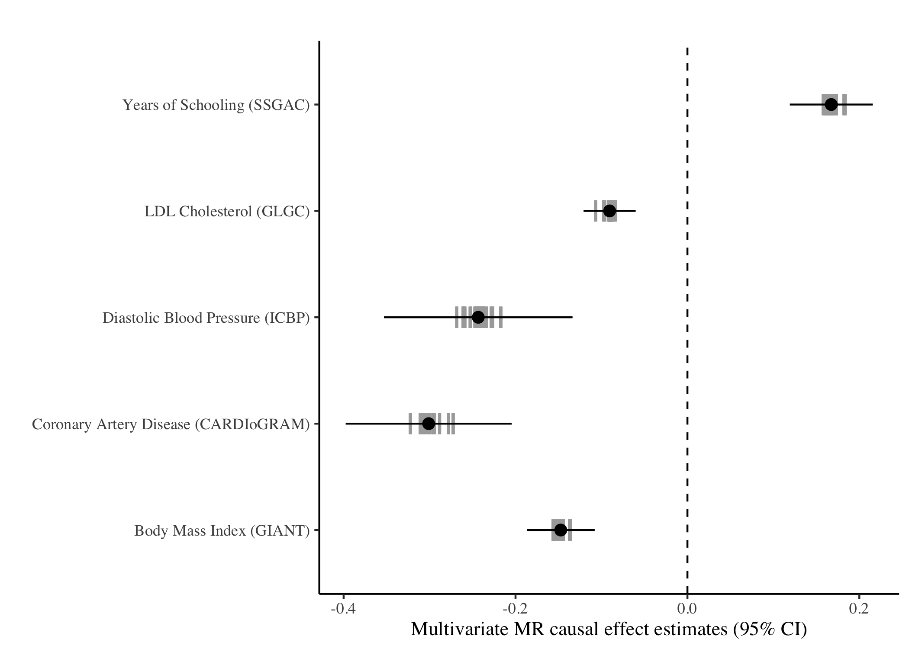
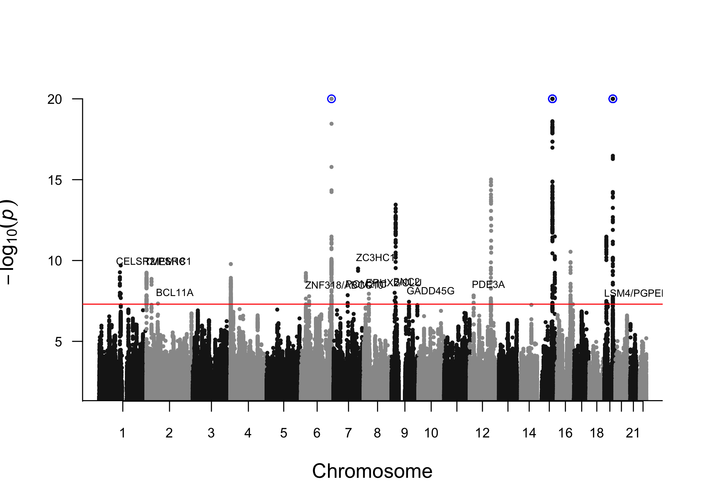
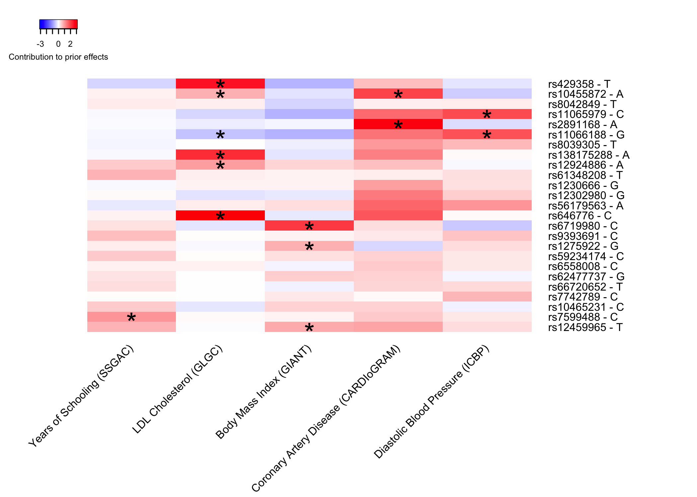

# Lifespan Analysis

In this example, we will use the data from Timmers et al to apply our
Bayesian GWAS approach to study lifespan.  
Here, we assume that the `bGWAS` package is already installed, that the
Z-matrix files have already been downloaded and stored in
`"~/ZMatrices"`. If that is not the case, please follow the steps
described [here](../README.md).

``` r
library(bGWAS) # bGWAS github version:

# Download data to working directory (~460 MB) if not already here
if(!file.exists("lifegen_phase2_bothpl_alldr_2017_09_18.tsv.gz")) download.file(url = "https://datashare.is.ed.ac.uk/bitstream/handle/10283/3209/lifegen_phase2_bothpl_alldr_2017_09_18.tsv.gz?sequence=1&isAllowed=y", destfile = "lifegen_phase2_bothpl_alldr_2017_09_18.tsv.gz")
```

Now that we have the data in our working directory, we can launch the
analysis (with default parameters):

``` r
Lifespan_bGWAS = bGWAS(name = "Lifespan_Timmers2019",
                       GWAS = "lifegen_phase2_bothpl_alldr_2017_09_18.tsv.gz")
```

    ## <<< Preparation of analysis >>> 
    ## > Checking parameters 
    ## The name of your analysis is: "Lifespan_Timmers2019".

    ## Registered S3 method overwritten by 'R.oo':
    ##   method        from       
    ##   throw.default R.methodsS3

    ## The Z-Matrix files are stored in "/Users/nmounier/ZMatrices".  
    ## # Preparation of the data... 
    ## The conventional GWAS used as input is: "lifegen_phase2_bothpl_alldr_2017_09_18.tsv.gz".  
    ##    SNPID column, ok - ALT column, ok - REF column, ok - BETA column, ok - SE column, ok
    ## Posterior effects will be rescaled using BETA and SE.The analysis will be run in the folder: "/Users/nmounier/Documents/SGG/Projects/Packaging/bGWAS/doc".  
    ## The p-value threshold used for selecting MR instruments is: 1e-06.  
    ## The minimum number instruments required for each trait is: 3.  
    ## The distance used for pruning MR instruments is: 500Kb.  
    ## Distance-based pruning will be used for MR instruments.  
    ## No shrinkage applied before performing MR.The p-value threshold used for stepwise selection will be derived according to the number of Prior GWASs used.  
    ## Using MR_shrinkage as default for prior_shrinkage:No shrinkage applied before performing calculating the prior.The p-value threshold used for stepwise selection will be derived according to the number of Prior GWASs used.  
    ## Significant SNPs will be identified according to p-value. The threshold used is :5e-08.  
    ## The distance used for pruning results is: 500Kb.  
    ## Distance-based pruning will be used for results.  
    ## <><><><><><><><><><><><><><><><><><><><><><><><><><><><><><><><><><><><><><><><><><><><> 
    ## <<< Identification of significant prior GWASs for MR >>>  
    ## > Creating the Z-Matrix of strong instruments 
    ## # Loading the ZMatrix... 
    ## Selecting studies :
    ## 38 studies 
    ## 209,840 SNPs 
    ## # Adding data from the conventional GWAS : 
    ##  "lifegen_phase2_bothpl_alldr_2017_09_18.tsv.gz" 
    ## Done! 
    ## 197,681 SNPs in common between prior studies and the conventional GWAS 
    ## # Thresholding... 
    ## 134,807 SNPs left after thresholding 
    ## Neuroticism (GPC) - Smoking - ever smoked (TAG) - Smoking - age of onset (TAG) : removed (less than 3 instrument after thresholding) 
    ## 35 studies left after thresholding 
    ## Pruning MR instruments... 
    ##    distance : 500Kb 
    ## 1,934 SNPs left after pruning 
    ## Anorexia (GCAN) - Openness to Experience (GPC) - Extraversion (GPC) - Insulin (MAGIC) - 2010 - HOMA-IR (MAGIC) - Depression (PGC) - Autism (PGC) - Smoking - cigarettes per day (TAG) - Smoking - former smoker (TAG) : removed (less than 3 strong instrument after pruning) 
    ## 26 studies left after thresholding+pruning 
    ## 1,927 SNPs left after removing studies with only one strong instrument 
    ## > Performing MR  
    ## #Preparation of the MR analyses to identify significant studies... 
    ## Conventionnal GWAS of interest : lifegen_phase2_bothpl_alldr_2017_09_18.tsv.gz
    ## # Univariate regressions for each trait... 
    ##   Number of trait-specific instruments per univariate regression: 
    ##   . Body Mass Index (GIANT) : 89 
    ##   . Schizophrenia (PGC) - 2014 : 6 
    ##   . Coronary Artery Disease (CARDIoGRAM) : 12 
    ##   . Type 2 Diabetes (DIAGRAM) : 12 
    ##   . Years of Schooling (SSGAC) : 80 
    ##   . Glucose (ENGAGE) : 11 
    ##   . Crohns Disease (IBD) : 43 
    ##   . Ulcerative Colitis (IBD) : 75 
    ##   . HDL Cholesterol (GLGC) : 72 
    ##   . LDL Cholesterol (GLGC) : 57 
    ##   . Total Cholesterol (GLGC) : 73 
    ##   . Triglycerides (GLGC) : 51 
    ##   . Glucose (MAGIC) - 2010 : 10 
    ##   . HOMA-B (MAGIC) : 6 
    ##   . Glucose (MAGIC) : 17 
    ##   . Insulin (MAGIC) : 5 
    ##   . Heart Rate (HRgene) : 14 
    ##   . Height (GIANT) : 522 
    ##   . Parkinsons : 382 
    ##   . Neuroblastoma : 353 
    ##   . Multiple Sclerosis : 153 
    ##   . Systolic Blood Pressure (ICBP) : 8 
    ##   . Diastolic Blood Pressure (ICBP) : 9 
    ##   . Schizophrenia (PGC) - 2013 : 19 
    ##   . Schizophrenia (PGC) : 107 
    ##   . College Completion (SSGAC) : 3 
    ## Done! 
    ## # Stepwise selection (all traits)... 
    ## The p-value threshold used for stepwise selection is 0.0019 (26 Prior GWASs tested).  
    ## Studies tested (reaching p<0.05 in univariate models) : 
    ##  Years of Schooling (SSGAC) 
    ##  Body Mass Index (GIANT) 
    ##  Coronary Artery Disease (CARDIoGRAM) 
    ##  Ulcerative Colitis (IBD) 
    ##  HDL Cholesterol (GLGC) 
    ##  LDL Cholesterol (GLGC) 
    ##  Total Cholesterol (GLGC) 
    ##  Triglycerides (GLGC) 
    ##  Glucose (MAGIC) - 2010 
    ##  Glucose (MAGIC) 
    ##  Systolic Blood Pressure (ICBP) 
    ##  Diastolic Blood Pressure (ICBP)
    ## Adding the first study :Years of Schooling (SSGAC) 
    ##   iteration 1: 1 studies 
    ## #Run model 
    ## #Test if any study can be added with p<0.0019 
    ## Adding one study :LDL Cholesterol (GLGC) 
    ## Done! 
    ## #Update model 
    ## #Test if any study has p>0.0019 now 
    ##   iteration 2: 2 studies 
    ## #Run model 
    ## #Test if any study can be added with p<0.0019 
    ## Adding one study :Body Mass Index (GIANT) 
    ## Done! 
    ## #Update model 
    ## #Test if any study has p>0.0019 now 
    ##   iteration 3: 3 studies 
    ## #Run model 
    ## #Test if any study can be added with p<0.0019 
    ## Adding one study :Coronary Artery Disease (CARDIoGRAM) 
    ## Done! 
    ## #Update model 
    ## #Test if any study has p>0.0019 now 
    ##   iteration 4: 4 studies 
    ## #Run model 
    ## #Test if any study can be added with p<0.0019 
    ## Adding one study :Diastolic Blood Pressure (ICBP) 
    ## Done! 
    ## #Update model 
    ## #Test if any study has p>0.0019 now 
    ##   iteration 5: 5 studies 
    ## #Run model 
    ## #Test if any study can be added with p<0.0019 
    ## #Update model 
    ## #Test if any study has p>0.0019 now 
    ## It converged! 
    ## # Final regression... 
    ## The studies used are: 
    ## - Years of Schooling (SSGAC)
    ## - LDL Cholesterol (GLGC)
    ## - Body Mass Index (GIANT)
    ## - Coronary Artery Disease (CARDIoGRAM)
    ## - Diastolic Blood Pressure (ICBP)
    ## Estimating adjusted R-squared: 
    ## - in-sample adjusted R-squared for the all-chromosomes multivariate regression is 0.5435 
    ## - out-of-sample R-squared (masking one chromosome at a time), for the multivariate regression will be estimated when calculating the prior. 
    ## <><><><><><><><><><><><><><><><><><><><><><><><><><><><><><><><><><><><><><><><><><><><> 
    ## <<< Estimation of the prior >>>  
    ## > Creating the full Z-Matrix  
    ## # Loading the ZMatrix... 
    ## Selecting studies :
    ## 5 studies 
    ## 6,811,310 SNPs 
    ## # Adding data from the conventional GWAS : 
    ##  "lifegen_phase2_bothpl_alldr_2017_09_18.tsv.gz" 
    ## Done! 
    ## 6,513,704 SNPs in common between prior studies and the conventional GWAS 
    ## > Computing prior  
    ## # Calculating the prior chromosome by chromosome... 
    ##    Chromosome 1
    ## Running regression, 
    ## Calculating prior estimates for SNPs on this chromosome, 
    ## Calculating prior standard errors for SNPs on this chromosome, 
    ##    Chromosome 2
    ## Running regression, 
    ## Calculating prior estimates for SNPs on this chromosome, 
    ## Calculating prior standard errors for SNPs on this chromosome, 
    ##    Chromosome 3
    ## Running regression, 
    ## Calculating prior estimates for SNPs on this chromosome, 
    ## Calculating prior standard errors for SNPs on this chromosome, 
    ##    Chromosome 4
    ## Running regression, 
    ## Calculating prior estimates for SNPs on this chromosome, 
    ## Calculating prior standard errors for SNPs on this chromosome, 
    ##    Chromosome 5
    ## Running regression, 
    ## Calculating prior estimates for SNPs on this chromosome, 
    ## Calculating prior standard errors for SNPs on this chromosome, 
    ##    Chromosome 6
    ## Running regression, 
    ## Calculating prior estimates for SNPs on this chromosome, 
    ## Calculating prior standard errors for SNPs on this chromosome, 
    ##    Chromosome 7
    ## Running regression, 
    ## Calculating prior estimates for SNPs on this chromosome, 
    ## Calculating prior standard errors for SNPs on this chromosome, 
    ##    Chromosome 8
    ## Running regression, 
    ## Calculating prior estimates for SNPs on this chromosome, 
    ## Calculating prior standard errors for SNPs on this chromosome, 
    ##    Chromosome 9
    ## Running regression, 
    ## Calculating prior estimates for SNPs on this chromosome, 
    ## Calculating prior standard errors for SNPs on this chromosome, 
    ##    Chromosome 10
    ## Running regression, 
    ## Calculating prior estimates for SNPs on this chromosome, 
    ## Calculating prior standard errors for SNPs on this chromosome, 
    ##    Chromosome 11
    ## Running regression, 
    ## Calculating prior estimates for SNPs on this chromosome, 
    ## Calculating prior standard errors for SNPs on this chromosome, 
    ##    Chromosome 12
    ## Running regression, 
    ## Calculating prior estimates for SNPs on this chromosome, 
    ## Calculating prior standard errors for SNPs on this chromosome, 
    ##    Chromosome 13
    ## Running regression, 
    ## Calculating prior estimates for SNPs on this chromosome, 
    ## Calculating prior standard errors for SNPs on this chromosome, 
    ##    Chromosome 14
    ## Running regression, 
    ## Calculating prior estimates for SNPs on this chromosome, 
    ## Calculating prior standard errors for SNPs on this chromosome, 
    ##    Chromosome 15
    ## Running regression, 
    ## Calculating prior estimates for SNPs on this chromosome, 
    ## Calculating prior standard errors for SNPs on this chromosome, 
    ##    Chromosome 16
    ## Running regression, 
    ## Calculating prior estimates for SNPs on this chromosome, 
    ## Calculating prior standard errors for SNPs on this chromosome, 
    ##    Chromosome 17
    ## Running regression, 
    ## Calculating prior estimates for SNPs on this chromosome, 
    ## Calculating prior standard errors for SNPs on this chromosome, 
    ##    Chromosome 18
    ## Running regression, 
    ## Calculating prior estimates for SNPs on this chromosome, 
    ## Calculating prior standard errors for SNPs on this chromosome, 
    ##    Chromosome 19
    ## Running regression, 
    ## Calculating prior estimates for SNPs on this chromosome, 
    ## Calculating prior standard errors for SNPs on this chromosome, 
    ##    Chromosome 20
    ## Running regression, 
    ## Calculating prior estimates for SNPs on this chromosome, 
    ## Calculating prior standard errors for SNPs on this chromosome, 
    ##    Chromosome 21
    ## Running regression, 
    ## Calculating prior estimates for SNPs on this chromosome, 
    ## Calculating prior standard errors for SNPs on this chromosome, 
    ##    Chromosome 22
    ## Running regression, 
    ## Calculating prior estimates for SNPs on this chromosome, 
    ## Calculating prior standard errors for SNPs on this chromosome, 
    ## ## Out-of-sample R-squared for MR instruments across all chromosomes is 0.5298
    ## ## Out-of-sample squared correlation for MR instruments across all chromosome is 0.53
    ## ## Correlation between prior and observed effects for all SNPs is 0.1953
    ## ## Correlation between prior and observed effects for SNPs with GWAS p-value < 0.001 is 0.6141
    ## Done! 
    ## <><><><><><><><><><><><><><><><><><><><><><><><><><><><><><><><><><><><><><><><><><><><> 
    ## <<< Calculation of Bayes Factors and p-values >>>  
    ## > Calculating them for all SNPs  
    ## # Computing observed Bayes Factor for all SNPs... 
    ## Done! 
    ## # Computing BF p-values... 
    ##    using a distribution approach: 
    ## ... getting approximated p-values using non-linear quantiles  
    ## ... checking p-values near significance threshold  
    ##     everything is ok!  
    ## # Estimating p-values for posterior effects... 
    ## Done! 
    ## # Estimating p-values for direct effects... 
    ## Done! 
    ## > Pruning and identifying significant SNPs 
    ## Identification based on BFs 
    ##    Starting with 6,513,704 SNPs 
    ## # Selecting significant SNPs according to p-values... 
    ## 782 SNPs left 
    ## Done! 
    ## # Pruning significant SNPs... 
    ##    distance : 500Kb 
    ## 25 SNPs left 
    ## Done! 
    ## Identification based on posterior effects 
    ##    Starting with 6,513,704 SNPs 
    ## # Selecting significant SNPs according to p-values... 
    ## 318 SNPs left 
    ## Done! 
    ## # Pruning significant SNPs... 
    ##    distance : 500Kb 
    ## 11 SNPs left 
    ## Done! 
    ## Identification based on direct effects 
    ##    Starting with 6,513,704 SNPs 
    ## # Selecting significant SNPs according to p-values... 
    ## 87 SNPs left 
    ## Done! 
    ## # Pruning significant SNPs... 
    ##    distance : 500Kb 
    ## 2 SNPs left 
    ## Done! 
    ## <><><><><><><><><><><><><><><><><><><><><><><><><><><><><><><><><><><><><><><><><><><><>
    ## Time of the analysis: 34 minute(s) and 1 second(s).

We can now look at the results more in details.

## Prior GWASs used

``` r
coefficients_plot_bGWAS(Lifespan_bGWAS)
```



5 prior GWASs (risk factors) are used to create the prior, the
multivariate causal effect estimates are consistent with what we would
expect. On this figure, the multivariate causal effect estimate and the
95% interval from the multivariate MR model using all chromosomes (black
dot and bars) as well as the 22 per-chromosome estimates (grey bars) are
represented for each prior GWASs. Coronary Artery Disease (CAD) has the
strongest negative effect on lifespan. High Diastolic Blood Pressure
(DBP) and Body Mass Index (BMI) also decreases lifespan. We can also see
that education, in this case the number of years of schooling, has a
positive effect on lifespan.

Overall, the squared correlation between prior and observed effects is
about 0.038 and goes up to 0.377 when we consider only SNPs having at
least a moderate effect on lifespan (observed p-value \< 0.001).  
Using the previous version (Timmers et al), squared correlation was
around 0.003 when considering all SNPs and around 0.082 for SNPs having
a moderate effect.

## Results - BF

With this approach, we identified 25 SNPs affecting lifespan through the
identified risk factors:

``` r
# all hits
knitr::kable(extract_results_bGWAS(Lifespan_bGWAS) %>% mutate(BF = as.character(format(BF, scientific=T, digits=3)), BF_p = as.character(format(BF_p, scientific=T, digits=3))) %>% arrange(chrm_UK10K), digits=3)
```

| rsid        | chrm\_UK10K | pos\_UK10K | alt | ref |  z\_obs | mu\_prior\_estimate | mu\_prior\_std\_error | BF       | BF\_p    |
| :---------- | ----------: | ---------: | :-- | :-- | ------: | ------------------: | --------------------: | :------- | :------- |
| rs1230666   |           1 |  114173410 | A   | G   | \-5.805 |             \-1.433 |                 1.116 | 1.96e+05 | 2.01e-10 |
| rs646776    |           1 |  109818530 | T   | C   | \-4.908 |             \-4.822 |                 1.236 | 1.07e+05 | 5.36e-10 |
| rs6719980   |           2 |     651507 | T   | C   | \-5.407 |             \-1.906 |                 1.143 | 1.03e+05 | 5.66e-10 |
| rs1275922   |           2 |   26932887 | A   | G   | \-5.817 |             \-0.850 |                 1.111 | 5.95e+04 | 1.37e-09 |
| rs7599488   |           2 |   60718347 | T   | C   | \-4.663 |             \-1.956 |                 1.114 | 6.86e+03 | 4.60e-08 |
| rs61348208  |           4 |    3089564 | T   | C   |   5.823 |               1.479 |                 1.106 | 2.22e+05 | 1.66e-10 |
| rs10455872  |           6 |  161010118 | A   | G   |  10.282 |               2.150 |                 1.157 | 4.25e+16 | 1.27e-26 |
| rs9393691   |           6 |   26272829 | T   | C   | \-5.570 |             \-1.565 |                 1.107 | 9.97e+04 | 5.98e-10 |
| rs7742789   |           6 |   43345803 | T   | C   | \-5.299 |             \-0.984 |                 1.110 | 1.30e+04 | 1.63e-08 |
| rs56179563  |           7 |  129685597 | A   | G   |   5.190 |               2.881 |                 1.165 | 1.49e+05 | 3.14e-10 |
| rs62477737  |           7 |   75162278 | A   | G   | \-5.269 |             \-1.088 |                 1.110 | 1.43e+04 | 1.39e-08 |
| rs6558008   |           8 |   27438306 | A   | C   | \-5.424 |             \-0.890 |                 1.106 | 1.61e+04 | 1.14e-08 |
| rs2891168   |           9 |   22098619 | A   | G   |   6.601 |               2.327 |                 1.241 | 4.99e+07 | 3.52e-14 |
| rs59234174  |           9 |   16730258 | T   | C   | \-5.127 |             \-1.492 |                 1.107 | 1.76e+04 | 9.90e-09 |
| rs10465231  |           9 |   92183413 | T   | C   | \-5.156 |             \-0.985 |                 1.109 | 8.00e+03 | 3.58e-08 |
| rs11065979  |          12 |  112059557 | T   | C   | \-7.128 |             \-2.227 |                 1.220 | 5.48e+08 | 9.74e-16 |
| rs11066188  |          12 |  112610714 | A   | G   | \-6.524 |             \-1.846 |                 1.215 | 1.34e+07 | 2.64e-13 |
| rs12302980  |          12 |  111360290 | A   | G   | \-5.750 |             \-1.390 |                 1.138 | 1.59e+05 | 2.82e-10 |
| rs66720652  |          12 |   20582640 | A   | T   | \-5.347 |             \-0.937 |                 1.110 | 1.38e+04 | 1.46e-08 |
| rs8042849   |          15 |   78817929 | T   | C   |  10.659 |               0.265 |                 1.105 | 8.57e+13 | 5.24e-23 |
| rs8039305   |          15 |   91422543 | T   | C   |   6.414 |               1.473 |                 1.129 | 2.65e+06 | 3.27e-12 |
| rs12924886  |          16 |   72075593 | A   | T   |   5.679 |               2.455 |                 1.116 | 6.65e+05 | 2.88e-11 |
| rs429358    |          19 |   45411941 | T   | C   |  19.328 |               1.854 |                 1.217 | 1.59e+54 | 7.52e-80 |
| rs138175288 |          19 |   11189980 | A   | C   |   5.733 |               3.305 |                 1.189 | 2.60e+06 | 3.36e-12 |
| rs12459965  |          19 |   18452195 | T   | C   |   4.426 |               2.781 |                 1.121 | 6.55e+03 | 4.96e-08 |

``` r
# new hits (compared to conventional GWAS)
extract_results_bGWAS(Lifespan_bGWAS) %>%
  mutate(obs_p = 2*pnorm(-abs(z_obs))) %>%
  filter(obs_p>5e-8) %>% 
  arrange(chrm_UK10K) -> New_Hits
knitr::kable(New_Hits %>% mutate(BF = as.character(format(BF, scientific=T, digits=3)), BF_p = as.character(format(BF_p, scientific=T, digits=3))), digits=3)
```

| rsid       | chrm\_UK10K | pos\_UK10K | alt | ref |  z\_obs | mu\_prior\_estimate | mu\_prior\_std\_error | BF       | BF\_p    | obs\_p |
| :--------- | ----------: | ---------: | :-- | :-- | ------: | ------------------: | --------------------: | :------- | :------- | -----: |
| rs646776   |           1 |  109818530 | T   | C   | \-4.908 |             \-4.822 |                 1.236 | 1.07e+05 | 5.36e-10 |      0 |
| rs6719980  |           2 |     651507 | T   | C   | \-5.407 |             \-1.906 |                 1.143 | 1.03e+05 | 5.66e-10 |      0 |
| rs7599488  |           2 |   60718347 | T   | C   | \-4.663 |             \-1.956 |                 1.114 | 6.86e+03 | 4.60e-08 |      0 |
| rs7742789  |           6 |   43345803 | T   | C   | \-5.299 |             \-0.984 |                 1.110 | 1.30e+04 | 1.63e-08 |      0 |
| rs56179563 |           7 |  129685597 | A   | G   |   5.190 |               2.881 |                 1.165 | 1.49e+05 | 3.14e-10 |      0 |
| rs62477737 |           7 |   75162278 | A   | G   | \-5.269 |             \-1.088 |                 1.110 | 1.43e+04 | 1.39e-08 |      0 |
| rs6558008  |           8 |   27438306 | A   | C   | \-5.424 |             \-0.890 |                 1.106 | 1.61e+04 | 1.14e-08 |      0 |
| rs59234174 |           9 |   16730258 | T   | C   | \-5.127 |             \-1.492 |                 1.107 | 1.76e+04 | 9.90e-09 |      0 |
| rs10465231 |           9 |   92183413 | T   | C   | \-5.156 |             \-0.985 |                 1.109 | 8.00e+03 | 3.58e-08 |      0 |
| rs66720652 |          12 |   20582640 | A   | T   | \-5.347 |             \-0.937 |                 1.110 | 1.38e+04 | 1.46e-08 |      0 |
| rs12459965 |          19 |   18452195 | T   | C   |   4.426 |               2.781 |                 1.121 | 6.55e+03 | 4.96e-08 |      0 |

11 of them are missed by the conventional GWAS (using same p-value
threshold of 5e-8 to call significance).  
Using the previous version (Timmers et al), we identified 7 new variants
(using a threshold of 2.5e-8 for both GWAS and bGWAS results). Using a
threshold of 5e-8 would have resulted

``` r
# For the plots, we will use only the new hits
New_Hits %>% 
  transmute(rs=rsid,
        gene = c("CELSR2/PSRC1", "TMEM18", "BCL11A", "ZNF318/ABCC10", "ZC3HC1", "POM21C", "EPHX2/CLU", "BNC2", "GADD45G", "PDE3A", "LSM4/PGPEP1"),
        color="#932735") -> my_SNPs

manhattan_plot_bGWAS(Lifespan_bGWAS, SNPs=my_SNPs)
```



``` r
my_SNPs %>%
  mutate(color=NULL) -> my_SNPs
heatmap_bGWAS(Lifespan_bGWAS, SNPs = my_SNPs)
```



On this figure, the contribution of each risk factor to the prior
effects of new hits (alleles aligned to be life-lengthening) is
represented as a heatmap. Overall, we observe a lot of red, as expected
since alleles are aligned to be life-lengthening.  
Among these 11 new variants, 4 were known to be associated with at least
one of the RFs (indicated with a star on the heatmap - variant near
CELSR2/PSRC1 associated with LDL cholesterol, variants near TMEM18 and
LSM4/PGPEP1 associated with Body Mass Index, variant near BCL11A
associated with Years of Schooling). 7 variants (near ZNF318, ZC3HC1,
POM21C, EPHX2/CLU, BNC2, GADD45G and PDE3A) are not associated with any
of the RFs (at least not in the summary statistics used to create the
prior), suggesting that they could be acting on lifespan through smaller
pleiotropic effects on several RFs.  
These variants can be further investigated using the [GWAS
Catalog](https://www.ebi.ac.uk/gwas/) and looking at SNPs in 500kb
region, using [LDlink](https://ldlink.nci.nih.gov/) to get R2 estimates
in EUR population.  
**ZNF318**:  
\- a variant in LD (R2=0.8401), rs2270860, associated with “Diastolic
blood pressure (cigarette smoking interaction)” in [this
paper](https://www.ncbi.nlm.nih.gov/pubmed/26390057)  
\- a variant in LD (R2=0.8978), rs16896398, associated with “DBP” in a
recent GWAS using Japanese population
[here](https://www.ncbi.nlm.nih.gov/pubmed/29403010)  
**ZC3HC1**  
\- a variant in LD (R2=0.8661), rs11556924, associated with “CAD” in a
recent GWAS using UKBB
[here](https://www.ncbi.nlm.nih.gov/pubmed/29212778)  
**POM21C**  
\- two variants in LD (R2=0.1782), rs58862095, associated with “BMI” in
a recent GWAS using UKBB
[here](https://www.ncbi.nlm.nih.gov/pubmed/30595370)  
\- a variant in LD (R2=0.1947), rs1167827, associated with “Education
Attainment” in a recent GWAS
[here](https://www.ncbi.nlm.nih.gov/pubmed/30038396) and with “BMI” in
[this paper](https://www.ncbi.nlm.nih.gov/pubmed/26426971)  
**EPHX2/CLU**  
\- none of the risk factors  
**BNC2**  
\- a variant in LD (R2=0.7988), rs10962547, associated with “BMI” in a
recent GWAS using UKBB
[here](https://www.ncbi.nlm.nih.gov/pubmed/30595370)  
**GADD45G**  
\- none of the risk factors  
**PDE3A**  
\- none of the risk factors

## Results - Direct Effects

We can use direct effects to identify SNPs significantly acting on
lifespan independently from the prior GWASs used to create the prior:

``` r
knitr::kable(extract_results_bGWAS(Lifespan_bGWAS, results="direct")  %>% mutate(p_direct=as.character(format(p_direct, scientific=T, digits=3))), digits=3)
```

| rsid      | chrm\_UK10K | pos\_UK10K | alt | ref | z\_obs | mu\_direct\_estimate | mu\_direct\_std\_error | z\_direct | p\_direct |
| :-------- | ----------: | ---------: | :-- | :-- | -----: | -------------------: | ---------------------: | --------: | :-------- |
| rs429358  |          19 |   45411941 | T   | C   | 19.328 |               17.473 |                  1.575 |    11.093 | 1.36e-28  |
| rs8042849 |          15 |   78817929 | T   | C   | 10.659 |               10.395 |                  1.490 |     6.976 | 3.04e-12  |

Here, two variants (rs429358 near APOE and rs8042849 near HYKK/CHRNA3/5)
have a significant corrected effect. This is expected since APOE is
known to be highly pleiotropic and to notably have an affect on
Alzheimer disease, not used to create the prior. The second variant is
not associated with any of the risk factor, and therefore its prior
effect (0.265) is very small compared to its observed effect (10.659).
