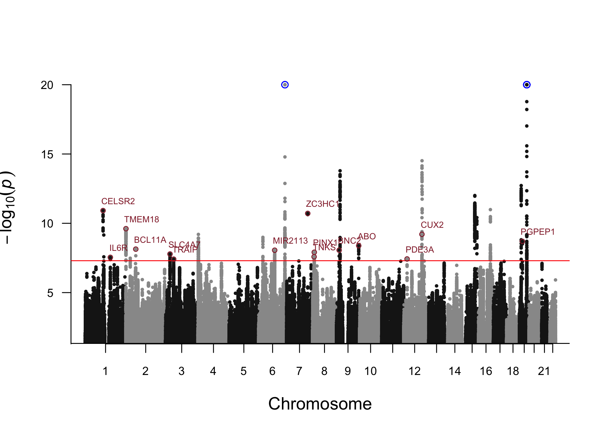

# Lifespan Analysis

In this example, we will use the data from [Timmers *et
al*](https://doi.org/10.7554/eLife.39856) to apply our Bayesian GWAS
approach to study lifespan.  
Here, we assume that the `bGWAS` package is already installed, that the
Z-matrix files have already been downloaded and stored in
`"~/ZMatrices"`. If that is not the case, please follow the steps
described [here](../README.md).

``` r
library(bGWAS) # bGWAS github version: v.1.0.2

# Download data to working directory (~460 MB) if not already here
if(!file.exists("lifegen_phase2_bothpl_alldr_2017_09_18.tsv.gz")) download.file(url = "https://datashare.is.ed.ac.uk/bitstream/handle/10283/3209/lifegen_phase2_bothpl_alldr_2017_09_18.tsv.gz?sequence=1&isAllowed=y", destfile = "lifegen_phase2_bothpl_alldr_2017_09_18.tsv.gz")
```

Now that we have the data in our working directory, we can launch the
analysis (with default parameters):

<details>

<summary> See log </summary>

``` r
Lifespan_bGWAS = bGWAS(name = "Lifespan_Timmers2019",
                       GWAS = "lifegen_phase2_bothpl_alldr_2017_09_18.tsv.gz")
```

    ## <<< Preparation of analysis >>> 
    ## > Checking parameters 
    ## The name of your analysis is: "Lifespan_Timmers2019". 
    ## The Z-Matrix files are stored in "/Users/nmounier/ZMatrices".  
    ## # Preparation of the data... 
    ## The conventional GWAS used as input is: "lifegen_phase2_bothpl_alldr_2017_09_18.tsv.gz".  
    ##    SNPID column, ok - ALT column, ok - REF column, ok - BETA column, ok - SE column, ok
    ## Posterior effects will be rescaled using BETA and SE.The analysis will be run in the folder: "/Users/nmounier/Documents/SGG/Projects/Packaging/bGWAS/doc".  
    ## The p-value threshold used for selecting MR instruments is: 1e-06.  
    ## The minimum number instruments required for each trait is: 3.  
    ## The distance used for pruning MR instruments is: 500Kb.  
    ## Distance-based pruning will be used for MR instruments.  
    ## No shrinkage applied before performing MR.The p-value threshold used for stepwise selection will be derived according to the number of Prior GWASs used.  
    ## Using MR_shrinkage as default for prior_shrinkage:No shrinkage applied before performing calculating the prior.The p-value threshold used for stepwise selection will be derived according to the number of Prior GWASs used.  
    ## Significant SNPs will be identified according to p-value. The threshold used is :5e-08.  
    ## The distance used for pruning results is: 500Kb.  
    ## Distance-based pruning will be used for results.  
    ## <><><><><><><><><><><><><><><><><><><><><><><><><><><><><><><><><><><><><><><><><><><><> 
    ## <<< Identification of significant prior GWASs for MR >>>  
    ## > Creating the Z-Matrix of strong instruments 
    ## # Loading the ZMatrix... 
    ## Selecting studies :
    ## 38 studies 
    ## 209,840 SNPs 
    ## # Adding data from the conventional GWAS : 
    ##  "lifegen_phase2_bothpl_alldr_2017_09_18.tsv.gz" 
    ## Done! 
    ## 197,681 SNPs in common between prior studies and the conventional GWAS 
    ## # Thresholding... 
    ## 134,807 SNPs left after thresholding 
    ## Neuroticism (GPC) - Smoking - ever smoked (TAG) - Smoking - age of onset (TAG) : removed (less than 3 instrument after thresholding) 
    ## 35 studies left after thresholding 
    ## Pruning MR instruments... 
    ##    distance : 500Kb 
    ## 1,934 SNPs left after pruning 
    ## Anorexia (GCAN) - Openness to Experience (GPC) - Extraversion (GPC) - Insulin (MAGIC) - 2010 - HOMA-IR (MAGIC) - Depression (PGC) - Autism (PGC) - Smoking - cigarettes per day (TAG) - Smoking - former smoker (TAG) : removed (less than 3 strong instrument after pruning) 
    ## 26 studies left after thresholding+pruning 
    ## 1,927 SNPs left after removing studies with only one strong instrument 
    ## > Performing MR  
    ## #Preparation of the MR analyses to identify significant studies... 
    ## Conventionnal GWAS of interest : lifegen_phase2_bothpl_alldr_2017_09_18.tsv.gz
    ## # Univariate regressions for each trait... 
    ##   Number of trait-specific instruments per univariate regression: 
    ##   . Body Mass Index (GIANT) : 89 
    ##   . Schizophrenia (PGC) - 2014 : 6 
    ##   . Coronary Artery Disease (CARDIoGRAM) : 12 
    ##   . Type 2 Diabetes (DIAGRAM) : 12 
    ##   . Years of Schooling (SSGAC) : 80 
    ##   . Glucose (ENGAGE) : 11 
    ##   . Crohns Disease (IBD) : 43 
    ##   . Ulcerative Colitis (IBD) : 75 
    ##   . HDL Cholesterol (GLGC) : 72 
    ##   . LDL Cholesterol (GLGC) : 57 
    ##   . Total Cholesterol (GLGC) : 73 
    ##   . Triglycerides (GLGC) : 51 
    ##   . Glucose (MAGIC) - 2010 : 10 
    ##   . HOMA-B (MAGIC) : 6 
    ##   . Glucose (MAGIC) : 17 
    ##   . Insulin (MAGIC) : 5 
    ##   . Heart Rate (HRgene) : 14 
    ##   . Height (GIANT) : 522 
    ##   . Parkinsons : 382 
    ##   . Neuroblastoma : 353 
    ##   . Multiple Sclerosis : 153 
    ##   . Systolic Blood Pressure (ICBP) : 8 
    ##   . Diastolic Blood Pressure (ICBP) : 9 
    ##   . Schizophrenia (PGC) - 2013 : 19 
    ##   . Schizophrenia (PGC) : 107 
    ##   . College Completion (SSGAC) : 3 
    ## Done! 
    ## # Stepwise selection (all traits)... 
    ## The p-value threshold used for stepwise selection is 0.0019 (26 Prior GWASs tested).  
    ## Studies tested (reaching p<0.05 in univariate models) : 
    ##  Years of Schooling (SSGAC) 
    ##  Body Mass Index (GIANT) 
    ##  Coronary Artery Disease (CARDIoGRAM) 
    ##  Ulcerative Colitis (IBD) 
    ##  HDL Cholesterol (GLGC) 
    ##  LDL Cholesterol (GLGC) 
    ##  Total Cholesterol (GLGC) 
    ##  Triglycerides (GLGC) 
    ##  Glucose (MAGIC) - 2010 
    ##  Glucose (MAGIC) 
    ##  Systolic Blood Pressure (ICBP) 
    ##  Diastolic Blood Pressure (ICBP)
    ## Adding the first study :Years of Schooling (SSGAC) 
    ##   iteration 1: 1 studies 
    ## #Run model 
    ## #Test if any study can be added with p<0.0019 
    ## Adding one study :LDL Cholesterol (GLGC) 
    ## Done! 
    ## #Update model 
    ## #Test if any study has p>0.0019 now 
    ##   iteration 2: 2 studies 
    ## #Run model 
    ## #Test if any study can be added with p<0.0019 
    ## Adding one study :Body Mass Index (GIANT) 
    ## Done! 
    ## #Update model 
    ## #Test if any study has p>0.0019 now 
    ##   iteration 3: 3 studies 
    ## #Run model 
    ## #Test if any study can be added with p<0.0019 
    ## Adding one study :Coronary Artery Disease (CARDIoGRAM) 
    ## Done! 
    ## #Update model 
    ## #Test if any study has p>0.0019 now 
    ##   iteration 4: 4 studies 
    ## #Run model 
    ## #Test if any study can be added with p<0.0019 
    ## Adding one study :Diastolic Blood Pressure (ICBP) 
    ## Done! 
    ## #Update model 
    ## #Test if any study has p>0.0019 now 
    ##   iteration 5: 5 studies 
    ## #Run model 
    ## #Test if any study can be added with p<0.0019 
    ## #Update model 
    ## #Test if any study has p>0.0019 now 
    ## It converged! 
    ## # Final regression... 
    ## The studies used are: 
    ## - Years of Schooling (SSGAC)
    ## - LDL Cholesterol (GLGC)
    ## - Body Mass Index (GIANT)
    ## - Coronary Artery Disease (CARDIoGRAM)
    ## - Diastolic Blood Pressure (ICBP)
    ## Estimating adjusted R-squared: 
    ## - in-sample adjusted R-squared for the all-chromosomes multivariate regression is 0.5435 
    ## - out-of-sample R-squared (masking one chromosome at a time), for the multivariate regression will be estimated when calculating the prior. 
    ## <><><><><><><><><><><><><><><><><><><><><><><><><><><><><><><><><><><><><><><><><><><><> 
    ## <<< Estimation of the prior >>>  
    ## > Creating the full Z-Matrix  
    ## # Loading the ZMatrix... 
    ## Selecting studies :
    ## 5 studies 
    ## 6,811,310 SNPs 
    ## # Adding data from the conventional GWAS : 
    ##  "lifegen_phase2_bothpl_alldr_2017_09_18.tsv.gz" 
    ## Done! 
    ## 6,513,704 SNPs in common between prior studies and the conventional GWAS 
    ## > Computing prior  
    ## # Calculating the prior chromosome by chromosome... 
    ##    Chromosome 1
    ## Running regression, 
    ## Calculating prior estimates for SNPs on this chromosome, 
    ## Calculating prior standard errors for SNPs on this chromosome, 
    ##    Chromosome 2
    ## Running regression, 
    ## Calculating prior estimates for SNPs on this chromosome, 
    ## Calculating prior standard errors for SNPs on this chromosome, 
    ##    Chromosome 3
    ## Running regression, 
    ## Calculating prior estimates for SNPs on this chromosome, 
    ## Calculating prior standard errors for SNPs on this chromosome, 
    ##    Chromosome 4
    ## Running regression, 
    ## Calculating prior estimates for SNPs on this chromosome, 
    ## Calculating prior standard errors for SNPs on this chromosome, 
    ##    Chromosome 5
    ## Running regression, 
    ## Calculating prior estimates for SNPs on this chromosome, 
    ## Calculating prior standard errors for SNPs on this chromosome, 
    ##    Chromosome 6
    ## Running regression, 
    ## Calculating prior estimates for SNPs on this chromosome, 
    ## Calculating prior standard errors for SNPs on this chromosome, 
    ##    Chromosome 7
    ## Running regression, 
    ## Calculating prior estimates for SNPs on this chromosome, 
    ## Calculating prior standard errors for SNPs on this chromosome, 
    ##    Chromosome 8
    ## Running regression, 
    ## Calculating prior estimates for SNPs on this chromosome, 
    ## Calculating prior standard errors for SNPs on this chromosome, 
    ##    Chromosome 9
    ## Running regression, 
    ## Calculating prior estimates for SNPs on this chromosome, 
    ## Calculating prior standard errors for SNPs on this chromosome, 
    ##    Chromosome 10
    ## Running regression, 
    ## Calculating prior estimates for SNPs on this chromosome, 
    ## Calculating prior standard errors for SNPs on this chromosome, 
    ##    Chromosome 11
    ## Running regression, 
    ## Calculating prior estimates for SNPs on this chromosome, 
    ## Calculating prior standard errors for SNPs on this chromosome, 
    ##    Chromosome 12
    ## Running regression, 
    ## Calculating prior estimates for SNPs on this chromosome, 
    ## Calculating prior standard errors for SNPs on this chromosome, 
    ##    Chromosome 13
    ## Running regression, 
    ## Calculating prior estimates for SNPs on this chromosome, 
    ## Calculating prior standard errors for SNPs on this chromosome, 
    ##    Chromosome 14
    ## Running regression, 
    ## Calculating prior estimates for SNPs on this chromosome, 
    ## Calculating prior standard errors for SNPs on this chromosome, 
    ##    Chromosome 15
    ## Running regression, 
    ## Calculating prior estimates for SNPs on this chromosome, 
    ## Calculating prior standard errors for SNPs on this chromosome, 
    ##    Chromosome 16
    ## Running regression, 
    ## Calculating prior estimates for SNPs on this chromosome, 
    ## Calculating prior standard errors for SNPs on this chromosome, 
    ##    Chromosome 17
    ## Running regression, 
    ## Calculating prior estimates for SNPs on this chromosome, 
    ## Calculating prior standard errors for SNPs on this chromosome, 
    ##    Chromosome 18
    ## Running regression, 
    ## Calculating prior estimates for SNPs on this chromosome, 
    ## Calculating prior standard errors for SNPs on this chromosome, 
    ##    Chromosome 19
    ## Running regression, 
    ## Calculating prior estimates for SNPs on this chromosome, 
    ## Calculating prior standard errors for SNPs on this chromosome, 
    ##    Chromosome 20
    ## Running regression, 
    ## Calculating prior estimates for SNPs on this chromosome, 
    ## Calculating prior standard errors for SNPs on this chromosome, 
    ##    Chromosome 21
    ## Running regression, 
    ## Calculating prior estimates for SNPs on this chromosome, 
    ## Calculating prior standard errors for SNPs on this chromosome, 
    ##    Chromosome 22
    ## Running regression, 
    ## Calculating prior estimates for SNPs on this chromosome, 
    ## Calculating prior standard errors for SNPs on this chromosome, 
    ## ## Out-of-sample R-squared for MR instruments across all chromosomes is 0.5298
    ## ## Out-of-sample squared correlation for MR instruments across all chromosome is 0.53
    ## ## Correlation between prior and observed effects for all SNPs is 0.1953
    ## ## Correlation between prior and observed effects for SNPs with GWAS p-value < 0.001 is 0.6141
    ## Done! 
    ## <><><><><><><><><><><><><><><><><><><><><><><><><><><><><><><><><><><><><><><><><><><><> 
    ## <<< Calculation of Bayes Factors and p-values >>>  
    ## > Calculating them for all SNPs  
    ## # Computing observed Bayes Factor for all SNPs... 
    ## Done! 
    ## # Computing BF p-values... 
    ##    using a distribution approach: 
    ## ... getting approximated p-values using non-linear quantiles  
    ## ... checking p-values near significance threshold  
    ##    9 p-values have been re-estimated using the exact formula.  
    ## # Estimating p-values for posterior effects... 
    ## Done! 
    ## # Estimating p-values for direct effects... 
    ## Done! 
    ## > Pruning and identifying significant SNPs 
    ## Identification based on BFs 
    ##    Starting with 6,513,704 SNPs 
    ## # Selecting significant SNPs according to p-values... 
    ## 871 SNPs left 
    ## Done! 
    ## # Pruning significant SNPs... 
    ##    distance : 500Kb 
    ## 28 SNPs left 
    ## Done! 
    ## Identification based on posterior effects 
    ##    Starting with 6,513,704 SNPs 
    ## # Selecting significant SNPs according to p-values... 
    ## 975 SNPs left 
    ## Done! 
    ## # Pruning significant SNPs... 
    ##    distance : 500Kb 
    ## 28 SNPs left 
    ## Done! 
    ## Identification based on direct effects 
    ##    Starting with 6,513,704 SNPs 
    ## # Selecting significant SNPs according to p-values... 
    ## 166 SNPs left 
    ## Done! 
    ## # Pruning significant SNPs... 
    ##    distance : 500Kb 
    ## 4 SNPs left 
    ## Done! 
    ## <><><><><><><><><><><><><><><><><><><><><><><><><><><><><><><><><><><><><><><><><><><><>
    ## Time of the analysis: 94 minute(s) and 15 second(s).

</details>

We can now look at the results more in details.

## Risk factors (Prior GWASs) used

``` r
coefficients_plot_bGWAS(Lifespan_bGWAS)
```


5 risk factors are used to create the prior, the multivariate causal
effect estimates are consistent with what we would expect. On this
figure, the multivariate causal effect estimate and the 95% interval
from the multivariate MR model using all chromosomes (black dot and
bars) as well as the 22 per-chromosome estimates (grey bars) are
represented for each prior GWASs. Coronary Artery Disease (CAD) has the
strongest negative effect on lifespan. High Diastolic Blood Pressure
(DBP) and Body Mass Index (BMI) also decreases lifespan. We can also see
that education, in this case the number of years of schooling, has a
positive effect on lifespan.

Overall, the squared correlation between prior and observed effects is
about 0.038 and goes up to 0.377 when we consider only SNPs having at
least a moderate effect on lifespan (observed p-value \< 0.001).  
Using the previous version (Timmers et al), squared correlation was
around 0.003 when considering all SNPs and around 0.082 for SNPs having
a moderate effect.

## Results - BF (all)

With this approach, we identified 28 SNPs affecting lifespan through the
selected risk factors:

``` r
# all hits
extract_results_bGWAS(Lifespan_bGWAS) %>% 
  mutate(BF = as.character(format(BF, scientific=T, digits=3)), BF_p = as.character(format(BF_p, scientific=T, digits=3))) %>%
  arrange(chrm_UK10K, pos_UK10K) -> Hits
knitr::kable(Hits, digits=3)
```

| rsid       | chrm\_UK10K | pos\_UK10K | alt | ref |    beta |    se |  z\_obs | mu\_prior\_estimate | mu\_prior\_std\_error | beta\_prior\_estimate | beta\_prior\_std\_error | BF       | BF\_p    |
| :--------- | ----------: | ---------: | :-- | :-- | ------: | ----: | ------: | ------------------: | --------------------: | --------------------: | ----------------------: | :------- | :------- |
| rs646776   |           1 |  109818530 | T   | C   | \-0.023 | 0.005 | \-4.908 |             \-4.822 |                 0.748 |               \-0.022 |                   0.003 | 1.36e+05 | 1.21e-11 |
| rs1230666  |           1 |  114173410 | A   | G   | \-0.032 | 0.006 | \-5.805 |             \-1.433 |                 0.527 |               \-0.008 |                   0.003 | 1.03e+04 | 6.99e-10 |
| rs7536152  |           1 |  154423909 | A   | G   | \-0.018 | 0.004 | \-4.627 |             \-1.636 |                 0.544 |               \-0.006 |                   0.002 | 1.24e+03 | 2.86e-08 |
| rs6719980  |           2 |     651507 | T   | C   | \-0.028 | 0.005 | \-5.407 |             \-1.906 |                 0.581 |               \-0.010 |                   0.003 | 1.97e+04 | 2.45e-10 |
| rs1275922  |           2 |   26932887 | A   | G   | \-0.026 | 0.004 | \-5.817 |             \-0.850 |                 0.515 |               \-0.004 |                   0.002 | 1.15e+03 | 3.31e-08 |
| rs7599488  |           2 |   60718347 | T   | C   | \-0.018 | 0.004 | \-4.663 |             \-1.956 |                 0.521 |               \-0.008 |                   0.002 | 2.62e+03 | 7.32e-09 |
| rs13082711 |           3 |   27537909 | T   | C   |   0.020 | 0.005 |   4.428 |               1.954 |                 0.616 |                 0.009 |                   0.003 | 1.67e+03 | 1.65e-08 |
| rs2271961  |           3 |   49878113 | T   | C   |   0.015 | 0.004 |   3.824 |               3.085 |                 0.572 |                 0.012 |                   0.002 | 1.06e+03 | 3.87e-08 |
| rs61348208 |           4 |    3089564 | T   | C   |   0.023 | 0.004 |   5.823 |               1.479 |                 0.502 |                 0.006 |                   0.002 | 1.10e+04 | 6.32e-10 |
| rs9393691  |           6 |   26272829 | T   | C   | \-0.022 | 0.004 | \-5.570 |             \-1.565 |                 0.505 |               \-0.006 |                   0.002 | 8.18e+03 | 1.03e-09 |
| rs4580876  |           6 |   98322872 | A   | G   |   0.016 | 0.004 |   4.112 |               2.915 |                 0.526 |                 0.011 |                   0.002 | 2.37e+03 | 8.76e-09 |
| rs10455872 |           6 |  161010118 | A   | G   |   0.076 | 0.007 |  10.282 |               2.150 |                 0.606 |                 0.016 |                   0.005 | 2.42e+12 | 2.85e-22 |
| rs11556924 |           7 |  129663496 | T   | C   |   0.020 | 0.004 |   5.062 |               3.276 |                 0.648 |                 0.013 |                   0.003 | 1.00e+05 | 1.93e-11 |
| rs10104032 |           8 |    9616664 | A   | C   | \-0.017 | 0.004 | \-4.232 |             \-2.169 |                 0.533 |               \-0.009 |                   0.002 | 1.31e+03 | 2.61e-08 |
| rs11986845 |           8 |   10691318 | T   | C   | \-0.017 | 0.004 | \-4.237 |             \-2.428 |                 0.544 |               \-0.010 |                   0.002 | 1.96e+03 | 1.23e-08 |
| rs59234174 |           9 |   16730258 | T   | C   | \-0.028 | 0.005 | \-5.127 |             \-1.492 |                 0.508 |               \-0.008 |                   0.003 | 2.38e+03 | 8.70e-09 |
| rs1333045  |           9 |   22119195 | T   | C   |   0.024 | 0.004 |   6.256 |               2.981 |                 0.844 |                 0.012 |                   0.003 | 1.05e+07 | 1.62e-14 |
| rs2519093  |           9 |  136141870 | T   | C   | \-0.022 | 0.005 | \-4.517 |             \-2.275 |                 0.596 |               \-0.011 |                   0.003 | 3.62e+03 | 4.13e-09 |
| rs10841520 |          12 |   20586395 | T   | C   |   0.024 | 0.005 |   4.944 |               1.334 |                 0.522 |                 0.006 |                   0.003 | 1.08e+03 | 3.75e-08 |
| rs10849925 |          12 |  111495518 | A   | G   |   0.021 | 0.004 |   5.193 |               1.881 |                 0.605 |                 0.008 |                   0.002 | 1.11e+04 | 6.24e-10 |
| rs11065979 |          12 |  112059557 | T   | C   | \-0.028 | 0.004 | \-7.128 |             \-2.227 |                 0.719 |               \-0.009 |                   0.003 | 3.19e+07 | 3.06e-15 |
| rs17630235 |          12 |  112591686 | A   | G   | \-0.026 | 0.004 | \-6.503 |             \-1.884 |                 0.713 |               \-0.007 |                   0.003 | 1.06e+06 | 5.27e-13 |
| rs8042849  |          15 |   78817929 | T   | C   |   0.044 | 0.004 |  10.659 |               0.265 |                 0.499 |                 0.001 |                   0.002 | 6.99e+05 | 9.90e-13 |
| rs8039305  |          15 |   91422543 | T   | C   |   0.025 | 0.004 |   6.414 |               1.473 |                 0.550 |                 0.006 |                   0.002 | 6.40e+04 | 3.86e-11 |
| rs12924886 |          16 |   72075593 | A   | T   |   0.028 | 0.005 |   5.679 |               2.455 |                 0.522 |                 0.012 |                   0.003 | 1.51e+05 | 1.03e-11 |
| rs6511720  |          19 |   11202306 | T   | G   |   0.034 | 0.006 |   5.631 |               3.787 |                 0.754 |                 0.023 |                   0.005 | 2.07e+06 | 1.89e-13 |
| rs12459965 |          19 |   18452195 | T   | C   |   0.020 | 0.004 |   4.426 |               2.781 |                 0.533 |                 0.012 |                   0.002 | 5.51e+03 | 2.00e-09 |
| rs429358   |          19 |   45411941 | T   | C   |   0.106 | 0.005 |  19.328 |               1.854 |                 0.712 |                 0.010 |                   0.004 | 1.11e+37 | 7.06e-70 |

## Results - BF (new hits)

``` r
# new hits (compared to conventional GWAS)
# look at SNPs in a 100kb window around (to assess significance in conventional GWAS)
Hits$NewHits = NA
dist=100000
for(snp in 1:nrow(Hits)){
  Hits %>% dplyr::slice(snp) %>% pull(chrm_UK10K) -> chr
  Hits %>% dplyr::slice(snp) %>% pull(pos_UK10K) -> pos
  extract_results_bGWAS(Lifespan_bGWAS, SNPs = "all") %>%
    filter(chrm_UK10K  == chr,
           pos_UK10K > pos - dist,
           pos_UK10K < pos + dist) %>%
    mutate(p_obs =  2*pnorm(-abs(z_obs))) %>%
    pull(p_obs) %>% min() -> minP_region
  Hits$NewHits[snp] = ifelse(minP_region<5e-8,FALSE,TRUE)
}
Hits %>%
  filter(NewHits == TRUE) %>%
  mutate(NewHits = NULL)-> New_Hits
# also add gene names using annovar
suppressWarnings(suppressMessages(source(system.file("Scripts/Get_GenesAndTraits.R", package="bGWAS"))))
Gene_Info <- do.call(rbind.data.frame, 
                     apply(New_Hits, 1, function(x) get_geneInfo(as.numeric(x[2]), as.numeric(x[3]), x[4], x[5])))
# clean some names for intergenic regions
knitr::kable(Gene_Info)
```

| Function   | Gene                 | Distance      |
| :--------- | :------------------- | :------------ |
| downstream | CELSR2               | 157           |
| intronic   | IL6R                 | 0             |
| intergenic | LOC105373352/TMEM18  | 89415/12371   |
| intronic   | BCL11A               | 0             |
| intergenic | SLC4A7/EOMES         | 12034/219531  |
| intronic   | TRAIP                | 0             |
| intergenic | LOC101927314/MIR2113 | 166079/149535 |
| exonic     | ZC3HC1               | 0             |
| intronic   | TNKS                 | 0             |
| intronic   | PINX1                | 0             |
| intronic   | BNC2                 | 0             |
| intronic   | ABO                  | 0             |
| intronic   | PDE3A                | 0             |
| intronic   | CUX2                 | 0             |
| intronic   | PGPEP1               | 0             |

``` r
# intergenic    LOC105373352/TMEM18 89415/12371 -> TMEM18
Gene_Info[3,2:3] = c("TMEM18", "12371")
# intergenic    SLC4A7/EOMES    12034/219531
Gene_Info[5,2:3] = c("SLC4A7", "12034")
# intergenic    LOC101927314/MIR2113    166079/149535 -> MIR2113
Gene_Info[7,2:3] = c("MIR2113", "149535")

Gene_Info %>%
  bind_cols(New_Hits) -> New_Hits

knitr::kable(New_Hits, digits=3)
```

| Function   | Gene    | Distance | rsid       | chrm\_UK10K | pos\_UK10K | alt | ref |    beta |    se |  z\_obs | mu\_prior\_estimate | mu\_prior\_std\_error | beta\_prior\_estimate | beta\_prior\_std\_error | BF       | BF\_p    |
| :--------- | :------ | :------- | :--------- | ----------: | ---------: | :-- | :-- | ------: | ----: | ------: | ------------------: | --------------------: | --------------------: | ----------------------: | :------- | :------- |
| downstream | CELSR2  | 157      | rs646776   |           1 |  109818530 | T   | C   | \-0.023 | 0.005 | \-4.908 |             \-4.822 |                 0.748 |               \-0.022 |                   0.003 | 1.36e+05 | 1.21e-11 |
| intronic   | IL6R    | 0        | rs7536152  |           1 |  154423909 | A   | G   | \-0.018 | 0.004 | \-4.627 |             \-1.636 |                 0.544 |               \-0.006 |                   0.002 | 1.24e+03 | 2.86e-08 |
| intergenic | TMEM18  | 12371    | rs6719980  |           2 |     651507 | T   | C   | \-0.028 | 0.005 | \-5.407 |             \-1.906 |                 0.581 |               \-0.010 |                   0.003 | 1.97e+04 | 2.45e-10 |
| intronic   | BCL11A  | 0        | rs7599488  |           2 |   60718347 | T   | C   | \-0.018 | 0.004 | \-4.663 |             \-1.956 |                 0.521 |               \-0.008 |                   0.002 | 2.62e+03 | 7.32e-09 |
| intergenic | SLC4A7  | 12034    | rs13082711 |           3 |   27537909 | T   | C   |   0.020 | 0.005 |   4.428 |               1.954 |                 0.616 |                 0.009 |                   0.003 | 1.67e+03 | 1.65e-08 |
| intronic   | TRAIP   | 0        | rs2271961  |           3 |   49878113 | T   | C   |   0.015 | 0.004 |   3.824 |               3.085 |                 0.572 |                 0.012 |                   0.002 | 1.06e+03 | 3.87e-08 |
| intergenic | MIR2113 | 149535   | rs4580876  |           6 |   98322872 | A   | G   |   0.016 | 0.004 |   4.112 |               2.915 |                 0.526 |                 0.011 |                   0.002 | 2.37e+03 | 8.76e-09 |
| exonic     | ZC3HC1  | 0        | rs11556924 |           7 |  129663496 | T   | C   |   0.020 | 0.004 |   5.062 |               3.276 |                 0.648 |                 0.013 |                   0.003 | 1.00e+05 | 1.93e-11 |
| intronic   | TNKS    | 0        | rs10104032 |           8 |    9616664 | A   | C   | \-0.017 | 0.004 | \-4.232 |             \-2.169 |                 0.533 |               \-0.009 |                   0.002 | 1.31e+03 | 2.61e-08 |
| intronic   | PINX1   | 0        | rs11986845 |           8 |   10691318 | T   | C   | \-0.017 | 0.004 | \-4.237 |             \-2.428 |                 0.544 |               \-0.010 |                   0.002 | 1.96e+03 | 1.23e-08 |
| intronic   | BNC2    | 0        | rs59234174 |           9 |   16730258 | T   | C   | \-0.028 | 0.005 | \-5.127 |             \-1.492 |                 0.508 |               \-0.008 |                   0.003 | 2.38e+03 | 8.70e-09 |
| intronic   | ABO     | 0        | rs2519093  |           9 |  136141870 | T   | C   | \-0.022 | 0.005 | \-4.517 |             \-2.275 |                 0.596 |               \-0.011 |                   0.003 | 3.62e+03 | 4.13e-09 |
| intronic   | PDE3A   | 0        | rs10841520 |          12 |   20586395 | T   | C   |   0.024 | 0.005 |   4.944 |               1.334 |                 0.522 |                 0.006 |                   0.003 | 1.08e+03 | 3.75e-08 |
| intronic   | CUX2    | 0        | rs10849925 |          12 |  111495518 | A   | G   |   0.021 | 0.004 |   5.193 |               1.881 |                 0.605 |                 0.008 |                   0.002 | 1.11e+04 | 6.24e-10 |
| intronic   | PGPEP1  | 0        | rs12459965 |          19 |   18452195 | T   | C   |   0.020 | 0.004 |   4.426 |               2.781 |                 0.533 |                 0.012 |                   0.002 | 5.51e+03 | 2.00e-09 |

15 of the 28 genome-wide significant loci are missed by the conventional
GWAS (using same p-value threshold of 5e-8 to call significance).  
Using the previous version (Timmers et al), we identified 7 new loci
(using a threshold of 2.5e-8 for both GWAS and bGWAS results), 4 of them
are also significant in this analysis (near CELSR2, TMEM18, ZC3HC1 and
ABO). The 11 other variants identified in this analysis (near IL6R,
BCL11A, SLC4A7, TRAIP, SLC4A7, PINX1, TNKS, BNC2, CUX2, PDE3A and
PGPEP1) are reported to be associated with lifespan for the first time.

``` r
# For the plots, we will use only the new hits
New_Hits %>% 
  transmute(rs=rsid,
        gene = Gene,
        color="#932735") -> my_SNPs

manhattan_plot_bGWAS(Lifespan_bGWAS, SNPs=my_SNPs)
```



## Results - BF (new hits), association with risk factors

``` r
my_SNPs %>%
  mutate(color=NULL) -> my_SNPs
heatmap_bGWAS(Lifespan_bGWAS, SNPs = my_SNPs)
```


On this figure, the contribution of each risk factor to the prior
effects of new hits (alleles aligned to be life-lengthening) is
represented as a heatmap. Overall, we observe a lot of red, as expected
since alleles are aligned to be life-lengthening.  
Among these 15 new variants, 8 were known to be associated with at least
one of the RFs (indicated with a star on the heatmap - variant near
CELSR2 associated with LDL cholesterol, variants near TMEM18 and PGPEP1
associated with Body Mass Index, variants near BCL11A, TRAIP and MIR2113
associated with Years of Schooling, variant near ZC3HC1 associated with
Coronary Artery Disease and variant near ABO associated with both LDL
cholesterol and Coronary Artery Disease). 7 variants (near IL6R, SLC4A7,
PINX1, TNKS, BNC2, CUX2 and PDE3A) are not associated with any of the
RFs (at least not in the summary statistics used to create the prior),
suggesting that they could be acting on lifespan through smaller
pleiotropic effects on several RFs.  
These variants (and the ones in a 100kb window) can be further
investigated using the [GWAS Catalog](https://www.ebi.ac.uk/gwas/). R2
estimates in EUR population from [LDlink](https://ldlink.nci.nih.gov/)
are used to keep only SNPs in LD (R2\>0.1) with the variant identified.
SNP-trait associations p-values below 5e-8 are reported below (when
LD-friends are used, p-values adjusted for the correlation between the
variants).

``` r
New_Hits %>% 
  filter(Gene %in% c("IL6R", "SLC4A7", "PINX1", "TNKS", "BNC2", "CUX2", "PDE3A")) -> SNPs_lookup 
for(i in 1:nrow(SNPs_lookup)){
  Hit = SNPs_lookup[i,]
  cat(crayon::bold(paste0("\n* SNP - ", Hit$rsid, " (",Hit$Gene,"):\n")))
  
  Info = get_associatedTraits(Hit$rsid, Hit$chrm_UK10K, Hit$pos_UK10K,
                                    LD=0.1, distance=100000, P=5e-8,
                                    gwascatdata = my_ebicat37)
  # format for nice kable output
  if(nrow(Info)>0){
    Info %>%
      mutate(p=as.character(format(p, scientific=T, digits=3)),
             adjusted_p = as.character(format(adjusted_p, scientific=T, digits=3))) -> Info
    print(knitr::kable(Info, digits=3))
  } else {
    cat("\n   No association reported")
  }
  cat("\n")
}
```

  - SNP - rs7536152 (IL6R):

| snp           | chrm |    posh19 | LD\_R2 | LD\_alleles                 | trait                                                                                                                                                                      | p     | adjusted\_p | effect                        | gene | url                                  |
| :------------ | :--- | --------: | -----: | :-------------------------- | :------------------------------------------------------------------------------------------------------------------------------------------------------------------------- | :---- | :---------- | :---------------------------- | :--- | :----------------------------------- |
| rs6689306-A   | 1    | 154395946 |  0.902 | rs6689306(G)/rs7536152(G)   | Atrial fibrillation                                                                                                                                                        | 1e-18 | 4.76e-17    | \[1.05-1.08\]                 | IL6R | www.ncbi.nlm.nih.gov/pubmed/30061737 |
| rs146402667-G | 1    | 154398553 |  0.616 | rs34280647(AC)/rs7536152(G) | Blood protein levels                                                                                                                                                       | 0e+00 | 0.00e+00    | \[0.91-0.99\] unit increase   | IL6R | www.ncbi.nlm.nih.gov/pubmed/29875488 |
| rs4129267-C   | 1    | 154426264 |  0.462 | rs4129267(T)/rs7536152(G)   | C-reactive protein levels                                                                                                                                                  | 2e-48 | 2.72e-23    | \[0.07-0.09\] unit increase   | IL6R | www.ncbi.nlm.nih.gov/pubmed/21300955 |
| rs2228145-C   | 1    | 154426970 |  0.462 | rs2228145(C)/rs7536152(G)   | Cerebrospinal fluid biomarker levels                                                                                                                                       | 7e-29 | 3.39e-14    |                               | IL6R | www.ncbi.nlm.nih.gov/pubmed/28031287 |
| rs61812598-G  | 1    | 154420087 |  0.464 | rs61812598(G)/rs7536152(A)  | Cerebrospinal fluid levels of Alzheimer’s disease-related proteins                                                                                                         | 6e-63 | 3.68e-30    |                               | IL6R | www.ncbi.nlm.nih.gov/pubmed/25340798 |
| rs4129267-?   | 1    | 154426264 |  0.462 | rs4129267(T)/rs7536152(G)   | Chronic inflammatory diseases (ankylosing spondylitis, Crohn’s disease, psoriasis, primary sclerosing cholangitis, ulcerative colitis) (pleiotropy)                        | 9e-18 | 5.29e-09    |                               | IL6R | www.ncbi.nlm.nih.gov/pubmed/26974007 |
| rs4845625-T   | 1    | 154422067 |  1.000 | rs4845625(T)/rs7536152(A)   | Coronary artery disease                                                                                                                                                    | 6e-16 | 6.00e-16    | \[0.034-0.056\] unit increase | IL6R | www.ncbi.nlm.nih.gov/pubmed/29212778 |
| rs6689306-A   | 1    | 154395946 |  0.902 | rs6689306(G)/rs7536152(G)   | Coronary artery disease (myocardial infarction, percutaneous transluminal coronary angioplasty, coronary artery bypass grafting, angina or chromic ischemic heart disease) | 2e-09 | 1.22e-08    | \[1.03-1.07\]                 | IL6R | www.ncbi.nlm.nih.gov/pubmed/28714975 |
| rs4129267-T   | 1    | 154426264 |  0.462 | rs4129267(T)/rs7536152(G)   | Fibrinogen                                                                                                                                                                 | 6e-27 | 2.70e-13    | \[0.009-0.013\] unit decrease | IL6R | www.ncbi.nlm.nih.gov/pubmed/23969696 |
| rs61812598-A  | 1    | 154420087 |  0.464 | rs61812598(G)/rs7536152(A)  | Fibrinogen levels                                                                                                                                                          | 3e-36 | 1.07e-17    | NR unit decrease              | IL6R | www.ncbi.nlm.nih.gov/pubmed/26561523 |
| rs4129267-?   | 1    | 154426264 |  0.462 | rs4129267(T)/rs7536152(G)   | Protein quantitative trait loci                                                                                                                                            | 2e-57 | 1.79e-27    |                               | IL6R | www.ncbi.nlm.nih.gov/pubmed/18464913 |

  - SNP - rs13082711 (SLC4A7):

| snp          | chrm |   posh19 | LD\_R2 | LD\_alleles                 | trait                                                                                     | p     | adjusted\_p | effect                      | gene                  | url                                  |
| :----------- | :--- | -------: | -----: | :-------------------------- | :---------------------------------------------------------------------------------------- | :---- | :---------- | :-------------------------- | :-------------------- | :----------------------------------- |
| rs13082711-T | 3    | 27537909 |     NA | NA                          | Blood pressure                                                                            | 5e-09 | NA          | \[0.22-0.45\] mmHg decrease | AC099535.1 - RNU1-96P | www.ncbi.nlm.nih.gov/pubmed/21909110 |
| rs13082711-C | 3    | 27537909 |     NA | NA                          | Diastolic blood pressure                                                                  | 3e-10 | NA          | \[0.23-0.43\] unit increase | AC099535.1 - RNU1-96P | www.ncbi.nlm.nih.gov/pubmed/28739976 |
| rs13082711-? | 3    | 27537909 |     NA | NA                          | Diastolic blood pressure (cigarette smoking interaction)                                  | 7e-12 | NA          |                             | AC099535.1 - RNU1-96P | www.ncbi.nlm.nih.gov/pubmed/29455858 |
| rs13082711-? | 3    | 27537909 |     NA | NA                          | Systolic blood pressure (cigarette smoking interaction)                                   | 3e-11 | NA          |                             | AC099535.1 - RNU1-96P | www.ncbi.nlm.nih.gov/pubmed/29455858 |
| rs13063291-? | 3    | 27446285 |  0.775 | rs13063291(T)/rs13082711(T) | Diastolic blood pressure x smoking status (current vs non-current) interaction (2df test) | 4e-11 | 6.08e-09    |                             | SLC4A7                | www.ncbi.nlm.nih.gov/pubmed/29455858 |
| rs13063291-? | 3    | 27446285 |  0.775 | rs13063291(T)/rs13082711(T) | Diastolic blood pressure x smoking status (ever vs never) interaction (2df test)          | 2e-11 | 3.54e-09    |                             | SLC4A7                | www.ncbi.nlm.nih.gov/pubmed/29455858 |
| rs2643826-T  | 3    | 27562988 |  0.309 | rs2643826(T)/rs13082711(T)  | Systolic blood pressure x alcohol consumption interaction (2df test)                      | 6e-32 | 6.14e-11    |                             | RNU1-96P - AC137675.1 | www.ncbi.nlm.nih.gov/pubmed/29912962 |
| rs13063291-? | 3    | 27446285 |  0.775 | rs13063291(T)/rs13082711(T) | Systolic blood pressure x smoking status (current vs non-current) interaction (2df test)  | 5e-10 | 4.36e-08    |                             | SLC4A7                | www.ncbi.nlm.nih.gov/pubmed/29455858 |
| rs13063291-? | 3    | 27446285 |  0.775 | rs13063291(T)/rs13082711(T) | Systolic blood pressure x smoking status (ever vs never) interaction (2df test)           | 1e-10 | 1.24e-08    |                             | SLC4A7                | www.ncbi.nlm.nih.gov/pubmed/29455858 |

  - SNP - rs10104032 (TNKS):

| snp         | chrm |  posh19 | LD\_R2 | LD\_alleles                | trait                                                                                    | p     | adjusted\_p | effect                        | gene             | url                                  |
| :---------- | :--- | ------: | -----: | :------------------------- | :--------------------------------------------------------------------------------------- | :---- | :---------- | :---------------------------- | :--------------- | :----------------------------------- |
| rs9286060-A | 8    | 9653145 |  0.702 | rs9286060(C)/rs10104032(C) | Diastolic blood pressure x alcohol consumption interaction (2df test)                    | 2e-13 | 7.46e-10    |                               | TNKS - LINC00599 | www.ncbi.nlm.nih.gov/pubmed/29912962 |
| rs4383974-? | 8    | 9619348 |  0.704 | rs4383974(G)/rs10104032(A) | Heel bone mineral density                                                                | 2e-17 | 1.02e-12    | \[0.014-0.023\] unit decrease | TNKS             | www.ncbi.nlm.nih.gov/pubmed/30048462 |
| rs1976671-A | 8    | 9679634 |  0.642 | rs1976671(G)/rs10104032(C) | Systolic blood pressure x alcohol consumption interaction (2df test)                     | 7e-18 | 5.14e-12    |                               | TNKS - LINC00599 | www.ncbi.nlm.nih.gov/pubmed/29912962 |
| rs4841235-? | 8    | 9683358 |  0.538 | rs4841235(G)/rs10104032(C) | Systolic blood pressure x smoking status (current vs non-current) interaction (2df test) | 5e-15 | 9.54e-09    |                               | TNKS - LINC00599 | www.ncbi.nlm.nih.gov/pubmed/29455858 |
| rs4841235-? | 8    | 9683358 |  0.538 | rs4841235(G)/rs10104032(C) | Systolic blood pressure x smoking status (ever vs never) interaction (2df test)          | 4e-14 | 2.96e-08    |                               | TNKS - LINC00599 | www.ncbi.nlm.nih.gov/pubmed/29455858 |

  - SNP - rs11986845 (PINX1):

| snp         | chrm |   posh19 | LD\_R2 | LD\_alleles                | trait                                                                 | p     | adjusted\_p | effect                      | gene                     | url                                  |
| :---------- | :--- | -------: | -----: | :------------------------- | :-------------------------------------------------------------------- | :---- | :---------- | :-------------------------- | :----------------------- | :----------------------------------- |
| rs4551304-A | 8    | 10665069 |  0.723 | rs4551304(G)/rs11986845(T) | Diastolic blood pressure x alcohol consumption interaction (2df test) | 2e-14 | 7.82e-11    |                             | PINX1, PINX1             | www.ncbi.nlm.nih.gov/pubmed/29912962 |
| rs9650657-T | 8    | 10607400 |  0.586 | rs9650657(T)/rs11986845(T) | Neuroticism                                                           | 2e-23 | 2.27e-14    | z score increase            | PINX1, PINX1, AC105001.1 | www.ncbi.nlm.nih.gov/pubmed/29255261 |
| rs1821002-G | 8    | 10640065 |  0.660 | rs1821002(G)/rs11986845(T) | Systolic blood pressure                                               | 4e-19 | 3.83e-13    | \[0.33-0.52\] unit decrease | PINX1, PINX1             | www.ncbi.nlm.nih.gov/pubmed/28135244 |
| rs7814757-T | 8    | 10675188 |  0.716 | rs7814757(T)/rs11986845(T) | Systolic blood pressure x alcohol consumption interaction (2df test)  | 3e-22 | 2.28e-16    |                             | PINX1, PINX1             | www.ncbi.nlm.nih.gov/pubmed/29912962 |

  - SNP - rs59234174 (BNC2):
    
    No association reported

  - SNP - rs10841520 (PDE3A):
    
    No association reported

  - SNP - rs10849925 (CUX2):
    
    No association reported

Interestingly, we can see that a few loci identified have been
associated with some of the risk factors used to create the prior in
more recent studies. Variants in LD with the variant identified near
IL6R have been associated with Coronary Artery Disease. Variants in LD
with the variants identified near SLC4A7, PINX1 and TNKS have been
associated with Diastolic Blood Pressure. The other loci have not been
associated with any of the risk factors, and are likely acting on
lifespan through moderate effects on several risk factors (pleiotropic
effects).

<!---
\newpage
\Large \textbf{References}
\scriptsize --->
