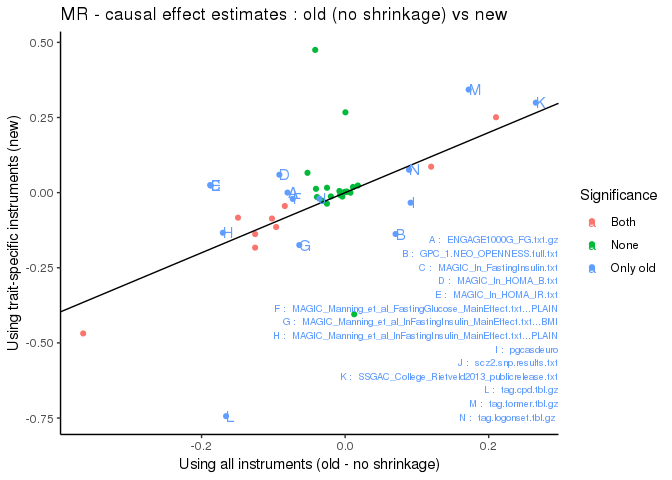
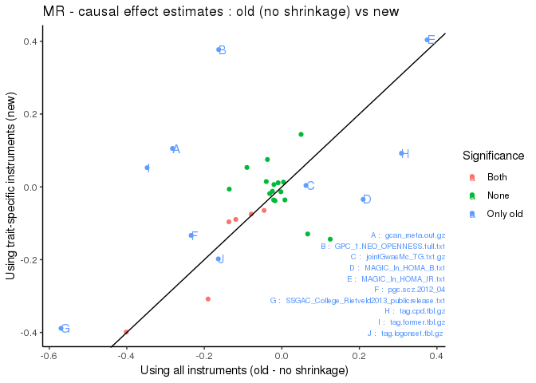
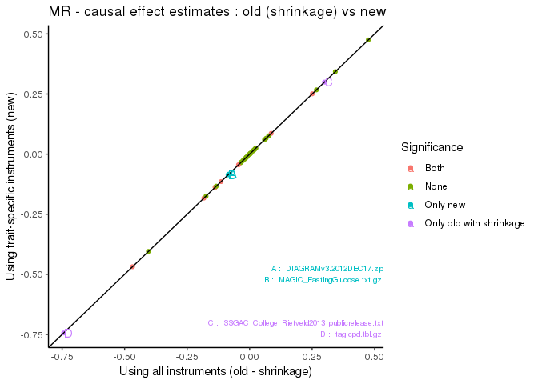
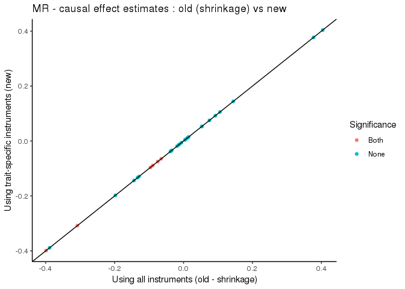

MR - Trait selection
====================

**Do not modify this .md file, it is automatically generated by the Scripts `Make_README.sh` and `MRSelection.Rmd`**

Problem : all the MR models are using the same matrix of instruments !
----------------------------------------------------------------------

- univariate : update the function to use only trait-specific instruments
- multivariate : how should we update the MR matrix in the selection procedure?

To test different approaches, replace the bGWAS function **`identify_studiesMR`** by a different version.   Test for the LifeGen dataset + UKBB BMI from Neale  

### Summary

For each approach and each trait: in-sample adjusted Rsquared, out-of-sample Rsquared, squared correlation of out-sample-prediction and observed values (instruments), and correlation of prior effects and observed values are reported (all SNPs).

**Ref** : MR selection as implemented in the package  
**Ref Shrinkage** : MR selection as implemented in the package but shrinking instruments   **v1** : MR selection as implemented (no shrinkage) but using correct univariate estimates  
**v2** : AIC stepwise selection, using only traits significant in univariate (i.e. instruments for this subset of traits only)   **v3** : AIC stepwise selection, using only traits significant in univariate (i.e. instruments for this subset of traits only) + iterations (upudating the instruments) until convergence   *Note that this not correct to use AIC anymore, since we need to change the instruments for each model, we should use a selection based on the p-values*   **v4** : backward selection based on p-values   **v5** : forward selection based on p-values   **v6** : stepwise selection based on p-values  

**A** : using traits significant in univariate - threshold of 0.05   **B** : using all traits - threshold of 0.05   **C** : using all traits - threshold of 0.05 / number of traits  

| Version       | Trait    |   AdjR2|    OSR2|  SquCorr|  CorObsPrior|
|:--------------|:---------|-------:|-------:|--------:|------------:|
| Ref           | Lifespan |  0.2595|  0.2454|   0.2457|       0.1828|
| Ref           | BMI      |  0.1940|  0.1754|   0.1784|       0.2287|
| Ref Shrinkage | Lifespan |  0.2268|  0.1902|   0.1905|       0.1375|
| Ref Shrinkage | BMI      |  0.1127|  0.1049|   0.1084|       0.2056|
| v1            | Lifespan |  0.2595|  0.2634|   0.2635|       0.1828|
| v1            | BMI      |  0.1865|  0.1902|   0.1928|       0.2285|
| v2            | Lifespan |  0.4763|  0.4601|   0.4590|       0.1712|
| v2            | BMI      |  0.2134|  0.2013|   0.2131|       0.1712|
| v3            | Lifespan |  0.4975|  0.4797|   0.4790|       0.1702|
| v3            | BMI      |  0.2434|  0.2307|   0.2408|       0.2081|
| v4-A          | Lifespan |  0.4959|  0.4789|   0.4777|       0.1736|
| v4-A          | BMI      |  0.2434|  0.2307|   0.2408|       0.2081|
| v4-B          | Lifespan |  0.2857|  0.2675|   0.2681|       0.1834|
| v4-B          | BMI      |  0.4044|  0.3787|   0.3820|       0.1980|
| v4-C          | Lifespan |  0.2946|  0.2755|   0.2760|       0.1764|
| v4-C          | BMI      |  0.3962|  0.3849|   0.0101|       0.2117|
| v5-A          | Lifespan |  0.4969|  0.4776|   0.4771|       0.1721|
| v5-A          | BMI      |  0.2434|  0.2307|   0.2408|       0.2081|
| v5-B          | Lifespan |  0.2884|  0.2700|   0.2709|       0.1811|
| v5-B          | BMI      |  0.2662|  0.2397|   0.2521|       0.2120|
| v5-C          | Lifespan |  0.2958|  0.2762|   0.2769|       0.1738|
| v5-C          | BMI      |  0.4030|  0.3864|   0.3892|       0.2013|
| v6-A          | Lifespan |  0.4969|  0.4776|   0.4771|       0.1721|
| v6-A          | BMI      |  0.2434|  0.2307|   0.2408|       0.2081|
| v6-B          | Lifespan |  0.2884|  0.2700|   0.2709|       0.1811|
| v6-B          | BMI      |  0.2662|  0.2397|   0.2521|       0.2120|
| v6-C          | Lifespan |  0.2958|  0.2762|   0.2769|       0.1738|
| v6-C          | BMI      |  0.4030|  0.3864|   0.3892|       0.2013|

Not sure we should use Rsquared to compare approaches. The correlation between prior effects and observed effects might be a better measure?     
The stepwise approach, using all studies and a more stringent threshold seems like a legitimate choice, even without looking at any prediction quality measure. It's probably admitted than it's usually better than a forward only / backward only approach, we are not making any assumption about the fact that only studies having a significant univariate effect should be included, and using a more stringent threshold is conservative. Even though we don't predict as well as we could, at least the MR selection procedure is rigorous and we can be confident in the studies included to build the prior.   
:arrow\_right: include it in the package!

:grey\_exclamation: :wavy\_dash: :wavy\_dash: :wavy\_dash: :wavy\_dash: :wavy\_dash: :wavy\_dash: :wavy\_dash: :wavy\_dash: :wavy\_dash: :wavy\_dash: :wavy\_dash: :wavy\_dash: :wavy\_dash: :wavy\_dash: :wavy\_dash: :wavy\_dash: :wavy\_dash: :wavy\_dash: :wavy\_dash: :wavy\_dash: :wavy\_dash: :wavy\_dash: :grey\_exclamation:

### Reference analysis

These analyses will be used for comparisons. All following analyses will use the same parameters:
`MR_threshold = 1e-6`
`MR_pruning_dist = 250`
`MR_pruning_LD = 0`
`MR_shrinkage = 1`
We will only change the way the MR selection is performed.

| Version       | Trait    |   AdjR2|    OSR2|  SquCorr|  CorObsPrior|
|:--------------|:---------|-------:|-------:|--------:|------------:|
| Ref           | Lifespan |  0.2595|  0.2454|   0.2457|       0.1828|
| Ref           | BMI      |  0.1940|  0.1754|   0.1784|       0.2287|
| Ref Shrinkage | Lifespan |  0.2268|  0.1902|   0.1905|       0.1375|
| Ref Shrinkage | BMI      |  0.1127|  0.1049|   0.1084|       0.2056|

### v1 : only change the univariate MR model

When using a subset of the MR Z-Matrix (to include only trait-specific instruments), we obtain "slightly" different causal effect estimates.

#### Lifespan

#### BMI

When using the old version but setting the shrinkage threshold equal to the MR threshold, the causal effect estimates are consistent with the ones obtained using trait-specific instruments.

#### Lifespan

#### BMI

Even though most instruments are set to 0 for the exposure(s) effect, they are still used as instruments. The causal effects estimates are the same, but the standard errors are different so we have different p-values...

**From here, if a trait has only one instrument, it will be excluded for the analysis**

### v2 : keep AIC selection, but restricted to traits with univariate p-value &lt; 0.05 (and Z-Matrix corresponding to these traits, not the ones selected after AIC)

#### Lifespan

Using the correct univariate estimations, there are 9 studies with an univariate p-value &lt; 0.05 that could be selected in the AIC stepwise selection.

| Study                                                   | UniSign | Ref\_used | Ref\_estimate | Ref\_SE | Ref\_P   | v2\_used | v2\_estimate | v2\_SE | v2\_P    |
|:--------------------------------------------------------|:--------|:----------|:--------------|:--------|:---------|:---------|:-------------|:-------|:---------|
| All\_ancestries\_SNP\_gwas\_mc\_merge\_nogc.tbl.uniq.gz | TRUE    | TRUE      | -0.0815       | 0.0135  | 1.63e-09 | TRUE     | -0.121       | 0.0168 | 2.28e-12 |
| cardiogram\_gwas\_results.txt                           | TRUE    | TRUE      | -0.254        | 0.0234  | 9.64e-27 | TRUE     | -0.332       | 0.0369 | 4.62e-18 |
| DIAGRAMv3.2012DEC17.zip                                 | TRUE    | TRUE      | -0.0721       | 0.0213  | 0.000727 | FALSE    | NA           | NA     | NA       |
| EDUyears\_2016\_sumstat.txt                             | TRUE    | TRUE      | 0.172         | 0.0148  | 4.46e-30 | TRUE     | 0.186        | 0.0196 | 9.07e-20 |
| GPC\_2.NEUROTICISM.zip                                  | NA      | TRUE      | 0.0607        | 0.0278  | 0.0291   | FALSE    | NA           | NA     | NA       |
| jointGwasMc\_HDL.txt.gz                                 | TRUE    | TRUE      | 0.0836        | 0.0123  | 1.34e-11 | TRUE     | 0.0461       | 0.0141 | 0.00114  |
| jointGwasMc\_TC.txt.gz                                  | TRUE    | TRUE      | -0.0928       | 0.0109  | 4.08e-17 | FALSE    | NA           | NA     | NA       |
| MetaSum.height                                          | FALSE   | TRUE      | 0.0279        | 0.00564 | 8.69e-07 | FALSE    | NA           | NA     | NA       |
| scz2.snp.results.txt                                    | FALSE   | TRUE      | -0.0498       | 0.0131  | 0.000157 | FALSE    | NA           | NA     | NA       |
| tag.cpd.tbl.gz                                          | FALSE   | TRUE      | -0.0907       | 0.0283  | 0.00135  | FALSE    | NA           | NA     | NA       |
| tag.former.tbl.gz                                       | FALSE   | TRUE      | 0.0946        | 0.0283  | 0.000864 | FALSE    | NA           | NA     | NA       |
| jointGwasMc\_LDL.txt.gz                                 | TRUE    | FALSE     | NA            | NA      | NA       | TRUE     | -0.0914      | 0.013  | 5.81e-12 |

Remarks:
- The median out-of-sample R-squared is 0.4601.
- There are 7 studies used by "Ref", and 1 studies used by "v2",
- 4 studies are used by both versions,
- Among the 7 studies used only by "Ref", 5 are not significant in the univariate models:

| File                   |     uni\_P|
|:-----------------------|----------:|
| GPC\_2.NEUROTICISM.zip |         NA|
| MetaSum.height         |  0.5253991|
| scz2.snp.results.txt   |  0.3042383|
| tag.cpd.tbl.gz         |  0.1523954|
| tag.former.tbl.gz      |  0.3527728|

#### BMI

Using the correct univariate estimations, there are 6 studies with an univariate p-value &lt; 0.05 that could be selected in the AIC stepwise selection.

| Study                       | UniSign | Ref\_used | Ref\_estimate | Ref\_SE | Ref\_P   | v2\_used | v2\_estimate | v2\_SE | v2\_P    |
|:----------------------------|:--------|:----------|:--------------|:--------|:---------|:---------|:-------------|:-------|:---------|
| EDUyears\_2016\_sumstat.txt | TRUE    | TRUE      | -0.349        | 0.0292  | 4.05e-31 | TRUE     | -0.387       | 0.0375 | 3.86e-23 |
| GPC\_2.EXTRAVERSION.zip     | FALSE   | TRUE      | 0.154         | 0.0636  | 0.0155   | FALSE    | NA           | NA     | NA       |
| jointGwasMc\_HDL.txt.gz     | TRUE    | TRUE      | -0.0902       | 0.0221  | 4.86e-05 | TRUE     | -0.0906      | 0.0266 | 0.000721 |
| jointGwasMc\_TC.txt.gz      | TRUE    | TRUE      | -0.0575       | 0.02    | 0.00413  | TRUE     | -0.0739      | 0.0241 | 0.00224  |
| MAGIC\_ln\_HOMA\_IR.txt     | FALSE   | TRUE      | 0.215         | 0.0666  | 0.0013   | FALSE    | NA           | NA     | NA       |
| pgc.scz.2012\_04            | FALSE   | TRUE      | -0.194        | 0.0407  | 2.2e-06  | FALSE    | NA           | NA     | NA       |
| tag.cpd.tbl.gz              | FALSE   | TRUE      | 0.155         | 0.0643  | 0.0162   | FALSE    | NA           | NA     | NA       |
| tag.former.tbl.gz           | FALSE   | TRUE      | -0.17         | 0.0672  | 0.0117   | FALSE    | NA           | NA     | NA       |
| scz.swe.pgc1.2013\_11b.zip  | TRUE    | FALSE     | NA            | NA      | NA       | TRUE     | -0.183       | 0.0473 | 0.000123 |

Remarks:
- The median out-of-sample R-squared is 0.2013.
- There are 5 studies used by "Ref", and 1 studies used by "v2",
- 3 studies are used by both versions,
- Among the 5 studies used only by "Ref", "5 are not significant in the univariate models:

| File                    |     uni\_P|
|:------------------------|----------:|
| GPC\_2.EXTRAVERSION.zip |  0.5407314|
| MAGIC\_ln\_HOMA\_IR.txt |  0.4912423|
| pgc.scz.2012\_04        |  0.2520049|
| tag.cpd.tbl.gz          |  0.7127552|
| tag.former.tbl.gz       |  0.6716812|

### v3 : same as before, but use an iterative process and relaunch AIC until convergence (Z-Matrix corresponding to the traits kept when convergence is obtained)

#### Lifespan

| Study                                                   | v2\_used | v2\_estimate | v2\_SE | v2\_P    | v3\_used | v3\_estimate | v3\_SE | v3\_P    |
|:--------------------------------------------------------|:---------|:-------------|:-------|:---------|:---------|:-------------|:-------|:---------|
| EDUyears\_2016\_sumstat.txt                             | TRUE     | 0.186        | 0.0196 | 9.07e-20 | TRUE     | 0.188        | 0.0201 | 4.28e-19 |
| cardiogram\_gwas\_results.txt                           | TRUE     | -0.332       | 0.0369 | 4.62e-18 | TRUE     | -0.343       | 0.0392 | 4.82e-17 |
| All\_ancestries\_SNP\_gwas\_mc\_merge\_nogc.tbl.uniq.gz | TRUE     | -0.121       | 0.0168 | 2.28e-12 | TRUE     | -0.121       | 0.0174 | 1.31e-11 |
| jointGwasMc\_LDL.txt.gz                                 | TRUE     | -0.0914      | 0.013  | 5.81e-12 | TRUE     | -0.0883      | 0.0135 | 1.62e-10 |
| jointGwasMc\_HDL.txt.gz                                 | TRUE     | 0.0461       | 0.0141 | 0.00114  | TRUE     | 0.0436       | 0.0146 | 0.00298  |

Remarks:
- The median out-of-sample R-squared is 0.4797.

#### BMI

| Study                       | v2\_used | v2\_estimate | v2\_SE | v2\_P    | v3\_used | v3\_estimate | v3\_SE | v3\_P    |
|:----------------------------|:---------|:-------------|:-------|:---------|:---------|:-------------|:-------|:---------|
| EDUyears\_2016\_sumstat.txt | TRUE     | -0.387       | 0.0375 | 3.86e-23 | TRUE     | -0.385       | 0.0421 | 3.01e-18 |
| GPC\_2.EXTRAVERSION.zip     | FALSE    | NA           | NA     | NA       | FALSE    | NA           | NA     | NA       |
| jointGwasMc\_HDL.txt.gz     | TRUE     | -0.0906      | 0.0266 | 0.000721 | TRUE     | -0.0806      | 0.0291 | 0.00589  |
| jointGwasMc\_TC.txt.gz      | TRUE     | -0.0739      | 0.0241 | 0.00224  | TRUE     | -0.0771      | 0.0264 | 0.00367  |
| MAGIC\_ln\_HOMA\_IR.txt     | FALSE    | NA           | NA     | NA       | FALSE    | NA           | NA     | NA       |
| pgc.scz.2012\_04            | FALSE    | NA           | NA     | NA       | FALSE    | NA           | NA     | NA       |
| tag.cpd.tbl.gz              | FALSE    | NA           | NA     | NA       | FALSE    | NA           | NA     | NA       |
| tag.former.tbl.gz           | FALSE    | NA           | NA     | NA       | FALSE    | NA           | NA     | NA       |
| scz.swe.pgc1.2013\_11b.zip  | TRUE     | -0.183       | 0.0473 | 0.000123 | TRUE     | -0.272       | 0.0808 | 0.000831 |

Remarks:
- The median out-of-sample R-squared is 0.2307.

### v4-A : Backward selection among studies with univariate p&lt;0.05, updating the Z-Matrix for each model

All the backward selection approaches also check for the consistency between univariate and multivariate estimates. When a subset of significant studies is identified, all the directions are checked and the studies not fulfilling the consistency condition are removed. After removing these studies, a new backward selection approach is initiated, to make sure that the remaining studies are still all significant using the reduced subset.   Note : P-value threshold to exclude studies is set to **0.05**.

#### Lifespan

With this methods, 5 studies are selected.

| Study                                                   | v4A\_estimate | v4A\_SE | v4A\_P   |
|:--------------------------------------------------------|:--------------|:--------|:---------|
| EDUyears\_2016\_sumstat.txt                             | 0.188         | 0.0198  | 1.4e-19  |
| cardiogram\_gwas\_results.txt                           | -0.327        | 0.039   | 6.48e-16 |
| All\_ancestries\_SNP\_gwas\_mc\_merge\_nogc.tbl.uniq.gz | -0.121        | 0.0171  | 6.97e-12 |
| jointGwasMc\_TC.txt.gz                                  | -0.0861       | 0.0133  | 2.2e-10  |
| jointGwasMc\_HDL.txt.gz                                 | 0.0715        | 0.0148  | 1.96e-06 |

Remarks:
- The median out-of-sample R-squared is 0.4789.

#### BMI

With this methods, 4 studies are selected.

| Study                       | v4A\_estimate | v4A\_SE | v4A\_P   |
|:----------------------------|:--------------|:--------|:---------|
| EDUyears\_2016\_sumstat.txt | -0.385        | 0.0421  | 3.01e-18 |
| scz.swe.pgc1.2013\_11b.zip  | -0.272        | 0.0808  | 0.000831 |
| jointGwasMc\_TC.txt.gz      | -0.0771       | 0.0264  | 0.00367  |
| jointGwasMc\_HDL.txt.gz     | -0.0806       | 0.0291  | 0.00589  |

Remarks:
- The median out-of-sample R-squared is 0.2307.

### v4-B : Backward selection among studies with univariate p&lt;0.05, updating the Z-Matrix for each model

Note : P-value threshold to exclude studies is set to **0.05**.

#### Lifespan

With this methods, 10 studies are selected.

| Study                                                   | v4B\_estimate | v4B\_SE | v4B\_P   |
|:--------------------------------------------------------|:--------------|:--------|:---------|
| EDUyears\_2016\_sumstat.txt                             | 0.166         | 0.0162  | 7.29e-24 |
| cardiogram\_gwas\_results.txt                           | -0.256        | 0.0263  | 8.02e-22 |
| jointGwasMc\_TC.txt.gz                                  | -0.0932       | 0.0115  | 1.19e-15 |
| jointGwasMc\_HDL.txt.gz                                 | 0.0821        | 0.013   | 3.41e-10 |
| All\_ancestries\_SNP\_gwas\_mc\_merge\_nogc.tbl.uniq.gz | -0.0843       | 0.0141  | 3e-09    |
| MetaSum.height                                          | 0.0275        | 0.00578 | 2.21e-06 |
| tag.cpd.tbl.gz                                          | -0.109        | 0.032   | 0.000683 |
| tag.former.tbl.gz                                       | 0.107         | 0.033   | 0.00122  |
| DIAGRAMv3.2012DEC17.zip                                 | -0.0701       | 0.0237  | 0.00317  |
| scz2.snp.results.txt                                    | -0.0389       | 0.0146  | 0.00791  |

Remarks:
- The median out-of-sample R-squared is 0.2675.

#### BMI

With this methods, 5 studies are selected.

| Study                       | v4B\_estimate | v4B\_SE | v4B\_P   |
|:----------------------------|:--------------|:--------|:---------|
| EDUyears\_2016\_sumstat.txt | -0.348        | 0.0341  | 4.95e-21 |
| pgc.scz.2012\_04            | -0.335        | 0.0849  | 1e-04    |
| MAGIC\_ln\_HOMA\_IR.txt     | 0.431         | 0.12    | 0.000397 |
| jointGwasMc\_TC.txt.gz      | -0.061        | 0.0204  | 0.00308  |
| tag.cpd.tbl.gz              | 0.224         | 0.0995  | 0.0248   |

Remarks:
- The median out-of-sample R-squared is 0.3787.

### v4-C : Backward selection among studies with univariate p&lt;0.05, updating the Z-Matrix for each model

Note : P-value threshold to exclude studies is set to **0.05/N\_Studies**.

#### Lifespan

With this methods, 7 study is selected.

| Study                                                   | v4C\_estimate | v4C\_SE | v4C\_P   |
|:--------------------------------------------------------|:--------------|:--------|:---------|
| EDUyears\_2016\_sumstat.txt                             | 0.172         | 0.0167  | 4.82e-24 |
| cardiogram\_gwas\_results.txt                           | -0.273        | 0.0275  | 2.05e-22 |
| jointGwasMc\_TC.txt.gz                                  | -0.0893       | 0.0117  | 3.68e-14 |
| jointGwasMc\_HDL.txt.gz                                 | 0.0871        | 0.0131  | 5.24e-11 |
| All\_ancestries\_SNP\_gwas\_mc\_merge\_nogc.tbl.uniq.gz | -0.0913       | 0.0145  | 3.88e-10 |
| MetaSum.height                                          | 0.0276        | 0.00586 | 2.79e-06 |
| tag.cpd.tbl.gz                                          | -0.138        | 0.034   | 5.3e-05  |

Remarks:
- The median out-of-sample R-squared is 0.2755.

#### BMI

With this methods, 1 studies are selected.

| Study                       | v4C\_estimate | v4C\_SE | v4C\_P   |
|:----------------------------|:--------------|:--------|:---------|
| EDUyears\_2016\_sumstat.txt | -0.369        | 0.0501  | 1.44e-10 |

Remarks:
- The median out-of-sample R-squared is 0.3849.

### v5-A : Forward selection among studies with univariate p&lt;0.05, updating the Z-Matrix for each model

All the forward selection approaches also check for the consistency between univariate and multivariate estimates. When a study is identified as significant, the univariate/multivariate directions are checked and if it does not fulfill the consistency condition, the study is discarded from the list of studies that can be added, and the forward selection resumes.   Note : P-value threshold to include studies is set to **0.05**.

#### Lifespan

With this methods, 6 studies are selected.

| Study                                                   | v5A\_estimate | v5A\_SE | v5A\_P   |
|:--------------------------------------------------------|:--------------|:--------|:---------|
| EDUyears\_2016\_sumstat.txt                             | 0.185         | 0.0198  | 3.65e-19 |
| cardiogram\_gwas\_results.txt                           | -0.333        | 0.0386  | 1.11e-16 |
| jointGwasMc\_LDL.txt.gz                                 | -0.0911       | 0.0134  | 3.24e-11 |
| All\_ancestries\_SNP\_gwas\_mc\_merge\_nogc.tbl.uniq.gz | -0.114        | 0.0174  | 1.34e-10 |
| jointGwasMc\_HDL.txt.gz                                 | 0.0398        | 0.0146  | 0.0065   |
| DIAGRAMv3.2012DEC17.zip                                 | -0.071        | 0.0344  | 0.0398   |

Remarks:
- The median out-of-sample R-squared is 0.4776.

#### BMI

With this methods, 4 studies are selected.

| Study                       | v5A\_estimate | v5A\_SE | v5A\_P   |
|:----------------------------|:--------------|:--------|:---------|
| EDUyears\_2016\_sumstat.txt | -0.385        | 0.0421  | 3.01e-18 |
| scz.swe.pgc1.2013\_11b.zip  | -0.272        | 0.0808  | 0.000831 |
| jointGwasMc\_TC.txt.gz      | -0.0771       | 0.0264  | 0.00367  |
| jointGwasMc\_HDL.txt.gz     | -0.0806       | 0.0291  | 0.00589  |

Remarks:
- The median out-of-sample R-squared is 0.2307.

### v5-B : Forward selection among all studies, updating the Z-Matrix for each model

Note : P-value threshold to include studies is set to **0.05**.

#### Lifespan

With this methods, 10 studies are selected.

| Study                                                   | v5B\_estimate | v5B\_SE | v5B\_P   |
|:--------------------------------------------------------|:--------------|:--------|:---------|
| EDUyears\_2016\_sumstat.txt                             | 0.166         | 0.0162  | 9.53e-24 |
| cardiogram\_gwas\_results.txt                           | -0.264        | 0.0262  | 4.61e-23 |
| jointGwasMc\_LDL.txt.gz                                 | -0.097        | 0.0116  | 1.58e-16 |
| All\_ancestries\_SNP\_gwas\_mc\_merge\_nogc.tbl.uniq.gz | -0.0841       | 0.0142  | 3.89e-09 |
| MetaSum.height                                          | 0.0271        | 0.00581 | 3.28e-06 |
| jointGwasMc\_HDL.txt.gz                                 | 0.0534        | 0.0128  | 3.31e-05 |
| tag.cpd.tbl.gz                                          | -0.111        | 0.0321  | 0.000544 |
| DIAGRAMv3.2012DEC17.zip                                 | -0.0764       | 0.0239  | 0.00144  |
| tag.former.tbl.gz                                       | 0.104         | 0.0331  | 0.00165  |
| scz2.snp.results.txt                                    | -0.0375       | 0.0147  | 0.0107   |

Remarks:
- The median out-of-sample R-squared is 0.27.

#### BMI

With this methods, 6 studies are selected.

| Study                       | v5B\_estimate | v5B\_SE | v5B\_P   |
|:----------------------------|:--------------|:--------|:---------|
| EDUyears\_2016\_sumstat.txt | -0.358        | 0.042   | 3.23e-16 |
| scz.swe.pgc1.2013\_11b.zip  | -0.271        | 0.0791  | 0.000661 |
| MAGIC\_ln\_HOMA\_IR.txt     | 0.378         | 0.128   | 0.00343  |
| jointGwasMc\_TC.txt.gz      | -0.0684       | 0.026   | 0.00891  |
| tag.cpd.tbl.gz              | 0.254         | 0.114   | 0.0265   |
| jointGwasMc\_HDL.txt.gz     | -0.0616       | 0.0291  | 0.0349   |

Remarks:
- The median out-of-sample R-squared is 0.2397.

### v5-C : Forward selection among all studies, updating the Z-Matrix for each model

Note : P-value threshold to include studies is set to **0.05/N\_Studies**.

#### Lifespan

With this methods, 7 studies are selected.

| Study                                                   | v5C\_estimate | v5C\_SE | v5C\_P   |
|:--------------------------------------------------------|:--------------|:--------|:---------|
| cardiogram\_gwas\_results.txt                           | -0.284        | 0.0275  | 4.91e-24 |
| EDUyears\_2016\_sumstat.txt                             | 0.173         | 0.0168  | 7.93e-24 |
| jointGwasMc\_LDL.txt.gz                                 | -0.0898       | 0.0118  | 4.22e-14 |
| All\_ancestries\_SNP\_gwas\_mc\_merge\_nogc.tbl.uniq.gz | -0.0909       | 0.0146  | 5.83e-10 |
| jointGwasMc\_HDL.txt.gz                                 | 0.0601        | 0.0129  | 3.7e-06  |
| MetaSum.height                                          | 0.0271        | 0.00589 | 4.67e-06 |
| tag.cpd.tbl.gz                                          | -0.14         | 0.0342  | 4.86e-05 |

Remarks:
- The median out-of-sample R-squared is 0.2762.

#### BMI

With this methods, 4 studies are selected.

| Study                       | v5C\_estimate | v5C\_SE | v5C\_P   |
|:----------------------------|:--------------|:--------|:---------|
| EDUyears\_2016\_sumstat.txt | -0.367        | 0.0337  | 1.87e-23 |
| scz.swe.pgc1.2013\_11b.zip  | -0.33         | 0.0664  | 1.13e-06 |
| MAGIC\_ln\_HOMA\_IR.txt     | 0.378         | 0.118   | 0.00156  |
| jointGwasMc\_TC.txt.gz      | -0.0658       | 0.0206  | 0.0016   |

Remarks:
- The median out-of-sample R-squared is 0.3864.

### v6-A : Stepwise selection among studies with univariate p&lt;0.05, updating the Z-Matrix for each model

Start with no traits, then sequentially add the most significant traits. After adding each new trait, remove any trait that is no longer significant.   Be careful about loops (add trait A (makes trait B not significant anymore), remove trait B, add something or not, remove trait A (not significant anymore, because it was partially due to some of trait B instruments), add trait B (significant again now that trait A removed) ... ) !  

Note : P-value threshold to include/exclude studies is set to **0.05**.

#### Lifespan

With this methods, 6 studies are selected.

| Study                                                   | v6A\_estimate | v6A\_SE | v6A\_P   |
|:--------------------------------------------------------|:--------------|:--------|:---------|
| EDUyears\_2016\_sumstat.txt                             | 0.185         | 0.0198  | 3.65e-19 |
| cardiogram\_gwas\_results.txt                           | -0.333        | 0.0386  | 1.11e-16 |
| jointGwasMc\_LDL.txt.gz                                 | -0.0911       | 0.0134  | 3.24e-11 |
| All\_ancestries\_SNP\_gwas\_mc\_merge\_nogc.tbl.uniq.gz | -0.114        | 0.0174  | 1.34e-10 |
| jointGwasMc\_HDL.txt.gz                                 | 0.0398        | 0.0146  | 0.0065   |
| DIAGRAMv3.2012DEC17.zip                                 | -0.071        | 0.0344  | 0.0398   |

Remarks:
- The median out-of-sample R-squared is 0.4776.

#### BMI

With this methods, 4 studies are selected.

| Study                       | v6A\_estimate | v6A\_SE | v6A\_P   |
|:----------------------------|:--------------|:--------|:---------|
| EDUyears\_2016\_sumstat.txt | -0.385        | 0.0421  | 3.01e-18 |
| scz.swe.pgc1.2013\_11b.zip  | -0.272        | 0.0808  | 0.000831 |
| jointGwasMc\_TC.txt.gz      | -0.0771       | 0.0264  | 0.00367  |
| jointGwasMc\_HDL.txt.gz     | -0.0806       | 0.0291  | 0.00589  |

Remarks:
- The median out-of-sample R-squared is 0.2307.

### v6-B : Stepwise selection among all studies, updating the Z-Matrix for each model

Note : P-value threshold to include/exclude studies is set to **0.05**.

#### Lifespan

With this methods, 10 studies are selected.

| Study                                                   | v6B\_estimate | v6B\_SE | v6B\_P   |
|:--------------------------------------------------------|:--------------|:--------|:---------|
| EDUyears\_2016\_sumstat.txt                             | 0.166         | 0.0162  | 9.53e-24 |
| cardiogram\_gwas\_results.txt                           | -0.264        | 0.0262  | 4.61e-23 |
| jointGwasMc\_LDL.txt.gz                                 | -0.097        | 0.0116  | 1.58e-16 |
| All\_ancestries\_SNP\_gwas\_mc\_merge\_nogc.tbl.uniq.gz | -0.0841       | 0.0142  | 3.89e-09 |
| MetaSum.height                                          | 0.0271        | 0.00581 | 3.28e-06 |
| jointGwasMc\_HDL.txt.gz                                 | 0.0534        | 0.0128  | 3.31e-05 |
| tag.cpd.tbl.gz                                          | -0.111        | 0.0321  | 0.000544 |
| DIAGRAMv3.2012DEC17.zip                                 | -0.0764       | 0.0239  | 0.00144  |
| tag.former.tbl.gz                                       | 0.104         | 0.0331  | 0.00165  |
| scz2.snp.results.txt                                    | -0.0375       | 0.0147  | 0.0107   |

Remarks:
- The median out-of-sample R-squared is 0.27.

#### BMI

With this methods, 6 studies are selected.

| Study                       | v6B\_estimate | v6B\_SE | v6B\_P   |
|:----------------------------|:--------------|:--------|:---------|
| EDUyears\_2016\_sumstat.txt | -0.358        | 0.042   | 3.23e-16 |
| scz.swe.pgc1.2013\_11b.zip  | -0.271        | 0.0791  | 0.000661 |
| MAGIC\_ln\_HOMA\_IR.txt     | 0.378         | 0.128   | 0.00343  |
| jointGwasMc\_TC.txt.gz      | -0.0684       | 0.026   | 0.00891  |
| tag.cpd.tbl.gz              | 0.254         | 0.114   | 0.0265   |
| jointGwasMc\_HDL.txt.gz     | -0.0616       | 0.0291  | 0.0349   |

Remarks:
- The median out-of-sample R-squared is 0.2397.

### v6-C : Stepwise selection among all studies, updating the Z-Matrix for each model

Note : P-value threshold to include/exclude studies is set to **0.05/N\_Studies**.

#### Lifespan

With this methods, 7 studies are selected.

| Study                                                   | v6C\_estimate | v6C\_SE | v6C\_P   |
|:--------------------------------------------------------|:--------------|:--------|:---------|
| cardiogram\_gwas\_results.txt                           | -0.284        | 0.0275  | 4.91e-24 |
| EDUyears\_2016\_sumstat.txt                             | 0.173         | 0.0168  | 7.93e-24 |
| jointGwasMc\_LDL.txt.gz                                 | -0.0898       | 0.0118  | 4.22e-14 |
| All\_ancestries\_SNP\_gwas\_mc\_merge\_nogc.tbl.uniq.gz | -0.0909       | 0.0146  | 5.83e-10 |
| jointGwasMc\_HDL.txt.gz                                 | 0.0601        | 0.0129  | 3.7e-06  |
| MetaSum.height                                          | 0.0271        | 0.00589 | 4.67e-06 |
| tag.cpd.tbl.gz                                          | -0.14         | 0.0342  | 4.86e-05 |

Remarks:
- The median out-of-sample R-squared is 0.2762.

#### BMI

With this methods, 4 studies are selected.

| Study                       | v6C\_estimate | v6C\_SE | v6C\_P   |
|:----------------------------|:--------------|:--------|:---------|
| EDUyears\_2016\_sumstat.txt | -0.367        | 0.0337  | 1.87e-23 |
| scz.swe.pgc1.2013\_11b.zip  | -0.33         | 0.0664  | 1.13e-06 |
| MAGIC\_ln\_HOMA\_IR.txt     | 0.378         | 0.118   | 0.00156  |
| jointGwasMc\_TC.txt.gz      | -0.0658       | 0.0206  | 0.0016   |

Remarks:
- The median out-of-sample R-squared is 0.3864.
